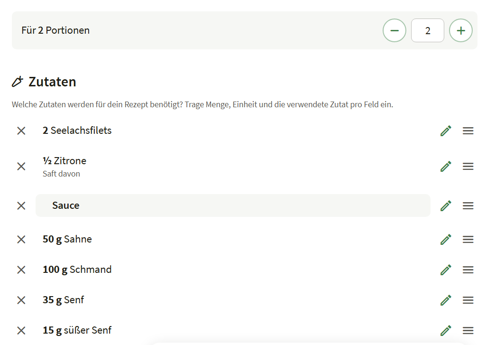

# Erledigt

## Admin-Link im Hauptmenü
~~Es fehlt ein Link zum Admin-Bereich im Menü für Administratoren.~~

Gelöst (2026-09-26): Der Admin-Bereich (`/admin`) war bisher nur über die direkte URL erreichbar. Neuer Link "Admin-Bereich" im Menü-Drawer (`nav.js`s `renderNav()`), nur sichtbar wenn `currentUser.is_admin` true ist - ein normaler `<a href>` (kein Hash-Route), da `/admin` eine eigene, serverseitig gerenderte Seite mit eigener AdminLTE-Shell ist, nicht Teil der SPA. Das gemeinsame JWT in `localStorage` sorgt dafür, dass der Klick direkt im Admin-Dashboard landet, ohne erneute Anmeldung. Per Playwright verifiziert: Link erscheint für einen Admin-Benutzer und führt zum Dashboard, bleibt für einen Nicht-Admin-Benutzer verborgen.

## Benutzerverwaltung und Passwort-Vergessen-Funktion
~~Die Benutzerverwaltung soll genauso gestaltet werden, wie bei YTAN. Sie soll inkl. Rechtesystem und Gestaltung übernommen werden.~~

Gelöst (2026-09-26): Recherchiert direkt an YTANs aktuellem Quellcode (`templates/admin-users.php`, `public/js/admin-user.js`, `public/js/user.js`, `templates/forgot-password.php`), nicht an einer Zusammenfassung, um wirklich "genauso" zu treffen.

**Rechtesystem**: Auf Nachfrage entschieden, nur die *Architektur* zu übernehmen (Filter-Panel, Rechte-Badges, Rechte-Beschreibungen), nicht YTANs konkrete Tour-Domain-Rechte (`tour_create` etc.), die für ein Rezeptbuch keinen Sinn ergeben - Kochbuch hat weiterhin nur `is_admin`, jetzt aber über ein generisches `USER_RIGHT_FIELDS`-Array (aktuell `['is_admin']`) abgebildet, das sich um ein neues Recht erweitern lässt, ohne die Filterlogik/Badge-Darstellung anfassen zu müssen.

**Gestaltung** (`public/js/admin-user.js`, `templates/admin-users.php` komplett neu gebaut): eine einzige Karte mit Kopfzeile (Zurück-Button + kontextabhängiger Titel + Aktions-Button), deren Body zwischen Liste und Formular umschaltet (`hidden`-Attribut), statt beides dauerhaft gestapelt anzuzeigen - Titel/Zurück-Button wechseln zwischen "Benutzerverwaltung"/"Benutzer einladen"/"Benutzer bearbeiten", exakt wie bei YTANs `setUserAdminHeader()`. Dazu: Such-Eingabe mit Lupe-Icon (`input-group`), aufklappbares "Nach Recht filtern"-Panel mit Aktiv-Zähler-Badge, "Zeilen pro Seite"-Auswahl (`ADMIN_LIST_PAGE_SIZES = [5, 10, 50, 100]`, neue Konstanten in `config.js`, identisch zu YTAN) mit client-seitiger Pagination, Rechte als Badges in der Liste, sowie YTANs `foldSearchText()` (diakritik-unabhängige Suche, z. B. "ö" matched "o") 1:1 nach `helper.js` portiert.

Eine bewusste Abweichung von YTANs Zeilen-Layout: YTAN zeigt Benutzername/E-Mail/Name/Rechte + 4 einzelne Icon-Buttons nebeneinander - bei ~390px Breite ist diese Zeile breiter als der Viewport und schiebt die Buttons unsichtbar hinter horizontalen Tabellen-Scroll (exakt der Fehler, der in diesem Projekt schon einmal behoben wurde, siehe weiter oben in dieser Datei). Kochbuchs eigene "Mobile First"-Vorgabe (todo.md "Allgemein") wiegt hier schwerer als Pixel-Treue: E-Mail steht als gedämpfte zweite Zeile unter dem Benutzernamen, alle vier Aktionen sitzen in einem einzigen "⋮"-Dropdown - beides bereits per Playwright bei 390px als überlauf-frei verifiziert.

**Fehlende Passwort-Vergessen-Funktion ergänzt**: Der Backend-Endpunkt (`POST /api/v1/auth/forgot-password`) existierte bereits aus einer früheren Änderung, war aber nirgends in der Oberfläche verlinkt. Neuer Link "Passwort vergessen?" unter dem Login-Formular (`login.js`) führt - wie bei YTANs `goToForgotPassword()` - auf eine eigenständige, aus der SPA herausführende Seite (`templates/forgot-password.php`, neue Route `GET /forgot-password`). Anders als YTANs eigene (noch vor dessen Bootstrap-Umstieg entstandene, mit `.leftCol`/`.startbtn` handgestrickte) Version folgt Kochbuchs Seite dem bereits etablierten Bootstrap-Standalone-Seiten-Muster (wie `set-password.php`) - Ablauf/UX (ein Identifikator-Feld, generische Erfolgsmeldung unabhängig vom tatsächlichen Ergebnis, Link zurück zum Login) ist aber identisch übernommen.

`composer test` weiterhin 69/69 grün (keine Backend-Logik geändert). Per Playwright verifiziert (mobil 390×844 und Desktop 1280×800): Liste/Formular-Umschalten, Rechte-Filter mit Zähler, Pagination (Seitengröße 5, "Seite 1 von 2"), Erstellen inkl. Einladungslink-Anzeige, Bearbeiten, Löschen - jeweils ohne Konsolenfehler; "Passwort vergessen?"-Link führt zur neuen Seite, Absenden zeigt die generische Erfolgsmeldung.

## Anpassungen von Schrift- und Buttongrößen
~~In der Mobilansicht müssen die Schriften und Buttons kleiner dargestellt werden. Wenn möglich soll die Schriftgröße getrennt für die Desktop- und die Mobilansicht von den Benutzern in einem Bereich von 50% bis 150% in ihren Einstellungen festgelegt werden können. Die Standardwerte für neue Nutzer können in den Einstellungen im Admin-Bereich festgelegt werden. Zunächst sollen alle Benutzer die Werte 100% (entsprechend 1rem) für Desktop und 80% (entsprechend 0.8rem) für die Mobilansicht erhalten.~~

Gelöst (2026-09-26): Ein einziger Hebel für "Schrift- UND Buttongrößen" zugleich: Bootstraps eigene Komponenten (Buttons, Formularfelder, Abstände) sind bereits durchgehend in `rem` (relativ zur Root-Schriftgröße) dimensioniert, daher skaliert das Setzen der Root-`font-size` (`<html>`) alles gemeinsam, ohne einzelne Komponenten anfassen zu müssen. `public/css/style.css` setzt jetzt mobile-first `html { font-size: var(--font-scale-mobile); }` mit einer Überschreibung auf `var(--font-scale-desktop)` ab 768px - beide Custom Properties sind reine CSS-Prozentwerte des Browser-Standards (16px), wodurch "100%" exakt `1rem`/16px und "80%" exakt `0.8rem`/12.8px ergibt, genau wie im Punkt vorgerechnet. Die bisherige pauschale `--bs-body-font-size`-Überschreibung entfiel dafür ersatzlos - Bootstraps eigener Default (`1rem`, relativ zur jetzt skalierten Root) erreicht dasselbe Ergebnis von selbst.

Gespeichert wird die Präferenz - wie Theme und Sprache schon vorher - im bestehenden `settings`-Cookie, nicht in der Datenbank: `public/js/settings.js`s `loadSettings()`/`setFontScale()`/`applyFontScale()` erweitert um `fontScaleDesktop`/`fontScaleMobile`, `applyStoredTheme()` (im `<head>` jeder Seite als Erstes aufgerufen) wendet jetzt auch die Schriftgröße an, damit kein sichtbares "Springen" nach dem Laden auftritt (gleiches Prinzip wie beim Theme). Zwei neue Schieberegler (`<input type="range">`, 50-150%, Live-Vorschau bei jedem `input`-Event) im Menü-Drawer neben Sprache/Theme, verdrahtet in `nav.js`/`app.js`.

Der admin-konfigurierbare Startwert für einen Browser ohne bisheriges Cookie (todo.md: "Standardwerte für neue Nutzer ... im Admin-Bereich") sitzt in der bestehenden `setting`-Tabelle (`default_font_scale_desktop`/`default_font_scale_mobile`, neue Migration `008_add_font_scale_settings.sql`, beide mit 100/80 vorbelegt) - zwei neue Zahlenfelder (50-150) in `/admin/settings`, serverseitig validiert in `SettingsController::update()`. `window.KOCHBUCH_SETTINGS` (bereits für die Rezept-Seitengröße vorhanden) trägt diese beiden Werte jetzt zusätzlich in die Seite ein; `loadSettings()`s Fallback für ein fehlendes Cookie liest sie von dort - fehlt `window.KOCHBUCH_SETTINGS` ganz (z. B. auf den Standalone-Seiten Impressum/Datenschutz/Passwort setzen), greifen die im Code hinterlegten Werte 100/80 aus dem Punkt selbst. Da "alle Benutzer" (nicht nur neu angelegte) zunächst 100%/80% erhalten sollen und die Präferenz cookie-basiert ist (kein bestehendes Cookie kennt diesen neuen Schlüssel), erreicht dieser Fallback-Mechanismus genau das geforderte Rollout-Verhalten, ohne bestehende Konten anfassen zu müssen.

Neuer Test `SettingsControllerTest` (es gab noch gar keinen für diesen Controller, nur einen für `SettingRepository` selbst) deckt sowohl die neue Schriftgrößen-Validierung (< 50 % / > 150 % abgelehnt) als auch die bereits bestehende `update()`-Validierung ab (App-Name, Seitengrößen) - `composer test` 69/69 grün. Per Playwright verifiziert: mobil (390×844) zeigt `getComputedStyle` 12.8px Root-Schriftgröße, Desktop (1280px) 16px; Schieberegler im Drawer verändern die Größe sofort sichtbar (Text, Buttons, Abstände); Admin-Einstellungsseite zeigt/speichert die beiden neuen Felder korrekt.

## Admin-Oberfläche
~~Erstelle einen Administrationsbereich auf Basis von AdminLTZE (siehe Projekt YTAN).

Der Administrationsbereich enthält:
- eine Benutzerverwaltung
- eine Seite für Einstellungen
- ein i18N-Tool für die Übersetzungen

Orientiere dich dabei am Projekt YTAN (c:\dev\www\ytan).

Die Benutzerverwaltung soll der des Projekts YTAN entsprechen (https://github.com/klopps/ytan). JWT-Login, `/api/v1/auth/me`, `user`/`user_token`-Schema stehen bereits — noch offen: Selbstregistrierung gibt es bewusst nicht (wie bei YTAN), aber es fehlt noch der komplette Invite-/Passwort-Reset-Flow, die Admin-Nutzerverwaltung (`/admin/users`) und Rechte-Flags über `is_admin` hinaus.~~

Gelöst (2026-09-26): Kompletter Administrationsbereich nach YTAN-Vorbild, recherchiert direkt an dessen Quellcode (nicht nur an dessen CLAUDE.md-Zusammenfassung) und 1:1 auf Kochbuchs Datenmodell übertragen.

**AdminLTE-Shell**: AdminLTE 4.9.1 (`public/lib/adminlte/adminlte.min.{css,js}`, von `cdn.jsdelivr.net/npm/admin-lte@4.9.1` vendort, nur die zwei kompilierten Dateien - die Demo-Abhängigkeiten wie ApexCharts/jsVectorMap braucht ein reines Stat-Kachel-Dashboard nicht). Bootstrap wurde dafür von 5.3.3 auf 5.3.8 angehoben (die Version, gegen die der AdminLTE-Build kompiliert ist). `templates/partials/admin-shell-header.php`/`-footer.php` sind der gemeinsame Rahmen für jede `/admin/*`-Seite (Nav-Items-Array, `$adminActiveNav`/`$pageScripts`-Konvention, exakt nach YTANs Muster) - eine neue Admin-Seite ist eine neue Route in `App.php` + ein neues dünnes Template + ein neuer Eintrag im `$adminNavItems`-Array. Wie bei YTAN gibt es serverseitig **keine** Auth-Prüfung vor dem Rendern der Admin-HTML (jede `/admin/*`-Route ist unauthentifiziert erreichbar, genau wie die Haupt-SPA-Shell) - das eigentliche Gate sitzt serverseitig auf der API via `BaseController::requireAdmin()`; clientseitig blendet `public/js/admin-auth.js`s `initAdminAuth()` zwischen `#loginBox` und `#adminAppWrapper` um, basierend auf `GET /auth/me`.

**Nachtrag (2026-09-26)**: Bei Desktop-Auflösung passte sich die Oberfläche nicht an - Navbar und Hauptinhalt blieben auf ~546px Breite eingequetscht, egal wie breit das Fenster war (per Playwright bei 1440×900 entdeckt, nachdem nur mobil getestet worden war). Ursache: AdminLTE 4s CSS-Grid (`.app-wrapper { display: grid; grid-template-areas: "lte-app-sidebar lte-app-header" ... }`) verlangt, dass `.app-header`/`.app-sidebar`/`.app-main` *direkte* Kinder von `.app-wrapper` sind - im Markup steckte die `app-wrapper`-Klasse aber auf einem äußeren Div, das `#loginBox` und `#adminAppWrapper` als Geschwister enthielt, mit der eigentlichen Header/Sidebar/Main-Struktur eine Ebene zu tief innerhalb von `#adminAppWrapper`. Ohne zugewiesenen Grid-Bereich landete `#adminAppWrapper` als einzelnes Grid-Item in der `auto`-breiten Sidebar-Spalte statt die volle `1fr`-Inhaltsspalte zu nutzen. Behoben, indem die `app-wrapper`-Klasse direkt auf `#adminAppWrapper` verschoben wurde (das äußere Div entfällt ersatzlos) - Header/Sidebar/Main sind jetzt direkte Kinder des Grid-Containers. Per Playwright bei 1440×900 verifiziert (Sidebar dauerhaft sichtbar, Inhalt füllt die volle Restbreite, Sidebar-Toggle klappt weiterhin korrekt ein/aus) sowie erneut mobil bei 390×844 gegengeprüft (unverändert korrekt).

**Nachtrag 2 (2026-09-26)**: Überschriften wie `<h3 class="mb-0">` im Admin-Content-Header waren schwarz auf dunklem Hintergrund kaum lesbar - trat nur bei Betriebssystemen/Browsern mit dunkler Farbpräferenz auf (per Playwrights `prefers-color-scheme: dark`-Emulation reproduziert). Ursache: `adminlte.min.js` bringt eine eigene, von unserem Theme-System komplett unabhängige Dark-Mode-Erkennung mit - es setzt `[data-bs-theme="dark"]` auf `<html>` automatisch anhand von `prefers-color-scheme`, während unser eigenes `[data-theme]` (das `--color-text`/`--color-bg`/etc. steuert, siehe `style.css`) nur von `public/js/settings.js`s `applyStoredTheme()` gesetzt wird - einer Funktion, die der Admin-Bereich nie aufruft. Damit dunkelte Bootstrap/AdminLTE die Hintergründe ab, während unser eigenes `body { color: var(--color-text) }` (das jede Überschrift per Vererbung mitzieht) auf dem hellen `:root`-Wert stehen blieb. Behoben, indem `style.css`s dunkler Token-Block jetzt zusätzlich auf `:root[data-bs-theme="dark"]:not([data-theme])` reagiert - dieselben Tokens folgen damit auch dann dem dunklen Zustand, wenn ausschließlich Bootstraps eigenes Attribut (durch AdminLTEs Auto-Erkennung) gesetzt ist, ohne das Verhalten der Haupt-SPA zu verändern (dort werden beide Attribute ohnehin immer gemeinsam von `applyTheme()` gesetzt). Per Playwright verifiziert: mit emulierter dunkler Farbpräferenz sind Übersicht/Benutzer/Einstellungen jetzt durchgehend hell auf dunkel lesbar; mit heller Präferenz und auf der Haupt-SPA unverändert korrekt.

**Einladungs-/Passwort-Reset-Flow**: `user_token` bekam die fehlende `used_at`-Spalte (`006_add_user_token_used_at.sql`) für echte Einmal-Verwendung. `UserRepository` um `findAll()/create()/update()/delete()/createToken()/deletePendingTokens()/findValidToken()/consumeToken()` erweitert (merge-basiertes `update()`, damit ein Teil-Update keine anderen Felder leert). `AuthService::setNewPassword()` (Token einlösen, gilt für Einladung UND Reset gleichermaßen) und `adminSetPassword()` (Admin-Override ohne Token) ergänzt, beide über das bereits bestehende private `issueToken()` - keine zweite Claim-Form entstanden. Neuer `MailService` (phpmailer/phpmailer, UTF-8/Quoted-Printable explizit gesetzt) für Einladungs-/Reset-Mails; `UserController::create()`/`sendResetEmail()` geben den generierten Link IMMER in der API-Antwort zurück (nicht nur per Mail) - praktisch für diese Dev-Umgebung ohne SMTP-Konfiguration, und ein Admin kann den Link notfalls auch manuell kopieren, wenn der Mailversand fehlschlägt (wird geloggt, nie fatal). Neue abgemeldet erreichbare Seite `templates/set-password.php` (`?token=...`) für beide Flows, meldet nach erfolgreichem Setzen direkt an.

**Benutzerverwaltung** (`/admin/users`, `public/js/admin-user.js`): Liste/Suche/Einladen/Bearbeiten/Passwort setzen/Reset-Mail senden/Löschen, hartes Löschen mit Selbstlösch-Schutz (wie bei YTAN, keine Soft-Deactivate-Flag). Da Kochbuch nur das eine `is_admin`-Recht hat (keine YTAN-Rechte wie `tour_create` etc.), entfiel die Mehrrechte-Filterapparatur von YTANs Vorlage komplett. Whrend der manuellen Prüfung fiel auf, dass eine Zeile mit Name+E-Mail+Badge+4 Icon-Buttons bei ~390px Breite breiter als der Viewport ist und die Buttons unsichtbar hinter horizontalem Tabellen-Scroll verschwinden (gleiche Fehlerklasse wie die in CLAUDE.md dokumentierte Zutatenzeilen-Regression) - behoben, indem E-Mail als gedämpfte zweite Zeile unter den Benutzernamen wandert und alle vier Aktionen in ein einziges "⋮"-Dropdown-Menü zusammengefasst wurden.

**Einstellungen** (`/admin/settings`, neue `setting`-Tabelle als flaches Key-Value-Store, `007_create_setting_table.sql`, `SettingRepository`): App-Name, Standard-Sprache und ob das Übersetzungs-Tool aktiv ist (wie ursprünglich vorgeschlagen), plus auf expliziten Wunsch zusätzlich die bisher fest codierte Seitengrößen-Auswahl der Rezeptliste (bisher `[10, 20, 100]` sowohl in `RecipeRepository` als PHP-Konstante als auch in `recipes-list.js`) - beide Stellen lesen die Werte jetzt zur Laufzeit aus den Settings (`RecipeRepository`/`RecipeController` per Konstruktor-Parameter, das Frontend über ein neues `window.KOCHBUCH_SETTINGS`, injiziert wie `KOCHBUCH_TRANSLATIONS`). Da `App::create()` bei jedem Request neu ausgeführt wird (kein persistenter App-Server), wirkt eine Einstellungsänderung sofort, ganz ohne Neustart - live per Playwright verifiziert (Einstellung geändert, Navigationspunkt "Übersetzungen" erschien beim nächsten Laden ohne Server-Neustart).

**Übersetzungs-Tool**: siehe eigener, separat geschlossener Punkt "Übersetzungen" weiter unten - im selben Zug gebaut, da beide Features sich die Admin-Shell teilen.

Alle Backend-Teile mit PHPUnit abgedeckt (`SettingRepositoryTest`, `UserControllerTest`, `AuthControllerTest`-Erweiterungen für `setPassword()`/`forgotPassword()`, `TranslationRepositoryTest`, `TranslationControllerTest`) - `composer test` 63/63 grün. Kompletter Durchlauf per Playwright verifiziert (mobil 390×844, echtes `testadmin`-Konto aus `.env`): Login, Dashboard-Kacheln mit echten Zahlen, Benutzer einladen inkl. Einladungslink-Anzeige, Löschen mit Bestätigungsdialog, Einstellungen speichern.

## Übersetzungen
~~Die Benutzeroberfläche muss in beliebige Sprachen übersetzt werden können. Dazu gibt es eine Funktion im Admin-Bereich. Benutzer können ihre bevorzugte Sprache wählen.
Siehe: https://github.com/klopps/ytan

Der Lese-Pfad (`Translator`, `resources/i18n/{de,en}.json`) sowie ein Sprachumschalter für Benutzer in der Navigation sind fertig. Noch offen: das Admin-Tool zum Bearbeiten der Übersetzungen selbst (`TranslationRepository` + `/admin/translate`, siehe YTAN).~~

Gelöst (2026-09-26): Der zuvor fehlende Schreib-Pfad ist jetzt da, im selben Zug wie die "Admin-Oberfläche" gebaut (siehe dort für Details zur Admin-Shell). Neuer `TranslationRepository` (mirror von YTANs Service): lädt/speichert `resources/i18n/{en,de}.json`, verweigert das Speichern bei abweichenden Schlüsselmengen zwischen den Sprachen (außer mit `force`), verweigert jeden Wert, der `</script` enthält (die Werte landen als `window.KOCHBUCH_TRANSLATIONS` in einem `<script>`-Tag auf jeder Seite). Ein Schlüssel-Mismatch wird als neue `TranslationKeyMismatchException` (mit `only_in_en`/`only_in_de`-Payload, im zentralen Error-Handler in die JSON-Antwort gemischt) geworfen; die Admin-UI (`translate.js`) fängt genau diesen Fehlercode ab und fragt per `window.confirm()` nach, ob trotzdem (mit `force`) gespeichert werden soll.

Neuer `TranslationUsageScanner` durchsucht `public/js/**` und `templates/**` statisch nach `t('key')`-Aufrufen (PHP und JS nutzen zufällig denselben Funktionsnamen) und markiert im Admin-Tool jeden nirgends referenzierten Schlüssel als Lösch-Kandidat - eine bekannte Einschränkung: Schlüssel, die dynamisch zusammengesetzt werden (z. B. `helper.js`s `VISIBILITY_META[x].labelKey`), erscheinen fälschlich als "ungenutzt", da der Scan nur String-Literale erkennt.

Die Admin-Oberfläche (`/admin/translate`, nur registriert wenn die neue Einstellung "Übersetzungs-Tool aktiv" an ist - Doppel-Gate wie bei YTANs `TRANSLATE_TOOL_ENABLED`) gruppiert alle Schlüssel nach Namensraum (Teil vor dem ersten Punkt) in aufklappbaren Abschnitten, zeigt DE/EN als zwei nebeneinander stehende (bei schmalem Viewport untereinander umbrechende) Textareas pro Schlüssel, markiert geänderte Zeilen farblich und zeigt eine laufende "X geändert"-Zahl. Per Playwright verifiziert (mobil 390×844): Suche filtert korrekt, ein geänderter Wert lässt sich speichern und übersteht einen Reload, Schlüssel-Mismatch-Bestätigungsdialog ausgelöst und mit `force` erfolgreich gespeichert.

## Passworteingabefelder mit Klartextdarstellung
~~Die Eingabefelder für Passwörter müssen immer die Option erhalten, die Passwörter im Klartext anzuzeigen (siehe Projekt YTAN).~~

Gelöst (2026-09-26): Neue `togglePasswordVisibility(inputId, button)` in `public/js/helper.js` (Bootstrap-Icons-Variante von YTANs gleichnamiger Funktion - YTAN hat zusätzlich eine Material-Icons-Variante für seine eigene SPA, die Kochbuch nicht braucht, da hier überall Bootstrap Icons verwendet werden) schaltet `type="password"`/`type="text"` um und tauscht `bi-eye`/`bi-eye-slash`. Neuer Helfer `passwordInputHtml(inputId, attrs)` baut das komplette Bootstrap-`input-group`-Markup (Eingabefeld + Toggle-Button) einheitlich, damit jedes Passwortfeld gleich aussieht und sich gleich verhält. Eingesetzt überall, wo es aktuell ein Passwortfeld gibt: Login-Formular (`login.js`), Admin-Login (`admin-shell-header.php`) und die neue `/set-password`-Seite (beide Felder). Per Playwright verifiziert: Klick auf das Auge zeigt das eingegebene Passwort im Klartext und tauscht das Icon.

## Farbschema an das neue Logo (#FF6F00) angleichen
~~Die Farbe #FF6F00 wird als --color-accent vewendet ist die Farbe des Logos. Stimme die Farben im Dark und Light Mode mit dieser wichtigen Farbe ab, so dass alles harmonisch wirkt.~~

Gelöst (2026-09-26): `public/css/style.css`s `--color-accent` war bereits (in einem vorherigen, nicht von mir stammenden Bearbeitungsschritt) auf `#FF6F00` gesetzt worden, allerdings mit einem kaputten CSS-Rest (`--color-accent: #FF6F00;*/` - ein verwaistes `*/` von einer alten auskommentierten Zeile) und einem `--color-accent-rgb`, das noch die RGB-Werte der alten Farbe `#b5651d` enthielt (181, 101, 29 statt 255, 111, 0) - dadurch waren u.a. `box-shadow`/Fokusringe, die `rgba(var(--color-accent-rgb), ...)` nutzen, noch auf die alte Farbe verdrahtet. Beides korrigiert.

Beim Prüfen fiel auf, dass `#FF6F00` als reine Textfarbe auf hellem Hintergrund nur ~2,7:1 Kontrast hat (WCAG AA verlangt 4,5:1 für Text) - im Light Mode kaum lesbare Links. Neuer Token `--color-link` (im Light Mode `color-mix(in srgb, var(--color-accent) 70%, black)`, dieselbe Farbfamilie wie das Logo nach dem bereits im File etablierten `color-mix()`-Muster für Hover-/Active-Zustände) wird jetzt für Text (`a`, `--bs-link-color`/`--bs-link-hover-color`) verwendet, während `--color-accent` selbst unverändert die volle Logo-Farbe für Buttons, Icons, Badges, Ränder etc. bleibt. Im Dark Mode ist `--color-accent` bereits eine hellere/entsättigte Variante (`#e6923f`) mit ausreichend Kontrast als Text (~7,5:1), daher zeigt `--color-link` dort einfach auf denselben Wert.

Per Playwright verifiziert (mobil 390×844, Menü-Drawer in Light und Dark Mode): "Anmelden"-Button und Logo zeigen weiterhin die volle Markenfarbe, "Impressum"/"Datenschutz"-Links sind im Light Mode jetzt in einem deutlich lesbaren dunkleren Orangeton statt der zu hellen reinen Logo-Farbe.

## Neues Logo überall einbinden
~~In .assets findet sich die logo.svg. Binde das Logo überall als neues Logo ein, u.a. in webmanifest, favicon, im Menü unten, Links oben auf der Seite.~~

Gelöst (2026-09-26): Das neue Logo (`.assets/logo.svg`, orangefarbenes Messer-/Topf-Symbol) ersetzt das bisherige Logo überall im Frontend. `public/images/logo.svg` (bisher eine komplexe mehrfarbige Illustration) wurde 1:1 durch die neue Datei ersetzt – das reicht für den Drawer-Logo-Platz ganz unten im Menü (`` in `templates/app.php`, unverändert referenziert), aber der Markenlink oben links in der Navbar zeigte bisher nur das Bootstrap-Icon `bi-egg-fried` statt eines echten Logos – dort wurde ein neues `` vor dem App-Namen eingefügt (`.app-navbar .navbar-brand .bi`-Regel in `style.css` durch eine neue `.brand-logo`-Größenregel, 28×28px, ersetzt).

`favicon.png`, `icon-192.png` und `icon-512.png` (referenziert von `site.webmanifest` sowie `<link rel="icon">`/`<link rel="apple-touch-icon">` in `templates/app.php`) waren bisher ein Platzhalter-"K"-Monogramm auf orangefarbenem Rechteck – da weder ImageMagick/Inkscape/rsvg-convert noch eine PHP-Imagick-Extension auf diesem Rechner verfügbar sind (nur GD, das kein SVG rastern kann), wurden alle drei PNGs stattdessen per kurzzeitig in einem Scratch-Verzeichnis installiertem `sharp`-npm-Paket aus der neuen SVG erzeugt (transparenter Hintergrund, `fit: contain`). `site.webmanifest` selbst musste nicht geändert werden, da die referenzierten Dateinamen gleich blieben.

Per Playwright verifiziert (mobil 390×844, Dark-Theme): Logo erscheint korrekt sowohl oben links neben "Kochbuch" als auch unten im aufgeklappten Menü unter der Versionsnummer.

## Vierfach-Klick auf das Logo lädt die Seite neu
~~Ein vierfach Klick auf das Logo im Menü soll einen kompletten Reload der Site auslösen.~~

Gelöst (2026-09-24): `templates/app.php`s Logo im Drawer (``) hat jetzt eine `id`, damit es sich gezielt anklicken lässt. Neue Funktion `wireLogoReload()` in `public/js/nav.js` (nach dem Muster von `wireThemeToggle()`/`wireLanguageSwitcher()`, aus `app.js`s `DOMContentLoaded`-Handler heraus gewired) hört auf `click` und prüft `event.detail === 4` - das ist der Browser-eigene Klick-Zähler innerhalb seines nativen Mehrfachklick-Zeitfensters, es brauchte also keine eigene Timer-/Zähler-Logik. Bei genau vier Klicks löst `window.location.reload()` einen echten Full-Page-Reload aus (nicht nur eine Hash-Navigation des SPA-Routers) - gedacht als versteckte Geste, um bei Bedarf einen hartnäckigen Cache/Service-Worker-Stand loszuwerden. Per Playwright verifiziert: ein im `window`-Objekt gesetzter Sentinel-Wert überlebt drei Klicks (kein Reload), aber nicht vier (echter Reload, `window` wurde neu initialisiert), keine Konsolenfehler.

## Eingabe der Zubereitungsschritte
~~Die Eingabe der Zubereitungsschritte soll genauso wie die Zutateneingabe umgebaut werden und auch Abschnittsüberschriften erhalten.~~

Gelöst (2026-09-24): Der Zubereitungs-Editor in `public/js/views/recipe-form.js` funktioniert jetzt exakt wie der Zutaten-Editor (siehe "Verbesserung Zutatenliste" unten) - Anzeige-/Editier-Umschalten mit Stift-Icon, immer nur eine Zeile im Editier-Modus, Entfernen-Button links, Verschieben-Anfasser rechts, neuer Button "Abschnitt hinzufügen" neben "Schritt hinzufügen" für Abschnittsüberschriften.

Da die Zutaten- und die Schritt-Liste bis auf die Anzahl der Eingabefelder (vier vs. eins) identisch funktionieren müssen, wurde die gemeinsame Logik in eine neue `wireEditableItemList()`-Engine extrahiert (uid-indizierte Liste, Drag-Reorder per Pointer Events nach dem YTAN-`tour-admin.js`-Muster, Zeilen-Wrapper mit Entfernen-/Bearbeiten-/Verschieben-Buttons) - `wireIngredientEditor()` und das neue `wireStepEditor()` sind jetzt nur noch dünne Adapter, die der Engine sagen, wie ein Element aus geladenen Daten entsteht, in seinen beiden Zuständen aussieht und aus seinem Editier-DOM zurückgelesen wird. Die zugehörigen CSS-Klassen wurden dafür von `.ingredient-item*` auf generisches `.editable-item*` umbenannt; drei aria-label-Übersetzungsschlüssel (`recipe.edit_row`/`recipe.finish_edit_row`/`recipe.reorder_row`) ebenso, da sie jetzt für beide Listen gelten.

Backend: `recipe_step` bekam wie schon `recipe_ingredient` eine `is_heading`-Spalte (`database/migrations/005_recipe_step_heading.sql`). Die API liefert `steps` jetzt als Array von `{instruction, is_heading}`-Objekten statt reiner Strings (Breaking Change gegenüber vorher, aber konsistent mit der bereits objektförmigen `ingredients`-API) - `RecipeRepository::replaceSteps()`/`hydrate()` sowie alle Konsumenten (Detailansicht, PDF-/JSON-/XML-Export, Tests) wurden mitgezogen.

Größte Detailfrage war die Nummerierung der Schritte über eine Abschnittsüberschrift hinweg. Entschieden für "durchlaufend, Überschrift zählt nicht mit" (nicht: pro Abschnitt neu bei 1 beginnen), weil das dem Charakter aufeinanderfolgender Kochschritte eher entspricht als eine Neuzählung. In der Detailansicht per CSS gelöst (`style.css`: `.step-list li.step-heading { counter-increment: none }`, `::before { content: none }` - die Zeile bekommt also keine Nummer und lässt den CSS-Zähler unangetastet). Im PDF-Export (dompdf, das CSS-Zähler nicht zuverlässig unterstützt) stattdessen nachgebaut: `RecipeController::pdfStepsHtml()` (neue `public static`-Methode, wie schon `pdfIngredientLine()` pur und ohne Objektinstanz testbar) schließt das laufende `<ol>` vor jeder Überschrift, rendert die Überschrift als eigenen `
`-Absatz und öffnet danach ein neues `<ol start="N">` mit der fortlaufenden Nummer weiter - neuer Unit-Test `tests/Unit/PdfStepsHtmlTest.php` (durchgehende Liste, Überschrift mittendrin, Überschrift am Anfang).

`composer test` (`C:\dev\php8\php.exe vendor/bin/phpunit`) 34/34 grün (2 neue Unit-Tests für `pdfStepsHtml()`, 1 neuer Integrationstest `testStepHeadingRoundTripsAndBlankStepsAreDropped`). Per Playwright verifiziert (mobil 390×844, Light-Theme, bestehendes Rezept 78 "Brathering" sowie ein neu angelegtes Testrezept): Schritt anlegen, Abschnitt "Sauce zubereiten" einfügen, zweiter Schritt danach zeigt in Detailansicht korrekt "2" (nicht neu bei 1), PDF-Export zeigt dieselbe fortlaufende Nummerierung (`pdftotext -layout` geprüft), Drag-Reorder auf der Schritt-Liste vertauscht zwei Zeilen korrekt, Pencil-Edit auf einem bestehenden (kopflastigen, umbrechenden) Schritt eines alten Rezepts öffnet die richtigen Werte. Test-Datensätze nach der Prüfung wieder gelöscht.

## Verbesserung Zutatenliste
~~

Die Eingabe der Zutatenliste muss verbessert werden.
- Die Eingabefelder für Anzahl, Einheit und Zutatenbeschreibung müssen hintereinander angeordnet werden.
- Nach der Eingabe einer Zutat, in dem man "Zutat hizufügen", "Abschnitt hinzufügen" klickt, eine Zutat löscht oder eine andere Zutat wieder in den Editier-Modus versetzt, wird die soeben bearbeitete Zutat als ein Text nur getrennt durch jeweils ein Leerzeichen dargestellt, wobei Anzahl und Einheit in fett dargestellt werden.
- Hinter jeder solcher Zeile muss ein Stiftsymbol zur Aktivierung der Bearbeitung existieren. Klickt man diesen an, wandelt sich die Zeile wieder zurück, so dass man wieder drei Eingabefelder für Anzahl, Einheit und Zutatenbeschreibung sieht.
- Es darf immer nur eine Zutatenzeile im Editier-Modus sein.
- Zwischen den eigentlichen Zutaten soll man zur Strukturierung Abschnittsüberschriften einfügen können. Dazu muss es neben dem Button "Zutat hinzufügen" auch einen Button "Abschnitt hinzufügen" geben.
- Alle Einträge, auch die Überschriften, müssen durch einen Anfasser nach oben oder unten verschoben werden können (siehe Edit Tour bei YTAN).
- Hinter jedem Eintrag muss ein entfernen Button existieren.

Schau Dir als Hinweis den Screenshot an.~~

Gelöst (2026-09-24): Betraf das Zutaten-Formular im Rezept-Editor (`public/js/views/recipe-form.js`), nicht die Detailansicht. Die Zutatenliste ist jetzt eine editierbare Liste, die serverseitig um eine neue Spalte `recipe_ingredient.is_heading` erweitert wurde (`database/migrations/004_recipe_ingredient_heading.sql`) – eine Abschnittsüberschrift ist eine Zeile mit `is_heading = 1`, die den bestehenden `name`-Wert für den Überschriftstext nutzt und `amount`/`unit`/`note` ignoriert (`RecipeRepository::replaceIngredients()`/`hydrate()`).

Frontend: Anders als der Rest des Formulars (Zutaten-/Schritt-Zeilen sind sonst zustandslose DOM-Zeilen, siehe Datei-Kommentar) führt `wireIngredientEditor()` jetzt eine echte, uid-indizierte JS-Liste, weil Drag-Reorder und ein Anzeige-/Editier-Umschalten mit "immer nur eine Zeile im Editier-Modus" sich nicht mehr zustandslos abbilden lassen. Eine nicht editierte Zeile zeigt reinen Text (Menge+Einheit fett, danach die Zutat, die Bemerkung in einer eigenen gedämpften Zeile darunter – gleiche Reihenfolge wie PDF-/Detailansicht), die gerade editierte Zeile zeigt die Eingabefelder in der Reihenfolge Menge → Einheit → Zutat → Bemerkung. Ein Stift-Icon rechts schaltet zwischen beiden um (wird während der Bearbeitung zu einem Haken); links sitzt der Entfernen-Button (X), ganz rechts ein Verschieben-Anfasser. Neuer Button "Abschnitt hinzufügen" neben "Zutat hinzufügen" legt eine Überschriftszeile mit eigenem, schattiertem Hintergrund an. Öffnen einer anderen Zeile, Hinzufügen oder Löschen schließt eine offene Editier-Zeile automatisch (übernimmt ihre aktuellen Eingabewerte).

Drag-Reorder ist 1:1 nach dem Pointer-Events-Muster aus YTANs Tour-Editor (`tour-admin.js`, siehe CLAUDE.md-Referenz auf YTAN) gebaut: Pointer Events vereinheitlichen Maus/Touch/Pen (mobile-first), ein an `<body>` gehängtes Ghost-Element (per `setPointerCapture`) folgt dem Finger/Cursor, während die eigentliche Liste darunter bei jeder Umsortierung neu gerendert wird (`.ingredient-item-ghost`, `touch-action: none` auf dem Anfasser, analog zu YTANs `.tour-route-manager-ghost`/`-handle`).

Beim ersten Implementierungsversuch gab es einen echten Bug in `RecipeRepository::replaceIngredients()`: `!$isHeading && ($ingredient['unit'] ?? null)) ?: null` lieferte wegen PHP-`&&`-Boolean-Koaleszenz statt des String-Werts nur `true`/`false`, wodurch Einheit und Bemerkung als `1`/`NULL` statt als Text gespeichert wurden. Per Playwright entdeckt (Testrezept anlegen → Detailansicht zeigte "2 1" statt "2 Stück"), auf `$isHeading ? null : ((...) ?: null)` korrigiert und der Regressionstest `RecipeControllerTest::testIngredientHeadingRowIgnoresAmountUnitAndNote()` um Assertions auf `unit`/`note` erweitert, damit dieser Bug-Typ künftig auffällt (die ursprüngliche Version prüfte nur `amount`, nicht `unit`/`note` - genau die Felder, die brachen).

Detailansicht (`recipe-detail.js`) und PDF-Export (`RecipeController::exportPdf()`) rendern eine Überschriftszeile jetzt ebenfalls eigens (fett, ohne Menge-Spalte bzw. eigene `<li>` ohne Listenpunkt). JSON-/XML-Export bekommen `is_heading` automatisch mit, ohne Sonderbehandlung. Neuer i18n-Schlüsselsatz `recipe.add_section`/`recipe.section_placeholder`/`recipe.edit_ingredient`/`recipe.finish_edit_ingredient`/`recipe.reorder_ingredient` in `de.json`/`en.json` (gleiche Schlüsselmengen, wie von der künftigen `TranslationRepository` verlangt).

`composer test` (via `C:\dev\php8\php.exe vendor/bin/phpunit`) 30/30 grün (neuer Test `testIngredientHeadingRowIgnoresAmountUnitAndNote`). Per Playwright verifiziert (mobil 390×844, Light-Theme): Zutat anlegen (Menge/Einheit/Zutat/Bemerkung), Abschnitt "Sauce" einfügen, zweite Zutat anlegen, Drag-Reorder (Abschnitt vor/zurück verschoben, Reihenfolge korrekt übernommen), Speichern, Detailansicht und PDF-Export geprüft (`pdftotext -layout`: Überschrift auf eigener Zeile), bestehendes Rezept ohne Überschriften weiterhin unverändert editierbar (Pencil öffnet die richtigen Werte). Test-Datensätze (Testrezepte, Testnutzer) nach der Prüfung wieder gelöscht.

## Zutatenreihenfolge in der Rezeptansicht
~~Bei cdf-Darstellung der Rezepte muss in der Zutatenliste folgende Reihenfolge von links nach rechts gelten: 1. Anzahl, 2. Einheit, 3. Zutat, 4. in Klammern Bemerkung/Ergänzung/Hinweis.~~

Gelöst (2026-09-23): Gemeint war die Darstellung in Web/App/PWA, also die Rezept-Detailansicht. `recipe-detail.js`s `renderIngredients()` hatte die Zutat links und Menge + Einheit per `justify-content: space-between` rechtsbündig am Zeilenende. Jetzt steht links eine Spalte `.ingredient-amount` mit Menge und Einheit (fett, `min-width: 5.5rem`, damit die Zutatennamen untereinander fluchten, und `flex: 0 0 auto`, damit eine lange Einheit nicht gequetscht wird), danach die Zutat und die Bemerkung in Klammern (gedämpft). Zutaten ohne Menge/Einheit bleiben eingerückt in derselben Namensspalte. Die Portionsskalierung ist unverändert. Per Playwright verifiziert (mobil 390×844, Rezept 78 "Brathering" mit langer Einheit und mehreren Zutaten ohne Menge): richtige Reihenfolge, kein horizontales Scrollen.

Im selben Zug wurde der PDF-Export angeglichen: Menge, Einheit und Zutat standen in `RecipeController::exportPdf()` bereits in dieser Reihenfolge. Es fehlte aber die Bemerkung (`recipe_ingredient.note`) komplett, und bei fehlender Einheit entstand ein doppeltes Leerzeichen. Die Zeile wird jetzt in der neuen `public static`-Methode `RecipeController::pdfIngredientLine()` zusammengesetzt: Menge (deutsches Dezimalkomma, ohne überflüssige Nullen), Einheit, Zutat, dann die Bemerkung in Klammern. Leere Teile werden übersprungen, also weder doppelte Leerzeichen noch leere `()`. JSON-/XML-Export sind unverändert, dort bleibt `note` ein eigenes Feld. Neuer Unit-Test `tests/Unit/PdfIngredientLineTest.php` (volle Zeile, Dezimalmenge, fehlende Einheit/Menge/Bemerkung) — `composer test` 29/29 grün. Zusätzlich ein Beispiel-PDF über `exportPdf()` erzeugt und per `pdftotext` geprüft: `250 g Mehl (Type 405)`, `2 Eier (Größe M)`, `Salz (nach Geschmack)`, `1,5 EL Öl`, Umlaute korrekt. Hinweis: Im aktuellen Datenbestand hat noch keine Zutat eine Bemerkung (die Chefkoch-Importe füllen `note` nicht), die Klammern erscheinen also erst, sobald Bemerkungen gepflegt werden.

## Logo im Menü
~~Stelle das Logo (logo.svg) unter der Versionsnummer im Menü dar.~~

Gelöst (2026-09-23): `logo.svg` aus dem Projekt-Root nach `public/images/logo.svg` kopiert. Der Root ist nicht per Web erreichbar, `public/` ist der Webroot. Die Quelldateien (`logo.af`, `logo.svg`, `logo_640.png`, `logo_640.svg`) liegen jetzt in einem eigenen Ordner `design/`, den `bin/deploy.bat`/`deploy.sh` per `--exclude` vom Upload ausschließen. Ein Muster wie `logo*` hätte auch `public/images/logo.svg` getroffen. In `templates/app.php` steht das Logo als `` direkt unter der Versionsnummer, beide gemeinsam per `mt-auto` am unteren Rand des Drawers. Anders als YTANs `.panel-logo` bewusst ohne `mask-image`-Einfärbung, weil das Kochbuch-Logo mehrfarbig ist und eine Maske es auf eine einzige Theme-Farbe reduzieren würde. `.nav-logo` in `style.css`: 120 px breit (max. 50 %), zentriert. Per Playwright verifiziert (mobil 390×844, Light- und Dark-Mode): Logo zentriert unter der Versionsnummer, in beiden Themes gut erkennbar, keine Konsolenfehler.

## Versionsnummer wie bei YTAN
~~Verwende das Versionsnummernkonstrukt aus YTAN inkl. automatischer Erhöhung und stelle im Menü die Versionsnummer unten zentriert dar.~~

Gelöst (2026-09-23): YTANs Mechanismus übernommen, ohne dessen Android-`versionCode`-Teil (Kochbuch hat noch kein `android/`). Neuer Git-Hook `.githooks/pre-commit` schreibt bei jedem Commit die Datei `VERSION` im Projekt-Root neu (`YYMMDD-HHMM-<Kurz-Hash des Eltern-Commits>`, UTC) und staged sie per `git add`, sodass der entstehende Commit die neue Version bereits enthält. Aktiviert wird der Hook über `git config core.hooksPath .githooks`. Das erledigt das neue `bin/configure-git-hooks.php` automatisch bei jedem `composer install`/`update` (neue `post-install-cmd`/`post-update-cmd`-Einträge in `composer.json`), außerhalb eines Git-Checkouts tut es nichts. Das betrifft etwa das Build-Verzeichnis von `deploy.bat`, das ohne `.git` gepackt wird. Die `/`-Route in `src/App.php` liest `VERSION` in `$appVersion` (Fallback `dev`). `templates/app.php` zeigt `v<Version>` unten zentriert im Burgermenü (`mt-auto` in der Flex-Spalte des Drawers, kleine gedämpfte Schrift über `.nav-version-text` mit `--color-text-muted`, damit beide Themes passen). `VERSION` wird bewusst mit deployt, da auf dem Server kein `.git` existiert. `bin/configure-git-hooks.php` bleibt ebenfalls im Paket, weil der lokale Composer-Build-Schritt es aufruft. Der Kommentar in `deploy.bat` und `CLAUDE.md` (Abschnitt Commands) sind ergänzt. Verifiziert: `core.hooksPath` ist in diesem Checkout gesetzt, `git hook run pre-commit` erzeugt und staged `VERSION` (`260923-2021-ea10ed2`), Playwright (mobil 390×844) zeigt die Versionsnummer zentriert am unteren Rand des Drawers, keine Konsolenfehler.

## Burgermenü auch im Desktop-Modus
~~Auch im Desktop-Mode sollen die Einstellungen etc. in einem Burgermenü verborgen werden.~~

Gelöst (2026-09-23): `navbar-expand-md` von der `<nav>` in `templates/app.php` entfernt. Ohne `navbar-expand-*`-Klasse klappt Bootstrap die Offcanvas-Navigation bei keiner Breite mehr zur statischen Leiste auf, Burger-Button und Drawer gelten also auch auf dem Desktop. In der oberen Leiste steht nur noch das Logo "Kochbuch" (Link zur Rezeptliste). Die bisherigen `*-md-*`-Hilfsklassen im Drawer (`flex-md-row`, `align-items-md-center`, `gap-md-3`, `mb-md-0`, `ms-md-auto`, `d-md-none` auf der Trennlinie), die den Drawer-Inhalt ab `md` als horizontale Leiste angeordnet haben, sind entfernt, damit der Drawer auf allen Breiten dieselbe vertikale Anordnung hat. Der Hinweis in `CLAUDE.md` zu `flex-md-row` in der Navbar ist entsprechend aktualisiert. Per Playwright verifiziert (Desktop 1280×900, Benutzer Christoph): obere Leiste nur mit Logo und Burger, der Drawer enthält Benutzer/Meine Rezepte/Abmelden, DE/EN, Dunkel-Umschalter, Impressum/Datenschutz — keine Konsolenfehler.

## Menü
~~Die Menüpunkte "Rezepte" und "Kategorien" werden nicht benötigt.~~

Gelöst (2026-09-23): Die `<ul class="navbar-nav">` mit beiden Links aus `templates/app.php` entfernt. Da diese Liste per `flex-grow-1` bisher den restlichen Navbar-Inhalt nach rechts geschoben hat, übernimmt das jetzt `ms-md-auto` auf `#navAuthArea` (Desktop-Navbar bleibt rechtsbündig, der mobile Drawer ist unverändert). Die Rezeptliste bleibt über das Logo/den App-Namen ("Kochbuch", verlinkt auf `#/recipes`) erreichbar. Ohne den Menüpunkt "Kategorien" wäre die Kategorienverwaltung (`#/categories`, anlegen/umbenennen/löschen) aber nur noch aus einem Rezept heraus erreichbar gewesen, und auch das nur, solange der Nutzer noch gar keine Kategorie hat. Deshalb hat das Kategorie-Dropdown in `recipes-list.js` jetzt einen Zahnrad-Button "Kategorien verwalten" (Bootstrap-`input-group`, vorhandener i18n-Schlüssel `category.manage`) mit Link auf `#/categories`. Die Schlüssel `nav.recipes`/`nav.categories` bleiben, da sie weiterhin als Seitenüberschriften dienen. Per Playwright verifiziert (mobil 390×844 und Desktop 1280×900, Benutzer Christoph): Drawer und Desktop-Navbar ohne die beiden Einträge, Zahnrad-Button neben dem Dropdown, Klick führt zur Kategorienverwaltung, keine Konsolenfehler.

## Exclude-Liste in deploy.bat
~~Schau Dir die exclude-Liste in der deploy.bat und ergänze diese um Verzeichnisse und Dateien, die zum Betrieb nicht auf dem Produktions-Webserver benötigt werden.~~

Gelöst (2026-09-23): `bin/deploy.bat`s `tar --exclude`-Liste um alles ergänzt, was zur Laufzeit nicht gebraucht wird: `.chefkoch/` (lokale Quelldaten für den Chefkoch-Import), `.vscode/`/`.idea/`, `.env.example`, `.gitignore`, `.gitkeep`, alle `*.md` (README/CLAUDE/todo/done sowie `public/lib/README.md`, das sonst sogar öffentlich abrufbar gewesen wäre), `LICENSE`, `phpunit.xml`, die `*.map`-Sourcemaps der vendored Bootstrap-Dateien sowie alle `bin/`-Skripte außer `migrate.php` (`deploy.bat`, `deploy.sh`, `import-recipes.php`, `setup-test-db.php` — nur `migrate.php` wird auf dem Server ausgeführt). `composer.json`/`composer.lock` werden weiterhin mitgepackt, weil der lokale `composer install --no-dev`-Schritt sie im Build-Verzeichnis braucht, danach aber vor dem Upload aus dem Build-Verzeichnis gelöscht (Laufzeit nutzt nur `vendor/autoload.php`). `bin/deploy.sh` auf dieselbe Liste gebracht (fehlten dort bisher auch `.githooks`/`.phpunit.cache`/`.playwright-mcp`). Außerdem die versehentlich eingecheckte, 75 Byte große Datei `tar` im Projekt-Root entfernt (Überbleibsel einer fehlgeschlagenen Kommandozeile, Inhalt `== -C "...\kochbuch-deploy-..." -cf - .`). Verifiziert per Trockenlauf des Pack-Schritts mit Windows' `tar.exe` (bsdtar, wie `deploy.bat`) und GNU tar (wie `deploy.sh`): beide packen identisch 58 Dateien — genau `src/`, `templates/`, `resources/i18n/`, `public/` (ohne Sourcemaps/README), `database/migrations/`, `bin/migrate.php` plus `composer.json`/`.lock` für den Build-Schritt. Ein echter Deploy wurde nicht ausgeführt.

## Sicherheitsabfrage beim Löschen
~~Wird eine Sicherheitsabfrage z. B. beim Löschen eines Rezept gestellt, soll diese nicht mehr als MessageBox, sondern in einem eigenen Modal entsprechend des restlichen Designs dargestellt werden.~~

Gelöst (2026-09-23): Neues `public/js/confirm-dialog.js` mit `showConfirmDialog(message, options)` — baut dynamisch ein Bootstrap-Modal auf (Icon je nach `options.type` = `danger`/Standard, konfigurierbare Confirm-/Cancel-Labels) und liefert ein `Promise<boolean>` zurück, genau wie YTANs gleichnamiges `confirm-dialog.js`, dessen Promise-Form und "Cancel bekommt den Fokus, Enter bestätigt nicht versehentlich" hier übernommen wurden — anders als YTAN aber als echtes Bootstrap-`Modal` statt eigenem CSS-Overlay gerendert, da Kochbuch (im Unterschied zu YTAN) Bootstrap für seine Oberfläche nutzt. Escape und Klick auf den Backdrop schließen den Dialog über Bootstraps eigene Modal-Defaults (Ergebnis bleibt `false`, kein Extra-Code nötig). Die beiden bisherigen `confirm()`-Aufrufe (`recipe-detail.js`s Rezept-Löschen, `categories.js`s Kategorie-Löschen) rufen jetzt `await showConfirmDialog(..., { type: 'danger' })`. Neue i18n-Schlüssel `common.cancel`/`common.confirm`/`common.delete` (DE/EN). Per Playwright verifiziert (mobil 390×844 und Desktop 1280×900): Modal öffnet mit Warn-Icon, rotem "Löschen"-Button und fokussiertem "Abbrechen", Abbrechen schließt ohne API-Aufruf — keine Konsolenfehler.

## Benutzeroberfläche und Suche
~~In der Anzeige werden unter dem Titel und dem Burgermenü zu oberst das Suchefeld für die Suche im Kochbuch, die Auswahl der persönlichen Kategorien als Dropdown, ein Pillswitch zur Auswahl "nur eigene Rezepte", die Liste aller Rezepte des Kochbuchs auf die die Suche UND die Kategorieauswahl UND ggfs. die Auswahl "nur eigene Rezepte" zutreffen mit Pagination angezeigt. Hat ein Benutzer eigene Rezepte, die keiner Kategorie zugeordnet sind, werden diese in der virtuellen Kategorie "eigene Rezepte ohne Kategorie" angezeigt. Klickt man auf ein Rezept wird dieses angezeigt. Über einen Zuückbutton kehrt man zur letzten Seite mit der vorher eingestellten Suche, Kategorie und Seite der Suchtreffer (Pagination) zurück. Die Pagination ist später in einer Admin-Oberfläche (AdminLTE) unter "Einstellungen" konfigurierbar. Zunächst stehen die Werte 10, 20 und 100 Treffer pro Seite zur Auswahl. 10 ist der Standardwert.~~

Gelöst (2026-09-23): Backend: `RecipeRepository::search()` erweitert um ownership-geprüfte Kategoriefilterung (`category_id`, per `INNER JOIN category_recipe ... INNER JOIN category ON cat.user_id = ?` — verhindert, dass ein erratener fremder `category_id`-Wert die Mitgliedschaft einer fremden Kategorie offenlegt), die virtuelle Pseudo-Kategorie "eigene Rezepte ohne Kategorie" (`category_id=uncategorized` → `NOT EXISTS`-Subquery gegen `category_recipe`) sowie echte Pagination mit Gesamtanzahl (`COUNT(*)`-Query getrennt von der `LIMIT`/`OFFSET`-Query, Seitengröße gegen eine feste Whitelist `[10, 20, 100]` geprüft, Default 10). `RecipeController::index()` gibt jetzt `{"data": {"items": [...], "total": N, "page": P, "per_page": PP}}` statt eines flachen Arrays zurück (Breaking Change, alle Call-Sites in Tests und Frontend mitgezogen). Vier neue Integrationstests decken Kategorie-Besitzprüfung, die virtuelle Kategorie und Pagination-Korrektheit (inkl. ungültiger `per_page`-Wert fällt auf 10 zurück) ab — `composer test` 26/26 grün.

Frontend: `recipes-list.js` komplett neu aufgebaut — Suchfeld ganz oben (Fokus-Erhalt beim Debounce-Re-Render wie zuvor, siehe "Bugfix: Suche verliert Fokus"), darunter das Kategorie-Dropdown (nur für angemeldete Nutzer, per `GET /categories` geladen, inkl. der virtuellen Option am Listenende), Diät-/Schwierigkeitsfilter, und ein als Bootstrap `form-switch` umgesetzter "Nur meine"-Pillswitch. Alle Filter plus Seite/Seitengröße leben in der Hash-Query (`#/recipes?q=...&category_id=...&mine=1&page=2&per_page=20`), sodass die Liste bookmarkable bleibt. Neue Pagination-Leiste (Zurück/Weiter, "Seite X von Y", Seitengrößen-Auswahl 10/20/100) unter den Ergebnissen. `recipe-detail.js`s Zurück-Link liest jetzt `lastRecipesListUrl` (ein von `recipes-list.js` bei jedem Render aktualisierter modulweiter String) statt eines hartkodierten `#/recipes`, sodass er exakt zur zuletzt eingestellten Suche/Kategorie/Seite zurückführt. Per Playwright verifiziert (mobil 390×844 und Desktop 1280×900, Benutzer Christoph): Kategorie-Filter inkl. virtueller Kategorie, Seitenwechsel, Rücksprung vom Rezept zur exakt vorherigen Listen-Seite, Such-Debounce ohne Fokusverlust — keine Konsolenfehler.

## Suche
~~Die Suche soll im Rezeptnamen, der Beschreibung und den Tags suchen.~~

Gelöst (2026-09-23): `RecipeRepository::search()`s Textsuche prüfte bisher nur `name`/`description`. Um den `q`-Filter erweitert: `EXISTS`-Subquery gegen `recipe_tag`/`tag` (bewusst kein zusätzlicher `JOIN`, damit ein Rezept mit mehreren passenden Tags weiterhin nur eine Ergebniszeile liefert). Neuer Integrationstest `testSearchMatchesTagsNotJustNameOrDescription` — `composer test` jetzt 23/23 grün. Verifiziert gegen die echten Chefkoch-Importdaten: Suche nach "Frankreich" findet zwei "Mousse au Chocolat"-Varianten über deren Tag `Frankreich` sowie "Crêpes" über die Beschreibung — keines der drei über den Namen.

## Kategorien zu Kochbuch
~~Die derzeitigen Kategorien gelten global. Sie sollen aber individuell pro Benutzer gelten. Jeder Benutzer kann sich eigene Kategorien anlegen. Alle Kategorien eines Benutzers ergeben sein Kochbuch. Übernimm die derzeitigen Kategorien und Rezeptzordnungen für den Benutzer "Christoph".~~

Gelöst (2026-09-23): Kategorien waren bereits seit der ursprünglichen Implementierung pro Benutzer angelegt (`category.user_id`, `CategoryController::index()` filtert auf `$auth['sub']`, `requireOwnCategory()` erzwingt Owner-oder-Admin bei Änderungen) — sie *wirkten* nur global, weil bislang ausschließlich der Test-Account `testadmin` existierte. Mit den 5 echten Benutzern (siehe "Neue Benutzer") war das architektonisch schon korrekt, es fehlte nur die eigentlich angeforderte Datenübernahme: Alle 6 bestehenden Kategorien (samt ihren `category_recipe`-Zuordnungen, die unverändert blieben, da sie nur `category_id`+`recipe_id` referenzieren, nicht den Besitzer) wurden von `testadmin` auf `Christoph` umgehängt (`UPDATE category SET user_id = ...`). Verifiziert: `composer test` weiterhin 22/22 grün; Christoph sieht per API/UI alle 6 Kategorien mit unveränderten Rezeptanzahlen (2/5/24/21/7/15), `testadmin` und ein fremder Nutzer (Swantje) sehen jeweils 0 Kategorien (korrekt isoliert).

## Sichtbarkeitsstatus
~~Die Sichtbarkeit von Rezepten kann folgenden die Status haben:~~
~~- privat: nur für den Ersteller sichtbar~~
~~- intern: nur für angemeldete Benutzer sichbar (default)~~
~~- öffentlich: für alle Benutzer sichtbar~~
~~Ggfs. gibt es später weitere Sichtbarkeitstatus.~~
~~Setze alle bereits vorhandenen Rezepte auf "intern".~~

Gelöst (2026-09-23): Dritte Sichtbarkeitsstufe "intern" ergänzt (`RecipeController::VISIBILITIES`, `findVisible()`: `public` → jeder inkl. abgemeldet, `internal` → jeder angemeldete Nutzer, nicht nur der Ersteller, `private` → nur Ersteller/Admin; `RecipeRepository::search()` mit eigenem, parallelem SQL-Sichtbarkeitsfilter, da dort keine einzelne bereits geladene Zeile geprüft wird). Default bei neuen Rezepten (Backend-Validierung *und* Formular) von `private` auf `internal` geändert. Migration `003_recipe_visibility_internal.sql` setzt alle 76 bereits vorhandenen Rezepte auf `internal`. Frontend: neues Options-Feld im Formular, gemeinsame `VISIBILITY_META`-Zuordnung (Icon + Label) in `helper.js` für Rezeptkarten und Detailseite, dritte Badge-Variante ("Intern", Personen-Icon). 3 neue Integrationstests (Default-Sichtbarkeit, intern sichtbar für jeden angemeldeten Nutzer aber nicht anonym, Suche berücksichtigt interne Rezepte nur bei Anmeldung) — `composer test` jetzt 22/22 grün. Verifiziert: anonymer `GET /api/v1/recipes` liefert 0 Treffer (alle 76 Rezepte sind jetzt intern), ein fremder angemeldeter Nutzer (Swantje) sieht alle 76; Badge "Intern" und alle drei Formular-Optionen im Playwright-Browser bestätigt.

## Neue Benutzer
~~Lege die folgenden 5 Benutzer an:~~
~~- Christoph, christoph@steindorff.de, is_admin~~
~~- Swantje, gwss@steindorff.de~~
~~- Thia, gwst@steindorff.de~~
~~- Micas, gwsm@steindorff.de~~
~~- Maxi, gwsx@steindorff.de~~
~~Gib allen Benutzern das Kennwort "Passw0rt!"~~

Gelöst (2026-09-23): `UserRepository::create()` um einen `$isAdmin`-Parameter erweitert (bisher fest `is_admin=0`, keine bestehenden Aufrufer betroffen). Alle 5 Nutzer angelegt (`Christoph` #2 mit `is_admin=1`, `Swantje` #3, `Thia` #4, `Micas` #5, `Maxi` #6), Passwort jeweils `Passw0rt!` gehasht via `password_hash()`. Verifiziert: Login sowohl per Benutzername (`Christoph`) als auch per E-Mail (`gwss@steindorff.de`) liefert HTTP 200 mit korrektem `is_admin`-Flag im JWT; `composer test` weiterhin 19/19 grün.

## Bugfix: Suche verliert Fokus
~~Wenn die Suche nach Eingabe von drei Zeichen erste Treffer anzeigt, verliert das Eingabefeld den Fokus und man kann nicht weitertippen.~~

Gelöst (2026-09-23): Der Debounce in `recipes-list.js` löst bei jeder Tipppause `Router.navigate()` aus, was den kompletten `#app`-Inhalt inkl. des Such-Eingabefelds per `innerHTML` neu erzeugt — das neue `#filterQ`-Element übernimmt zwar den eingegebenen Text (`value=`), ist aber ein komplett neues DOM-Element und daher nie fokussiert, selbst wenn der Nutzer gerade noch getippt hat. Fix: `renderRecipesList()` merkt sich vor dem Neuzeichnen, ob `#filterQ` gerade fokussiert war (inkl. Cursor-Position via `selectionStart`/`selectionEnd`), und stellt Fokus + Cursor-Position auf dem neuen Element danach wieder her. Verifiziert per Playwright: zeichenweise "brot" eingetippt (mit Zwischenpausen, die den 350-ms-Debounce mehrfach auslösen) — Fokus bleibt durchgehend auf dem Suchfeld, alle Zeichen kommen an, Ergebnisliste filtert korrekt auf Brot-Rezepte.

## Kategorien entsprechend der Chefkoch-Sammlungen
Nutzeranfrage: "Erzeuge die Kategorien entsprechend der Sammlungen und ordne die Rezepte den Kategorien hinzu."

Gelöst (2026-09-23): 6 Kategorien für `testadmin` angelegt (`_Standards`, `Aufläufe / Gratins`, `Beilagen`, `Brot`, `Desserts`, `Fisch und Meeresfrüchte`) und alle importierten Rezepte per `CategoryRepository::addRecipe()` zugeordnet — Zuordnung anhand des beim Import gesetzten Sammlungs-Tags (`recipe_tag`), da dieser die ursprüngliche Chefkoch-Sammlung jedes Rezepts eindeutig festhält. Ergebnis: 2/5/24/21/7/15 Rezepte (Summe 74, entspricht allen Chefkoch-importierten Rezepten).

Abweichung von den ursprünglich beobachteten Sammlungsgrößen (Beilagen 25, Brot 22 statt 24/21): vermutlich je ein Rezept, das der Nutzer bei Chefkoch in zwei Sammlungen gleichzeitig einsortiert hatte — beim Bereinigen der versehentlichen doppelten Import-Charge (siehe Chefkoch.de-Import-Eintrag) wurde pro betroffenem Rezept nur eine der beiden Sammlungs-Zuordnungen als "Duplikat" erkannt und verworfen, da die Dedup-Logik rein über `source_url` lief und diesen Fall nicht vorhersah. Das Rezept selbst ist nicht verloren, nur eine von zwei ursprünglichen Sammlungs-Mitgliedschaften; per UI ("Zu Kategorie hinzufügen") jederzeit nachtragbar, falls der Nutzer den fehlenden Fall identifiziert. Verifiziert: `composer test` 19/19 grün, Kategorien-Übersicht und Kategorie-Detail ("Brot", 21 Rezepte inkl. Bilder) im Playwright-Browser ohne Konsolenfehler.

## Bugfix: Bilder privater Rezepte luden nicht (403)
Beim Testen des Chefkoch-Imports (siehe unten) aufgefallen, kein separater Nutzer-Report.

Gelöst (2026-09-23): `` kann keinen `Authorization`-Header mitschicken, den `GET /api/v1/recipes/{id}/images/{imageId}` für ein **privates** Rezept verlangt (bei öffentlichen Rezepten war das Endpoint anonym erreichbar, daher fiel es vorher nicht auf). Fix: Jedes Rezeptbild wird jetzt als `` ohne `src` gerendert; `helper.js`s neue `hydrateAuthImages()` lädt es per authentifiziertem `fetch()` (`Kochbuch.fetchImageObjectUrl()` in `api-client.js`) und setzt `img.src` auf eine Object-URL, inkl. Revoke der vorherigen Object-URLs bei jedem neuen Render (Speicherleck-Vermeidung). Betraf Rezeptkarten (`recipeCardHtml`), Hero-Bild und Galerie-Thumbnails auf der Detailseite. Verifiziert per Playwright: privates Rezept mit Bild lädt jetzt fehlerfrei (vorher `403` in der Konsole).

## Chefkoch.de-Import (alle 76 Rezepte)
Nutzeranfrage: "Wenn ich Dir meine Zugangsdaten für chefkoch.de zur Verfügung [stelle], kannst Du dann alle Rezepte aus meinem Kochbuch dort herunterladen, als JSON ablegen und anschließend in die Datenbank überführen?" Danach: "Funktioniert. Fahre nun mit den restlichen Rezepten fort."

Gelöst (2026-09-23): Alle 6 Sammlungen aus "Mein Kochbuch" vollständig importiert — `_Standards` (2), `Aufläufe / Gratins` (5), `Beilagen` (25), `Brot` (22), `Desserts` (7), `Fisch und Meeresfrüchte` (15) = 76 Rezepte, davon 51 mit Originalfoto.

- **Login**: bewusst **nicht** per Skript automatisiert (Chefkoch zeigt ein CAPTCHA vor dem Login) — der Nutzer hat sich stattdessen selbst im Playwright-Browser angemeldet; danach wurde nur die bereits authentifizierte Session weiterverwendet.
- **Datenquelle**: statt brüchigem HTML-Scraping wurde Chefkochs eigene JSON-API benutzt (in den Netzwerk-Requests der Seite gefunden, Header `x-chefkoch-api-token`, aus einem echten Request abgekupfert statt selbst generiert): `GET /v2/cookbooks/{user}/collections/{collection}/recipes` liefert die komplette, paginierungsfreie Sammlungs-Liste (löste nebenbei ein Problem mit unvollständigem Lazy-Loading beim DOM-Scrollen); `GET /v2/recipes/{id}` für öffentliche und `GET /v2/cookbooks/{user}/private-recipes/{id}` für private/eigene Rezepte liefern beide sauber strukturierte Volltext-Daten (Zutaten mit Menge/Einheit/Name getrennt bei öffentlichen Rezepten, ein Freitext-Feld `ingredientsText` bei privaten — dort wurden zwei unterschiedliche vom Nutzer über die Jahre verwendete Formate gefunden, tab-separiert und "Menge Einheit Name"-Freitext, beide mit einem toleranten Parser abgedeckt).
- **`bin/import-recipes.php`** (neu, wiederverwendbar): importiert ein Verzeichnis von JSON-Dateien im Schema von `RecipeRepository::create()` für einen bestehenden Nutzer, inkl. optionalem Bild-Download über ein `image_url`-Feld.
- **Bilder**: Der CDN-Host (`img.chefkoch-cdn.de` bzw. signierte `api.chefkoch.de`-Bild-URLs) blockiert einfache `file_get_contents()`-Downloads mit 403 (auch mit User-Agent/Referer) — vermutlich TLS-/Browser-Fingerprinting. Alle 48 Fotos wurden stattdessen im Playwright-Browser per `fetch()` geladen, als Base64 zwischengespeichert und lokal dekodiert, dann per eigenem Skript (`RecipeRepository::addImage()`) den passenden Rezepten zugeordnet (Zuordnung über `source_url`).
- Beim Testen fiel auf und wurde behoben: [[Bugfix: Bilder privater Rezepte luden nicht (403)]] — ohne den Fix wären alle 76 (privaten) importierten Rezepte betroffen gewesen.
- Import-Artefakte (JSON-Zwischendateien, Konvertierungs-/Zuordnungs-Skripte, Zugangsdaten-Datei `.chefkoch`) wurden nach Abschluss vollständig entfernt, nur `bin/import-recipes.php` bleibt als wiederverwendbares Werkzeug im Repo.

Verifiziert: `composer test` weiterhin 19/19 grün, `SELECT COUNT(*) FROM recipe` = 76 (51 mit Bild, keine Duplikate), Stichproben über API und im Playwright-Browser (Rezeptliste "Nur meine", Detailansicht mit Foto/Zutaten/Tags) — keine Konsolenfehler.

## Bugfix: Login liefert "Not found" unter Apache/XAMPP (Unterverzeichnis-Deployment)
~~Mit dem Benutzernamen "testadmin" und dem Passwort "Passw0rt!" kann ich mich nicht anmelden. Es erscheint die Fehlermeldung "Not found".~~

Gelöst (2026-09-23): Trat nur auf, wenn die App über Apache/XAMPP aus einem Unterverzeichnis aufgerufen wird (z. B. `http://localhost/kochbuch/public/`, laut Nutzer-Setup) statt über `php -S`. Ursache: `public/index.php` enthält zwar eine Sonderbehandlung für PHP's eingebauten Dev-Server (`PHP_SAPI === 'cli-server'`), aber es fehlte ein `public/.htaccess` für Apache — ohne Rewrite-Regel liefert Apache für jede URL ohne passende reale Datei (z. B. `POST /kochbuch/public/api/v1/auth/login`) seine eigene 404-Antwort, bevor PHP/Slim die Anfrage überhaupt sieht; nur die Wurzel-URL selbst funktionierte (wird von Apaches `DirectoryIndex` ohne Rewrite direkt an `index.php` gereicht). Die JS-Fehlerbehandlung (`api-client.js`) fällt in diesem Fall mangels JSON-Antwort auf `response.statusText` zurück, was exakt die gemeldete Meldung "Not Found" erklärt. Fix: `public/.htaccess` mit der Standard-Slim-Rewrite-Regel (`RewriteCond %{REQUEST_FILENAME} !-f` → `index.php`) ergänzt; erfordert `mod_rewrite` sowie `AllowOverride All`/`FileInfo` in der Apache-Konfiguration für dieses Verzeichnis. Verifiziert direkt gegen die Apache/XAMPP-Instanz des Nutzers unter `http://localhost/kochbuch/public/`: `GET /api/v1/health`, `POST /api/v1/auth/login` und der komplette Login-Flow im Playwright-Browser (keine Konsolenfehler, Token gespeichert, Weiterleitung zu `#/recipes`) funktionieren jetzt.

## Bugfix: Klick auf "Anmelden" (und alle anderen Menüpunkte) tat nichts
~~Beim Klick auf Anmelden passiert nichts. Man kann sich nicht anmelden.~~

Gelöst (2026-09-23): Ursache war nicht auf "Anmelden" beschränkt, sondern betraf **jeden** Link im Offcanvas-Menü (Rezepte, Kategorien, Anmelden, Meine Rezepte) — Bootstraps `data-bs-dismiss="offcanvas"`-Klick-Handler (an diesen Links, damit sich das Menü nach der Auswahl schließt) ruft auf demselben Klick-Event `event.preventDefault()` auf, wodurch die native Sprungmarken-Navigation der `<a href="#/...">`-Links unterdrückt wurde, bevor sie überhaupt stattfinden konnte (per `event.defaultPrevented` im Browser verifiziert). Fix in `public/js/router.js`: `Router.start()` registriert jetzt `interceptInternalLinks()`, einen delegierten Klick-Handler auf `document` für jedes `a[href^="#/"]`, der `location.hash` selbst setzt statt sich auf die Browser-Standardaktion zu verlassen — funktioniert unabhängig davon, ob Bootstrap (oder ein künftiges anderes Skript) den Klick bereits `preventDefault()`et hat. Verifiziert per Playwright (frischer Zustand ohne gespeichertes Token): Menü öffnen → Anmelden → Formular erscheint (`#/login`) → Login → Weiterleitung zu `#/recipes` mit gespeichertem Token, sowie Kategorien-Link aus dem Menü → korrekt zu `#/categories` navigiert. `composer test` weiterhin 19/19 grün (Backend war nicht betroffen).

## Rezept eingeben
~~Es sollen Rezepte eingegeben werden können. Zu jedem kann man ...~~
~~- Name des Rezepts~~
~~- Beschreibung~~
~~- eine Zutatenliste mit Mengenangaben für x-Portionen~~
~~- Schritt für Schritt Anleitung~~
~~- Einstufung des Schwierigkeitsgrades (einfach, normal, schwierig, herausfordernd)~~
~~- Dauer der Vorbereitung, Ruhezeit und Koch-/Backzeit~~
~~- Anmerkungen~~
~~- Kalorien~~
~~- Hinweise für Allergiker~~
~~- Eigenschaftsflags: vegan, vegetarisch, pescetarisch (ggfs. weitere)~~
~~- Bilder vom Rezept~~
~~- Auswahl eines dieser Bild als primäres Rezeptbild.~~
~~- Quelle und Link zur Quelle~~
~~- Privat (nur der Ersteller des Rezepts kann es sehen) oder öffentlich (für jeden sichtbar)~~
~~- eine Liste von Tags~~
~~hinterlegen.~~

Gelöst (2026-09-22): `recipe`/`recipe_ingredient`/`recipe_step`/`recipe_image`/`tag`/`recipe_tag`-Schema (`database/migrations/002_create_recipe_schema.sql`), `RecipeRepository` (Transaktions-sichere create/update inkl. Zutaten/Schritte/Tags), `RecipeController` (`POST/GET/PUT/DELETE /api/v1/recipes[/{id}]`) und das Formular `public/js/views/recipe-form.js` decken alle genannten Felder ab: Name, Beschreibung, Zutatenliste mit Mengenangaben, Schritt-für-Schritt-Anleitung, Schwierigkeitsgrad (easy/normal/hard/challenging, übersetzt), Vorbereitungs-/Ruhe-/Koch-Backzeit, Anmerkungen, Kalorien, Allergiker-Hinweise, vegan/vegetarisch/pescetarisch-Flags, Bilder (Upload via `RecipeImageService`, außerhalb des Webroots unter `storage/recipe-images/`, mit Sichtbarkeits-Check beim Ausliefern), Auswahl eines primären Bildes, Quelle/Quell-Link, privat/öffentlich (`assertOwnerOrAdmin`-Check), Tag-Liste.

## Rezepte teilen
~~Es soll eine Funktion zum Teilen von Rezepten geben, die einen Link zum Rezept verschickt.~~

Gelöst (2026-09-22): Teilen-Button auf der Rezeptdetailseite (`public/js/views/recipe-detail.js`) nutzt die Web-Share-API, wenn verfügbar, sonst Kopieren des Links (`#/recipes/{id}`) in die Zwischenablage inkl. Toast-Bestätigung.

## Kategorien
~~- Jeder Nutzer kann eigene Kategorien definieren und beliebige Rezepte den Kategorien zuordnen. So entsteht durch Auswahl aus allen vorhandenen Rezepten ein eigenes Kochbuch.~~

Gelöst (2026-09-22): `category`/`category_recipe`-Schema, `CategoryRepository`/`CategoryController` (`/api/v1/categories*`) sowie `public/js/views/categories.js` (Liste, Anlegen/Umbenennen/Löschen, Kategorie-Detail mit Rezeptübersicht) und die Zuordnungs-Checkliste auf der Rezeptdetailseite. Kategorien gehören einem Nutzer, können aber beliebige (eigene wie fremde öffentliche) Rezepte enthalten.

## Suche
~~Man kann nach Rezepten suchen (Eigenschaften, Name, Beschreibung).~~

Gelöst (2026-09-22): `GET /api/v1/recipes` filtert nach `q` (Name/Beschreibung, `LIKE`), `difficulty`, `vegan`/`vegetarian`/`pescetarian` sowie `mine`; `public/js/views/recipes-list.js` spiegelt die Filter in die URL (Hash-Query), sodass Suchergebnisse teilbar/bookmarkbar sind.

## Anzeige eines Rezepts
~~Das Rezept wird angezeigt. Man kann die Anzahl der Portionen wählen. Wenn die Zutatenliste für 4 Portionen hinterlegt und man nun 2 Portionen auswählt, werden die Mengenangaben bei allen Positionen halbiert (2/4).~~

Gelöst (2026-09-22): Rezeptdetailseite (`public/js/views/recipe-detail.js`) mit Portionen-Stepper; die Zutatenmengen werden rein clientseitig um den Faktor `gewählte Portionen / Basis-Portionen` skaliert (`formatAmount()`), ohne API-Roundtrip. Backend liefert immer die Basis-Mengen (auch in Exporten).

## Export
~~Rezepte können als JSON, PDF, XML exportiert werden.~~

Gelöst (2026-09-22): `GET /api/v1/recipes/{id}/export/{json|xml|pdf}` (`RecipeController::export()`) — JSON als Pretty-Print der Rezept-Detailstruktur, XML per rekursivem Array→SimpleXMLElement-Walk, PDF via `dompdf/dompdf` (bereits YTAN-Abhängigkeit). `Kochbuch.download()` im Frontend hängt den Auth-Header an und löst den Browser-Download aus (nötig, da ein reines `<a href>` keinen Authorization-Header für private Rezepte mitschicken kann).

## Oberfläche (Bootstrap 5, mobil zuerst)
Nutzeranfrage: "Entwickele eine ansprechende, moderne Oberfläche für die App gemäß der Anforderungen."

Gelöst (2026-09-22): Bootstrap 5.3 + Bootstrap Icons 1.11 vendored (`public/lib/`, von `cdn.jsdelivr.net`), eigenes Re-Theming der Bootstrap-Komponenten-Farben auf den Akzentton (`public/css/style.css`, da Bootstraps kompiliertes CSS `--bs-primary` nicht zur Laufzeit für `.btn-primary` etc. liest). SPA-Shell (`templates/app.php`) mit Bootstrap-Navbar/Offcanvas (mobil: Drawer, ab `md`: horizontale Leiste — inkl. Fix, da Offcanvas-Body sonst bei jeder Breite spaltenweise gestapelt blieb), eigenem Hash-Router (`public/js/router.js`) und je einer View-Datei pro Bildschirm unter `public/js/views/` (Rezeptliste inkl. Filter, Rezeptdetail, Anlegen/Bearbeiten-Formular, Kategorien, Login). Light/Dark-Theming über CSS Custom Properties, synchron mit Bootstraps eigenem `[data-bs-theme]`. DE/EN-Sprachumschalter in der Navigation. `Cache-Control: no-store` auf den serverseitig gerenderten HTML-Routen ergänzt, damit `App::assetVersion()`-Cache-Busting zuverlässig greift. Mobile-First-Regression bei den Zutatenzeilen des Formulars behoben (5-spaltiges Grid brach auf 390px um auf `d-flex flex-wrap`). Backend um `RecipeImageService` (Upload/Validierung/Auslieferung mit Sichtbarkeitsprüfung) ergänzt; `RecipeRepository`s eigene Transaktionen auf Verschachtelungs-Sicherheit umgestellt (`inTransaction()`-Check), damit sie sowohl standalone als auch innerhalb der PHPUnit-Transaktions-Fixture funktionieren. 10 neue Integrationstests (`RecipeControllerTest`, `CategoryControllerTest`) ergänzt. `firebase/php-jwt` auf `^7.0` angehoben (löst eine Low-Severity-Advisory zu CVE-2025-45769) — `AuthService` prüft seitdem beim Boot, dass `JWT_SECRET` mindestens 32 Byte lang ist. Verifiziert: `composer test` (19 Tests grün), vollständiger manueller Durchlauf im Playwright-Browser (mobil 390×844 und Desktop 1280×900, Light+Dark) über Login, Rezept anlegen inkl. Bild-Upload, Portionsumrechnung, Kategorie-Zuordnung, Suche/Filter, Bearbeiten, Löschen, Sprachumschaltung — keine Konsolenfehler.

## Grundgerüst
~~Lege eine claude.md an.~~

Gelöst (2026-09-22): `CLAUDE.md` angelegt (Projektbeschreibung + geplante Architektur, orientiert an YTAN). Darauf aufbauend das PHP-Grundgerüst erstellt: Slim-4-App (`src/App.php`, `public/index.php`), JWT-Auth (`AuthService`/`AuthMiddleware`/`AuthController` mit `POST /api/v1/auth/login` und `GET /api/v1/auth/me`), Fehler-Hierarchie (`src/Exception/*`), `user`/`user_token`-Schema (`database/migrations/001_create_core_schema.sql`) samt Migrations-Runner (`bin/migrate.php`), `composer.json`, `.env.example`, `.gitignore`, `README.md` sowie `bin/deploy.bat`/`bin/deploy.sh` (SSH-Deploy nach YTAN-Vorbild, Zielpfad `kochbuch.steindorff.de` mit Platzhalter `<DOC_ID>` für die tatsächliche Dokumenten-Root-ID). Anschließend die Verzeichnisstruktur auf YTAN ausgerichtet: `src/Service/Translator.php` (Read-Path i18n) + `resources/i18n/{de,en}.json`, `public/{css,js,fonts,images,lib}/` (Theme-Tokens, `Kochbuch`-API-Client, `i18n.js`, `settings.js`), `templates/{app,imprint,privacy}.php` (per `ob_start()`/`ob_get_clean()` gerendert, inkl. `App::assetVersion()`-Cache-Busting und neuer Routen `GET /`, `/imprint`, `/privacy`), vollständiger PHPUnit-Unterbau (`phpunit.xml`, `tests/bootstrap.php`, `tests/TestCase.php`, `tests/Integration/ControllerTestCase.php`, `bin/setup-test-db.php`, je ein echter Unit-/Integration-Test für Auth), `docs/API.md`, `LICENSE` (MIT). Recipe-/Category-/Tag-Domain, TranslationRepository/Admin-Übersetzungstool, der AdminLTE-Admin-Bereich sowie Capacitor/PWA sind bewusst noch nicht gebaut — das sind eigene, in `todo.md` verbliebene Punkte. Verifiziert: `composer install`, PHP-Lint aller Dateien, `bin/migrate.php` + `bin/setup-test-db.php` gegen eine lokale MySQL, `composer test` (9 Tests grün), sowie `GET /`, `/imprint`, `/privacy`, `/css/style.css`, `/js/api-client.js`, `/api/v1/health` im laufenden Dev-Server.
