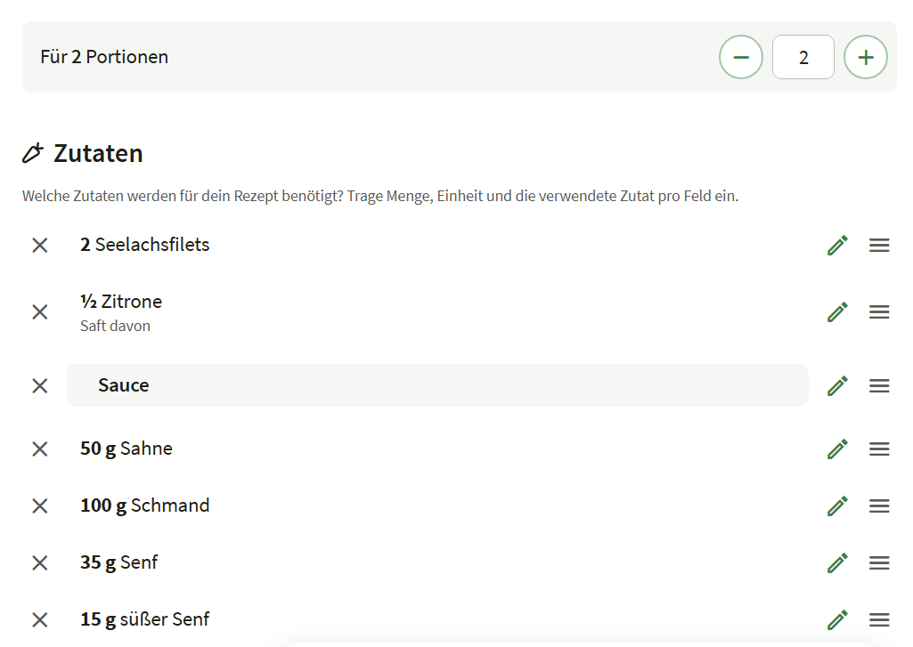

# Erledigt

## PWA/Offline Capability
~~The app should be able to function offline on smartphones. To achieve this, all recipes visible to the user should be saved locally on the smartphone. Recipe images should not be stored on the smartphone. Instead, placeholder images should be displayed. Is this possible only with a Capaticor app, or is it also possible with a PWA? Make a plan.~~

Gelöst (2026-10-02): Direkte Antwort auf die gestellte Frage: nein, kein Capacitor nötig - eine reine PWA reicht vollständig aus. Eine künftige Capacitor-App lädt laut CLAUDE.md ohnehin nur dieselbe ausgelieferte Seite in einer WebView, und moderne Android-/iOS-WebViews unterstützen Service Worker, Cache Storage und IndexedDB genauso wie ein vollwertiger Browser - was hier als normale PWA gebaut wird, funktioniert später in der Capacitor-App automatisch mit. Kein YTAN-Vorbild zum Portieren vorhanden (CLAUDE.md nennt das explizit) - echtes Neuland, komplett clientseitig, keine einzige Backend-Änderung nötig.

**Wichtiger, vorab behobener Fehler**: `loadCurrentUser()` (`helper.js`) hat bisher bei JEDEM Fehlschlag von `GET /auth/me` den Token gelöscht und den Benutzer abgemeldet - auch bei einem reinen Offline-Netzwerkfehler, nicht nur bei einem echten 401. Ohne diese Korrektur hätte sich die App beim ersten Öffnen ohne Netz sofort selbst abgemeldet, noch bevor überhaupt zwischengespeicherte Rezepte angezeigt werden könnten. Jetzt wird der Token nur noch bei einem echten `401` gelöscht; bei jedem anderen Fehler (offline, Timeout) greift ein in `localStorage` zwischengespeicherter letzter `/auth/me`-Stand, sodass `currentUser`/`isOwner()` - und damit z. B. die Bearbeiten-/Löschen-Buttons des Besitzers - auch offline korrekt weiterfunktionieren.

**Drei unabhängige Bausteine**:
1. **App-Shell** (neu `public/sw.js`, reines Vanilla-JS ohne Workbox, passend zum Projekt ohne Build-Schritt): Network-first mit Cache-Fallback für die HTML-Seite selbst sowie alle CSS-/JS-/Bibliotheks-/Icon-Dateien und die statischen Platzhalterbilder - alles unter `/api/v1/` wird bewusst NIE von diesem Service Worker abgefangen oder zwischengespeichert. Ein einziger versionierter Cache-Name (`kochbuch-shell-v1`, von Hand zu erhöhen bei einer Änderung, die alte Einträge verwerfen soll - gleiche "ein Mensch erinnert sich daran"-Philosophie wie die handnummerierten Migrationen). Registrierung über einen relativen Pfad (`./sw.js`, nicht `/sw.js`) in `templates/app.php`, damit eine Unterverzeichnis-Installation weiterhin funktioniert; bewusst ohne `?v=`-Cache-Busting-Parameter, da der Browser selbst periodisch prüft, ob sich der Inhalt von `sw.js` geändert hat.
2. **Rezeptdaten** (neu `public/js/offline-store.js`, IndexedDB statt der Service-Worker-eigenen Cache Storage API - Cache Storage ist über die exakte Request-URL indiziert, eine schlechte Passform für "gib mir Rezept #42 unabhängig vom Weg dorthin" oder "liste alles lokal Verfügbare auf", wofür IndexedDBs `keyPath`/`getAll()` deutlich besser passen): `recipe-detail.js` speichert jedes tatsächlich angesehene Rezept opportunistisch (Fire-and-Forget) beim erfolgreichen Laden - das deckt "idealerweise bereits angesehene Rezepte" komplett kostenlos ab. Zusätzlich ein neuer, explizit vom Nutzer auszulösender "Für Offline-Nutzung synchronisieren"-Button im Nav-Drawer (unter dem bestehenden "Bildschirm wach halten"-Schalter) - blättert serverseitig durch `GET /recipes` (dieselbe sichtbarkeits-gefilterte, ungefilterte Liste wie die normale Rezeptliste, kein Rezept ist nur über einen bestimmten Filter erreichbar) und lädt dann jedes einzelne Rezept per `GET /recipes/{id}` herunter - bewusst eine sichtbare, vom Nutzer ausgelöste Aktion statt eines stillen Hintergrundprozesses, der unbemerkt mobiles Datenvolumen verbrauchen würde (gleiche Überlegung wie beim ebenfalls manuell ausgelösten Chefkoch-Import). Live getestet: 86 echte Rezepte vollständig synchronisiert, Status-Zeile ("86 Rezepte verfügbar seit ...") korrekt aktualisiert.
3. **Bilder werden bewusst NIE zwischengespeichert** (ausdrückliche Anforderung): `hydrateAuthImages()`s einziger Fehlerpfad (vorher: Bild wird einfach kommentarlos aus dem DOM entfernt) zeigt jetzt stattdessen ein neues, generisches Platzhalter-Icon (eine eingebettete Inline-SVG-Daten-URI direkt im JS, kein eigener Netzwerk-Request nötig, funktioniert also garantiert auch bei einem komplett kalten Offline-Start) - gilt einheitlich für jeden Fehlschlag, nicht nur den Offline-Fall (eine strikte Verbesserung gegenüber dem bisherigen kommentarlosen Verschwinden).

Offline-Fallbacks in den bestehenden Ansichten: `recipe-detail.js` fällt bei fehlgeschlagenem `GET /recipes/{id}` auf `OfflineStore.getRecipe()` zurück und zeigt einen Hinweis-Banner ("Offline - zwischengespeicherte Version"); `recipes-list.js` fällt (sowohl im Home-Feed- als auch im gefilterten Such-Modus) auf eine neue `renderOfflineRecipeGrid()` zurück, die alle lokal gespeicherten Rezepte über denselben `recipeGridHtml()`-Helper rendert, mit rein clientseitiger Volltextsuche (Wiederverwendung von `foldSearchText()`) statt der vollen Server-Filterpalette (Schwierigkeitsgrad/Diät/Bewertung/Kategorie bleiben bewusst online-only, als bewusst einfacherer Fallback statt vollständiger Funktionsparität).

**Bewusst außerhalb des Umfangs**: Nur lesender Offline-Betrieb - Rezepte anlegen/bearbeiten/bewerten funktioniert offline nicht (kein Offline-Schreib-Queue/Outbox gebaut); ein Speicherversuch ohne Netz zeigt dank der bereits bestehenden `withBusyButton()`/Fehler-Modal-Behandlung ohnehin schon eine saubere Fehlermeldung, ganz ohne zusätzlichen Aufwand.

Keine Backend-Änderung nötig (`composer test`: weiterhin 233/233 grün, unverändert). Per Playwright verifiziert (echter `page.context().setOffline(true)`, kein Mock): Service Worker installiert und aktiv; ein zuvor angesehenes Rezept rendert offline vollständig aus IndexedDB mit sichtbarem Banner; die Bearbeiten-/Löschen-Buttons des Besitzers bleiben offline sichtbar (bestätigt die `loadCurrentUser()`-Korrektur); ein Rezept mit eigenem Foto zeigt bei fehlgeschlagenem Bild-Fetch korrekt den neuen generischen Platzhalter statt zu verschwinden; die Rezeptliste fällt offline auf die lokal gespeicherten Rezepte zurück, Volltextsuche nach "brot" liefert offline exakt dieselben 21 Treffer wie online; der explizite Sync-Button hat alle 86 echten Rezepte erfolgreich heruntergeladen und in der Status-Zeile vermerkt.

Nachgebessert (2026-10-02): Rückmeldung "Suche funktioniert offline nicht mehr". Mit Playwrights sauberer `setOffline(true)`-Simulation (sofortiger, eindeutiger Verbindungsfehler) ließ sich kein falsches Suchergebnis reproduzieren - der eigentliche Fehler lag in der gefühlten Reaktionszeit: `Kochbuch.get()` versuchte bei jedem einzelnen Tastendruck im Suchfeld zunächst den normalen 15-Sekunden-Timeout aus `api-client.js` abzuwarten, bevor auf die zwischengespeicherten Daten zurückgefallen wurde - auf einem echten Smartphone bedeutet "offline" aber häufig eine instabile/hängende statt einer sauber sofort scheiternden Verbindung (anders als Flugmodus), wodurch sich jede Sucheingabe bis zu 15 Sekunden eingefroren angefühlt haben dürfte, obwohl die Suche am Ende technisch korrekt zurückgefallen wäre. Gezielt mit einer künstlich um 8 Sekunden verzögerten Netzwerk-Route nachgestellt und bestätigt: vorher hätte das volle 15-Sekunden-Timeout abgewartet werden müssen, jetzt fällt die Suche nach genau 5 Sekunden korrekt zurück.

Zwei Korrekturen in `recipes-list.js`/`recipe-detail.js`: (1) neue, kürzere `OFFLINE_FALLBACK_TIMEOUT_MS` (5s, `offline-store.js`) statt des allgemeinen 15s-Standard-Timeouts für genau diese drei zwischenspeicher-gestützten Lesezugriffe (`GET /recipes`, `GET /home`, `GET /recipes/{id}`) - andere, nicht zwischengespeicherte Aktionen (Speichern, Chefkoch-Import usw.) behalten bewusst ihre längeren, z. T. absichtlich großzügigeren Timeouts. (2) Ein zusätzlicher, vorgeschalteter `navigator.onLine`-Schnellcheck: ist der Browser sich sicher, dass gar keine Netzwerkverbindung besteht (z. B. Flugmodus/kein Empfang), wird der ohnehin aussichtslose Netzwerkversuch komplett übersprungen und direkt aus dem lokalen Zwischenspeicher gerendert - `navigator.onLine` ist zwar für ein zuverlässiges "online" nicht vertrauenswürdig (ein Gerät kann sich fälschlich als verbunden melden, obwohl der Server nicht erreichbar ist), aber genau für den hier relevanten, häufigsten Offline-Fall (eindeutig kein Netz) durchaus verlässlich; der Timeout-Mechanismus bleibt als zweite Absicherung für den "fälschlich als online gemeldet"-Fall bestehen. Live verifiziert: mit `navigator.onLine = false` liefert die Suche nach "brot" jetzt in ca. 30ms (statt zuvor möglicherweise bis zu 15 Sekunden) exakt dieselben 21 Treffer.

## Loading Indicator During Longer Processes
~~For example, if the save process takes a while, you don't receive any feedback, and it feels as though you never clicked the Save button at all. You might even click the button again, which apparently triggers the save process once more. The button should be disabled after the first click, and a spinner should be displayed until the save process is complete or a timeout (to be defined in the backend) is reached. Then an error message (modal) must appear and the "Save" button must be reactivated.~~

Gelöst (2026-10-02): Mit dem Nutzer zwei Design-Entscheidungen abgestimmt: (1) ein app-weites, wiederverwendbares Muster statt nur das Rezeptformular zu behandeln, (2) ein fester Timeout-Wert im Code statt einer neuen Admin-Einstellung ("im Backend zu definieren" war im Sinne von "zentral, nicht pro Formular" gemeint, nicht als neue, einstellbare Konfiguration).

**Timeout**: `public/js/api-client.js`s `request()`/`upload()` hängen jetzt einen `AbortController` an jeden `fetch()`-Aufruf (Standard 15s für normale Anfragen, 60s für Uploads, da die eine Datei übertragen statt nur JSON) - ein `AbortError` wird zu einem normalen `{status: 0, data: {code: 'request_timeout', message}}`-Fehler umgewandelt, sodass `translateApiError()` ihn genauso behandelt wie jeden anderen API-Fehler (neuer i18n-Key `error.request_timeout`). Jede Methode (`get`/`post`/`put`/`del`/`upload`) akzeptiert optional einen abweichenden Timeout-Wert für einzelne, bekanntermaßen langsamere Aufrufe - genutzt vom Chefkoch-Importer (`admin-chefkoch-import.js`, 180s: die Liste blättert serverseitig durch das komplette "Mein Kochbuch" in 12er-Schritten, der Import lädt pro ausgewähltem Rezept ein Bild herunter) und dem JSON-Import (`recipe-import-json.js`, 120s: lädt pro Datei ein Bild herunter) - ein einzelner globaler Timeout hätte diese beiden, absichtlich lang laufenden Massenoperationen fälschlich abgebrochen.

**Wiederverwendbarer Button-Helper**: Neue Funktion `withBusyButton(button, action)` (`public/js/helper.js`) - deaktiviert den Button, zeigt einen Spinner, ruft `action()` auf (eine Funktion, kein bereits gestartetes Promise, damit der Button schon vor dem eigentlichen Request deaktiviert ist und ein zweiter Klick währenddessen wirkungslos bleibt) und stellt Button-Zustand/-Inhalt in jedem Fall wieder her, sobald `action()` abgeschlossen ist. Ein Fehlschlag (inklusive Timeout, der hier wie jeder andere Fehler ankommt) öffnet ein neues, blockierendes Fehler-Modal (`showErrorDialog()`, `public/js/error-dialog.js`, gleiche Bootstrap-Modal-Bauweise wie das bestehende `showConfirmDialog()` aus `confirm-dialog.js`, nur mit einem einzelnen Schließen-Button statt Bestätigen/Abbrechen) statt des sonst üblichen Toasts - bewusst, da es hier um eine Aktion geht, auf die aktiv gewartet wird und die deshalb nicht einfach an einem vorbeiscrollenden Toast vorbeigehen darf.

Eingebunden überall, wo ein echter Speichervorgang (oder eine andere potenziell länger laufende Aktion) bisher gar keine oder nur eine unvollständige Rückmeldung gab: Rezeptformular (Anlegen/Bearbeiten, der ursprüngliche Auslöser), Profil (Profildaten speichern, Passwort ändern), neue Kategorie anlegen (eigene Seite und die Inline-Variante in der Rezeptdetailansicht), Bring!-Export-Button, Admin-Einstellungen, Admin-Platzhalterbilder, Admin-Benutzerformular, Admin-Übersetzungen ("Alle speichern" - mit eigenem Kniff: die Schlüsselabweichungs-Nachfrage-und-Retry-Logik ruft jetzt eine separate `performTranslationSave()` rekursiv auf, da ein erneuter Aufruf von `withBusyButton()` auf demselben, noch deaktivierten Button sonst stillschweigend nichts täte), und der Chefkoch-Importer (beide Buttons). Rein clientseitig verbliebene Sofort-Validierungen (Profil: Passwörter stimmen nicht überein; Chefkoch/JSON-Import: keine Auswahl getroffen) bleiben bewusst als einfache Inline-Meldung bzw. Toast bestehen, ohne Netzwerk-Roundtrip ist dafür kein Spinner/Modal nötig. Foto- und JSON-Import (`recipe-import-photo.js`/`recipe-import-json.js`) hatten bereits eigene, ausführlichere Fortschrittsanzeigen - dort wurde nur die bisher fehlende Button-Deaktivierung ergänzt (Schutz vor Doppel-Klick), ihre bestehende Anzeige/Fehlerbehandlung blieb unangetastet. Bewusst ausgenommen: Login/Admin-Login (eigene, passende Inline-Fehleranzeige direkt unter den Feldern, eine Modal-Umstellung wäre hier eine Verschlechterung) sowie kleine, so gut wie augenblickliche Admin-Inline-Aktionen (Tag pro Zeile hinzufügen, einzelne Benutzer-Sofortaktionen wie Deaktivieren/Passwort setzen).

Keine Backend-Änderung nötig (`composer test`: weiterhin 230/230 grün, unverändert). Per Playwright verifiziert: ein `AbortController` mit 1ms-Timeout löst zuverlässig den neuen `request_timeout`-Fehler aus (korrekt über `translateApiError()` übersetzt); eine simulierte fehlschlagende Aktion zeigt das Fehler-Modal und stellt den Button danach korrekt wieder her; ein echtes Speichern über das Rezeptformular deaktiviert den Button, zeigt den Spinner und navigiert bei Erfolg weiter; ein echtes Speichern über die Admin-Einstellungsseite stellt den Button nach erfolgreichem Speichern ebenfalls korrekt wieder her (Testdaten anschließend bereinigt).

## Search Input
~~When a search term is entered into the search field, the results list updates immediately, and the input field briefly loses focus, causing individual letters to be missed. One possible solution would be to delay the update of the results list for x milliseconds if no letters are entered. Please suggest other solutions, if you know of any.~~

Gelöst (2026-10-02): Es gab bereits ein 350ms-Debounce UND eine Fokus-/Cursorposition-Rettung um `renderRecipesList()`s `app.innerHTML`-Ersetzung herum (für genau dieses Problem schon einmal eingebaut) - das Flackern kam vom Rettungsmechanismus selbst: jede debounce-ausgelöste Aktualisierung lief über `Router.navigate()` und damit durch `renderRecipesList()`, das bei JEDER Änderung das komplette Filter-Grundgerüst per `app.innerHTML = recipesListSkeleton(...)` neu aufbaut - inklusive Zerstören und Neuerzeugen von `#filterQ` selbst. Selbst mit sofortigem `focus()`+`setSelectionRange()` danach kann das kurze Entfernen eines fokussierten Eingabefelds auf dem Smartphone die virtuelle Tastatur aufflackern lassen oder den IME-Kompositionsstatus zurücksetzen und so den nächsten Tastendruck verschlucken - ein rein JS-seitiges Nachstellen des Fokus kann das nicht zuverlässig verhindern.

Nach Rückfrage (zwei Lösungsvorschläge vorgelegt: Debounce-Zeit einfach erhöhen vs. die Ursache beheben) hat sich der Nutzer für Letzteres entschieden: Die Debounce-Aktualisierung des Suchfelds (`wireRecipesListFilters()` in `public/js/views/recipes-list.js`) läuft jetzt über eine neue Funktion `updateSearchResultsInPlace()` statt über `navigateWithFilters()`/`Router.navigate()` - sie aktualisiert die Adresszeile still per `history.replaceState()` (löst bewusst KEIN `hashchange` aus, der Router läuft also nicht erneut) und rendert ausschließlich `#recipeResults`/`#recipePagination` neu; `#filterQ` wird dabei nie angefasst, es gibt also gar nichts, das den Fokus verlieren könnte. `replaceState()` statt `pushState()` vermeidet außerdem, dass jeder einzelne Tastendruck einen eigenen Browser-Verlaufseintrag erzeugt (ein einziges "Zurück" springt jetzt direkt vor die gesamte Sucheingabe zurück, nicht Zeichen für Zeichen). Jeder andere Filter (Checkboxen, Schwierigkeitsgrad, Bewertung, Kategorie) nutzt weiterhin unverändert den vollen `Router.navigate()`-Weg - eine gemeinsame neue `buildFilterQuery()`-Hilfsfunktion stellt sicher, dass beide Pfade exakt dieselbe Query-Objektform erzeugen. Die bestehende Fokus-Rettung in `renderRecipesList()` bleibt als Sicherheitsnetz für alle verbleibenden Vollständig-Neuaufbau-Pfade erhalten, wird aber vom heißen Tastatur-Pfad nicht mehr durchlaufen.

Rein frontend-seitige Änderung ohne Backend-Berührung (`composer test`: weiterhin 230/230 grün, unverändert). Per Playwright verifiziert (Freitext-Tipp-Simulation mit `pressSequentially`, Zeichen für Zeichen wie eine echte Tastatureingabe): das `#filterQ`-DOM-Element bleibt nachweislich dasselbe Objekt (per Marker-Attribut geprüft) und behält während der gesamten Eingabe den Fokus, die Ergebnisliste aktualisiert sich korrekt ("21 Rezepte gefunden" für "brot"), ein einzelner Druck auf "Zurück" springt direkt vor die komplette Sucheingabe zurück statt zeichenweise, und andere Filter (z.B. "vegan") navigieren weiterhin normal per vollem Seitenwechsel.

## Disabling the Screen Lock on Smartphones
~~Users should have the option in their settings to prevent the screen from locking after a certain amount of time while viewing the details of a recipe (and only then) on their smartphone. This option should be enabled by default for all users.~~

Gelöst (2026-10-02): Neuer Schalter "Bildschirm in der Rezeptansicht wach halten" im Nav-Drawer (`templates/app.php`, unter den Schriftgrößen-Reglern), als weiteres Feld im bestehenden, cookiebasierten `settings.js`-Mechanismus (`loadSettings()`/`saveSettings()`, derselbe Speicherort wie Theme/Sprache/Schriftgröße) - Default `true`, also für jeden Benutzer von Anfang an aktiv, auch ohne je das Einstellungsmenü geöffnet zu haben. Die eigentliche Bildschirm-Wachhaltung läuft über die native [Screen Wake Lock API](`navigator.wakeLock`) ausschließlich in `recipe-detail.js` - bewusst nicht global, sondern exakt auf die Detailansicht beschränkt, wie gefordert: `acquireWakeLockIfEnabled()` wird am Ende von `renderRecipeDetail()` aufgerufen, ein globaler `hashchange`-Listener released die Sperre, sobald der Hash nicht mehr auf eine `#/recipes/{id}`-Route zeigt (per `\d+`-Regex, damit `/recipes/new` & Co. nicht fälschlich als Detailseite zählen). Ein gehaltenes Wake Lock wird vom Browser automatisch freigegeben, sobald das Dokument unsichtbar wird (App-Wechsel, Bildschirm aus) - ein `visibilitychange`-Listener fordert es beim Zurückkehren erneut an, falls weiterhin eine Rezept-Detailseite aktiv ist, sonst würde die Funktion nach dem ersten App-Wechsel beim Kochen stillschweigend aufhören zu wirken. `'wakeLock' in navigator` schützt Browser ohne Unterstützung (z.B. ältere Safari-Versionen) - das Rezept bleibt dort vollständig nutzbar, nur ohne wach gehaltenen Bildschirm. Der Schalter im Drawer schreibt die Einstellung sofort fest und wirkt bei aktiver Detailansicht sofort (an-/abschalten ohne Neuladen). Rein frontend-seitige Änderung ohne Backend-Berührung (`composer test`: weiterhin 230/230 grün, unverändert). Per Playwright verifiziert: Schalter im Drawer ist standardmäßig aktiv; auf der Detailansicht hält `navigator.wakeLock.request('screen')` tatsächlich ein aktives, nicht freigegebenes Lock; eine Navigation zurück zur Rezeptliste (per `Router.navigate()`, also wie ein echter Seitenwechsel innerhalb der SPA) setzt es korrekt wieder auf freigegeben zurück.

## Displaying Star Ratings
~~Next to the stars in the rating, the average score should be displayed to one decimal place, with the number of ratings shown in parentheses; for example, "4.7 (5)" for an average rating of 4.7 based on 5 ratings.~~

Gelöst (2026-10-02): `starRatingHtml()` (`public/js/helper.js`) hängt jetzt direkt hinter den Stern-Icons einen Text `"{Durchschnitt} ({Anzahl})"` an (z.B. "4.7 (5)", `toFixed(1)` für die feste Nachkommastelle) - da dieser Helper gemeinsam von `recipeCardHtml()` und der Detailansicht genutzt wird, erscheint der Text überall dort, wo auch die Sterne selbst stehen, ohne zwei Stellen separat pflegen zu müssen. Die Detailansicht (`recipe-detail.js`s `recipeRatingHtml()`) hatte bisher eine eigene zusätzliche Zeile "{Anzahl} Bewertungen" darunter - die wurde entfernt, da sie die jetzt direkt neben den Sternen sichtbare Zahl nur verdoppelt hätte; der dafür nicht mehr benötigte i18n-Schlüssel `recipe.rating.count` wurde aus `de.json`/`en.json` entfernt. Neue CSS-Regel `.recipe-rating-value` (gedämpfte Textfarbe, passend zum bestehenden `.recipe-rating-star`-Grauton) in `style.css`. Rein frontend-seitige Änderung ohne Backend-Berührung (`composer test`: weiterhin 230/230 grün, unverändert). Per Playwright verifiziert: Rezeptkarte und Detailansicht zeigen beide korrekt "5.0 (1)" neben den fünf goldenen Sternen, keine doppelte Anzahl-Anzeige mehr in der Detailansicht.

## Displaying the Number of Search Results
~~The number of search results should be displayed above the results list.~~

Gelöst (2026-10-02): Neue Zeile `#recipeResultsCount` (`public/js/views/recipes-list.js`) direkt über dem Rezept-Grid, befüllt mit `recipe.results_count` ("{count} Rezepte gefunden") sobald `renderFilteredRecipeList()` ein Ergebnis mit `total > 0` zurückbekommt. Bei null Treffern bleibt die Zeile bewusst leer statt "0 Rezepte gefunden" anzuzeigen - das bestehende Empty-State-Icon samt "Keine Rezepte gefunden."-Text (`recipeGridHtml()`) deckt diesen Fall bereits ab, eine zusätzliche Zeile hätte sich nur wiederholt. Nur im klassischen gefilterten Listenmodus sichtbar, nicht im kuratierten Home-Feed ("Neueste"/"Zufällige Rezepte") - dort wird nicht aktiv gesucht, der Container bleibt dort schlicht ungefüllt. Rein frontend-seitige Änderung ohne Backend-Berührung (`composer test`: weiterhin 230/230 grün, unverändert). Per Playwright verifiziert: Suche nach "brot" zeigt "21 Rezepte gefunden" über dem Grid, eine Suche ohne Treffer zeigt korrekt nur die bestehende Empty-State-Meldung ohne zusätzliche "0"-Zeile.

## Filter for Custom Recipes
~~The filter for custom recipes is a pill switch, while other filters—such as those for vegan, vegetarian, and pescatarian—are checkboxes. A checkbox should be used instead of the pill switch.~~

Gelöst (2026-10-02): `recipeMineOnlyPillSwitchHtml()` (`public/js/views/recipes-list.js`) baute den "Nur meine"-Filter als eigenes `form-check form-switch`-Markup statt des bestehenden, gemeinsam genutzten `filterCheckbox()`-Helpers, den vegan/vegetarisch/pescetarisch bereits verwenden - daher die abweichende Optik. Funktion entfernt, Aufruf durch `filterCheckbox('filterMine', 'recipe.mine_only', query.mine)` ersetzt; id (`filterMine`) und Verhalten (gelesen über `.checked` in `navigateWithFilters()`) blieben unverändert, nur das Markup wechselte vom Schalter zur Checkbox. Die zugehörige, sonst ungenutzte CSS-Klasse `.mine-only-switch` hatte keine eigene Regel in `style.css` und wurde mit entfernt. Rein frontend-seitige Änderung ohne Backend-Berührung (`composer test`: weiterhin 230/230 grün, unverändert). Per Playwright verifiziert: "Nur meine" erscheint jetzt als Checkbox im selben Stil wie die Diät-Filter, Anklicken setzt weiterhin korrekt `?mine=1` in der URL und filtert die Liste.

## Rating Filter
~~An additional search filter is needed to narrow down the search results to recipes that have a minimum average number of stars.~~

Gelöst (2026-10-02): Baut auf dem Bewertungssystem (siehe Eintrag unten) auf. Neuer Filter `min_rating` (1-5) in `RecipeRepository::search()` - eine korrelierte Subquery-Bedingung `(SELECT AVG(rating) FROM recipe_rating WHERE recipe_id = r.id) >= ?`, dieselbe Grundform wie die bereits vorhandene `average_rating`-Anzeige-Subquery. Ein Rezept ganz ohne Bewertungen hat dort `AVG() = NULL`, und `NULL >= ?` ist in SQL nie wahr - es wird also automatisch ausgeschlossen, ohne eine gesonderte "hat überhaupt eine Bewertung"-Prüfung. `RecipeController::index()` validiert den Query-Parameter lose (nur 1-5 wird übernommen, alles andere - inklusive komplett fehlend - wird stillschweigend ignoriert statt einen Fehler zu werfen), passend zur Toleranz der übrigen Such-Filter dieses Endpunkts.

Frontend: neues `<select>` "Bewertung" (`public/js/views/recipes-list.js`) direkt neben dem bestehenden Schwierigkeitsgrad-Filter, mit den Optionen "ab 5 Sternen" bis "ab 1 Stern". Wie jeder andere aktive Filter schaltet ein gesetzter Mindest-Stern-Wert den "Home-Modus" (kuratierte Startseite mit "Neueste"/"Zufällige Rezepte") aus und wechselt in die klassische gefilterte/paginierte Listenansicht (`isHomeModeActive()` erweitert).

2 neue PHPUnit-Tests (`RecipeControllerTest::testSearchFiltersByMinimumAverageRating` - gut bewertetes Rezept erscheint, schlecht bewertetes und unbewertetes Rezept werden korrekt ausgeschlossen; `testSearchIgnoresAnInvalidMinRating`) decken das ab (`composer test`: 230/230 grün). Per Playwright gegen die echte Dev-Datenbank verifiziert: Filter "ab 5 Sternen" ausgewählt, Ergebnisliste zeigt korrekt nur die beiden tatsächlich mit 5 Sternen bewerteten Rezepte, URL/Filterzustand bleibt nach Auswahl erhalten.

## Bewertungssystem für Rezepte
~~Die App benötigt ein Bewertungssystem für die Rezepte. Jeder angemeldete Benutzer kann jedes für ihn sichtbares Rezept auf einer Skala von 1 bis 5 Sternen bewerten. In der Übersicht der Rezepte und in der Detailansicht wird der Durchschnitt der Sternebewertung angezeigt. In der Detailansicht kann die Bewertung vorgenommen werden.~~

Gelöst (2026-10-01): Neue Tabelle `recipe_rating` (Migration `015_create_recipe_rating.sql`) mit zusammengesetztem Primärschlüssel `(recipe_id, user_id)` - garantiert genau eine Zeile pro Benutzer und Rezept, sodass ein erneutes Bewerten ein reiner Upsert ist (`RecipeRepository::rate()`, `INSERT ... ON DUPLICATE KEY UPDATE`). Kein bestehendes "eine Zeile pro Benutzer+Rezept"-Muster im Projekt zum Kopieren (`recipe_tag`/`category_recipe` sind reine m:n-Tabellen ohne Besitzer-Spalte) - echtes Neuland. `average_rating`/`rating_count` werden als korrelierte Subquery-Spalten (Muster: `CategoryRepository::listForUser()`s `recipe_count`-Subquery) an jede rezeptzeilen-liefernde Abfrage angehängt (`find()`, `search()`, `homeFeed()`, `findMany()`), sodass sowohl die Übersicht als auch die Detailansicht den aktuellen Durchschnitt sehen, ohne separate Zusatzabfragen; `null`/`0` für ein noch unbewertetes Rezept statt eines SQL-Fehlers. Neuer Endpunkt `PUT /api/v1/recipes/{id}/rating` (`RecipeController::rate()`) kombiniert `requireAuthUser()` (angemeldet) mit dem bestehenden privaten `findVisible()`-Sichtbarkeits-Gate (sichtbar) - bewusst **ohne** `assertOwnerOrAdmin()`, da jeder angemeldete Nutzer bewerten darf, nicht nur der Besitzer (der Besitzer darf auch sein eigenes Rezept bewerten); das ist die erste mutierende Methode dieses Controllers, die nicht besitzgebunden ist. `show()` liefert zusätzlich `my_rating` (die eigene Bewertung des aktuell angemeldeten Betrachters, `null` wenn nicht angemeldet oder noch nicht bewertet).

Frontend: `public/js/helper.js`s neue `starRatingHtml()` (volle/halbe/leere Sterne via Bootstrap Icons `bi-star`/`bi-star-half`/`bi-star-fill`, auf die nächsten 0,5 gerundet - mit dem Nutzer abgestimmt: 3,3 rundet auf 3,5, nicht ab auf 3,0) ist in `recipeCardHtml()` eingebunden und wirkt dadurch automatisch in Rezeptliste, Home-Feed und Kategorien-Ansicht (alle drei nutzen dieselbe Helper-Funktion). Die Detailansicht (`recipe-detail.js`) zeigt zusätzlich einen anklickbaren 1-5-Sterne-"Deine Bewertung"-Picker (nur für angemeldete Nutzer sichtbar) direkt unter der Badges-Zeile - eigene CSS-Klassen (`recipe-rating-star`, `rating-picker-star`) statt Wiederverwendung des bestehenden, semantisch anderen `bi-star`/`bi-star-fill`-Toggles für das Standardbild (binärer Schalter, nicht 1-5-Skala), aber mit derselben "gefüllt = gold"-Farbkonvention. Klick auf einen Stern ruft `PUT .../rating` auf und lädt die Detailseite per `renderRecipeDetail()` neu, gleiches Muster wie beim Setzen des Standardbilds.

11 neue PHPUnit-Tests (`RecipeControllerTest`: Durchschnitt/Anzahl vor jeder Bewertung, nach zwei unterschiedlichen Bewertungen, erneutes Bewerten aktualisiert statt eine zweite Zeile anzulegen, ungültige Werte außerhalb 1-5 werden abgelehnt, fehlende Anmeldung, privates Rezept ohne Sichtrecht) decken das ab (`composer test`: 228/228 grün). Per Playwright gegen die echte Dev-Datenbank verifiziert (Testbewertung danach wieder gelöscht, um keine echten Nutzerdaten zu verfälschen): Sterne-Picker in der Detailansicht klicken, Durchschnitt und "Deine Bewertung" aktualisieren sich sofort korrekt (4 von 5 Sternen gefüllt), dieselbe Bewertung erscheint in der Rezeptkarte der Übersicht/Suche.

Nachgebessert (2026-10-02): Es gab keine Möglichkeit, eine einmal abgegebene Bewertung wieder zu entfernen - nur ändern. Neuer Endpunkt `DELETE /api/v1/recipes/{id}/rating` (`RecipeController::deleteRating()`, dieselbe `requireAuthUser()` + `findVisible()`-Gate wie `rate()`) und `RecipeRepository::removeRating()` (einfaches `DELETE`, kein Fehler falls noch gar keine Bewertung existierte - gleiche Toleranz wie bei anderen idempotenten Lösch-Operationen im Projekt). In der Detailansicht erscheint neben dem Sterne-Picker ein schlichter "Bewertung entfernen"-Link, aber nur solange `my_rating` tatsächlich gesetzt ist - kein Link, wenn ohnehin noch nichts zu entfernen wäre. 3 neue PHPUnit-Tests (Entfernen senkt Durchschnitt/Anzahl korrekt, Entfernen einer nie vorhandenen Bewertung ist ein No-op statt eines Fehlers, fehlende Anmeldung) decken das ab (`composer test`: 233/233 grün). Per Playwright verifiziert: Bewertung abgeben lässt den "Entfernen"-Link erscheinen, Klick darauf setzt Durchschnitt/Sterne-Picker korrekt zurück und lässt den Link wieder verschwinden.

## Import aus Kochbuch von Chefkoch.de
~~Es gab bereits einen einmaligen Import des persönlichen Kochbuchs aus Chefkoch.de. Dieser war jedoch nicht vollständig. Baue einen Importer für Chefkoch.de, der über den Admin-Bereich erreichbar ist. Greife dabei auf deine Erfahrungen aus dem ersten Import zurück, falls diese noch verfügbar sind. Der Importer soll den Benutzernamen und das Kennwort für Chefkoch abfragen, aber nicht dauerhaft in der Datenbank speichern. Der Importer soll bereits importierte Rezepte erkennen und diese nur auf einzelne Nachfrage importieren.~~

Gelöst (2026-09-30): Neue Admin-Seite `/admin/chefkoch-import` (`templates/admin-chefkoch-import.php`, `public/js/admin-chefkoch-import.js`, neuer Sidebar-Eintrag in `admin-shell-header.php`), genau nach dem bestehenden `admin-tags.php`-Muster aufgebaut. Backend: `src/Service/ChefkochImportService.php` (neu) kapselt sämtliche Chefkoch-spezifische HTTP-Kommunikation als injizierbarer curl-Wrapper (gleiches Muster wie `BringService`/`VisionOcrService`, damit die Tests nie echte Netzwerk-Requests auslösen), `src/Http/Controllers/ChefkochImportController.php` (neu, `requireAdmin()`-geschützt) mit zwei Endpunkten: `POST /api/v1/admin/chefkoch-import/list` (listet die persönliche Chefkoch-Sammlung und markiert per `RecipeRepository::existingSourceUrls()` bereits importierte Rezepte anhand ihrer `source_url`) und `POST /api/v1/admin/chefkoch-import/import` (importiert nur die vom Admin ausgewählte Teilmenge, ein try/catch pro Rezept nach dem Vorbild von `RecipeController::importJson()`, damit ein einzelner Fehlschlag nie den ganzen Batch abbricht). `RecipeController::validate()` wurde dafür in eine gemeinsame neue Klasse `src/Service/RecipeDataValidator.php` ausgelagert (vorher eine private Methode auf `RecipeController`, jetzt von beiden Controllern nutzbar), rein mechanische Verschiebung ohne Verhaltensänderung.

Live während der Planung verifiziert: echte chefkoch.de-Rezeptseiten enthalten vollständiges schema.org-Recipe-JSON-LD in exakt der Form, die der bestehende `SchemaOrgRecipeParser`/`IngredientLineParser` (aus dem JSON-LD-Import-Feature) bereits erwartet - bis auf `image`/`author`, die dort als reine `{"@id": "..."}`-Verweise auf Geschwister-Knoten im selben `@graph`-Array vorliegen statt als Inline-Werte; `ChefkochImportService::resolveGraphReferences()` löst das vor der Übergabe an den unverändert bleibenden, generischen Parser auf. Eigene, nicht mehr im Repo vorhandene Rezepte (nur für den Eigentümer sichtbar) fallen auf die interne, dokumentierte `v2`-API zurück (`GET /v2/cookbooks/private-recipes/{id}`), analog zum ersten, inzwischen gelöschten Import-Lauf (siehe der jetzt archivierte vorherige Eintrag unten). Anmeldedaten (ursprünglich Benutzername/Passwort oder alternativ ein eingefügtes API-Token, seit der Korrektur unten nur noch Letzteres) werden ausschließlich im Request-Body der beiden Endpunkte für genau diesen einen Aufruf verwendet, nirgends persistiert - weder in der Datenbank noch in einer PHP-Session, im Frontend nur in einer Modul-Variablen für die Dauer des Seitenaufrufs.

**Ursprüngliche, inzwischen durch die Korrektur unten überholte Einschränkung**: Chefkochs Login war beim ursprünglichen einmaligen Import per CAPTCHA blockiert - ein Mensch musste sich manuell im Browser anmelden, das Skript hat nur die entstandene Session weiterverwendet (siehe Eintrag unten). `ChefkochImportService::login()`s konkreter Endpunkt/Request-Aufbau war deshalb zunächst nicht live verifiziert und warf bei einem erkennbaren CAPTCHA/Fehlschlag einen eigenen Fehlercode; das Frontend bot als Ausweichoption zusätzlich ein Feld zum Einfügen eines API-Tokens. Diese Vermutung hat sich bestätigt, siehe die Korrektur unten: `login()` wurde komplett entfernt, da sich in der Praxis nur der Token-Weg als nötig erwiesen hat.

18 neue PHPUnit-Tests (`ChefkochImportControllerTest`: Admin-/Auth-Pflicht, Dedup-Markierung, CAPTCHA-Fehlercode, erfolgreicher Import inkl. Bild, Einzel-Fehler ohne Abbruch des Batches; `RecipeControllerTest::testExistingSourceUrlsReturnsOnlyTheMatchingSubset`; ein neuer `SchemaOrgRecipeParserTest`-Fall mit den echten, live erfassten Feldformen einer realen chefkoch.de-Seite) decken das ab (`composer test`: 208/208 grün). Per Playwright verifiziert: neuer Sidebar-Eintrag, Login-Formular inkl. Umschalten auf das Token-Feld rendert korrekt (ein tatsächliches Absenden gegen die echte Chefkoch-Seite wurde bewusst nicht ausgelöst, siehe Einschränkung oben).

Nachgebessert (2026-09-30): Beim ersten echten Test gegen den eigenen Chefkoch-Account zeigten sich mehrere Abweichungen zwischen den zunächst vermuteten API-Formen und der Realität, alle vom Nutzer live aus den Browser-DevTools zurückgemeldet und daraufhin behoben: (1) Die Owner-ID für die `user-{id}`-Pfadsegmente wurde zunächst über ein eigenes Formularfeld abgefragt - tatsächlich steckt sie bereits im Token selbst (`{ownerId}-{rest}`); `ChefkochImportController::resolveOwnerId()` extrahiert sie jetzt durch Abschneiden vor dem ersten `-`, das Formularfeld entfiel ersatzlos. (2) Der Listen-Endpunkt ist nicht `/private-recipes` (existiert nicht) und auch keine `/collections`-Route, sondern das paginierte `GET /v2/cookbooks/user-{id}/recipes?offset=&limit=12&order=0&orderBy=2` - `listCookbook()` blättert jetzt seitenweise, bis eine Antwort kürzer als `LIST_PAGE_SIZE` (12, der UI-eigene Standardwert) ist. (3) Jeder Treffer der Liste steckt eine Ebene tiefer als erwartet (`{recipe: {id, title, siteUrl, ...}, note, ...}` statt der Felder direkt auf oberster Ebene) - ohne dieses Auspacken meldete das Tool fälschlich "0 Rezepte gefunden", obwohl die Anfrage selbst erfolgreich war. Nach diesen drei Korrekturen listete das Tool erfolgreich alle 208 Rezepte des Testkontos über die dafür nötigen ~18 Folgeseiten.

Zwei weitere, vom Nutzer nach einem erfolgreichen Test-Import (je ein Rezept im alten Freitext- und im neuen strukturierten Format) gewünschte Ergänzungen: Jedes über dieses Tool importierte Rezept erhält jetzt automatisch das Tag "chefkoch-import" (zusätzlich zu einem eventuellen Sammlungs-Tag, `ChefkochImportController::import()`), damit Importe auch unabhängig vom `source_url`-Abgleich wiedererkennbar bleiben. Außerdem erkennt `IngredientLineParser::parse()` (gemeinsam genutzt von diesem Importer, dem Foto-OCR-Import und dem schema.org-JSON-LD-Import) jetzt einfache Brüche ("1/2", "1/4", "3/4" - werden zu 0.5/0.25/0.75 - sowie gemischte Zahlen wie "1 1/2" zu 1.5) als numerische Mengenangabe, statt sie unverständlich an den Namen zu hängen.

Insgesamt jetzt 23 zugehörige PHPUnit-Tests (Pagination über mehrere Seiten, Owner-ID-Ableitung aus dem Token, Bruch-/gemischte-Zahl-Parsing, automatisches Import-Tag mit und ohne Sammlung kamen hinzu) (`composer test`: 217/217 grün). Der komplette Ablauf - Anmeldung per eingefügtem API-Token, Auflisten des echten, 208 Rezepte umfassenden Kochbuchs, Auswahl einzelner Rezepte, Import inkl. Bild - wurde vom Nutzer erfolgreich gegen den eigenen, echten Chefkoch-Account getestet, sowohl für das alte Freitext- als auch das neue strukturierte Datenformat.

Nachgebessert (2026-09-30): Nachdem sich in der Praxis erwiesen hat, dass ausschließlich der API-Token-Weg benötigt wird (Benutzername/Passwort wurde nie tatsächlich verwendet), wurde die Benutzername/Passwort-Eingabe ersatzlos entfernt - `ChefkochImportService::login()` und die zugehörigen Fehlercodes (`chefkoch.invalid_credentials`, `chefkoch.captcha_or_login_failed`, `chefkoch.login_response_unrecognized`) existieren nicht mehr, `ChefkochImportController::resolveToken()` verlangt jetzt direkt ein Token (`chefkoch.token_required` statt `chefkoch.credentials_required`, falls keines angegeben wurde). Das Formular (`admin-chefkoch-import.js`) zeigt nur noch das eine Token-Feld, ohne Umschalt-Link auf ein vormals separates "oder Passwort"-Feld. Der Hilfetext daneben (`admin.chefkoch_import.token_help`) wurde zu einer ausführlichen Schritt-für-Schritt-Anleitung ausgebaut (anmelden, Entwicklertools öffnen, zum Network-Tab wechseln, zu "Mein Kochbuch" navigieren, eine Anfrage an api.chefkoch.de suchen, den `x-chefkoch-api-token`-Header kopieren), statt nur ein knapper CAPTCHA-Hinweis zu sein - der Token ist jetzt der einzige Weg, nicht mehr nur ein Ausweg. Ein PHPUnit-Test wurde entsprechend angepasst/entfernt (`composer test`: 216/216 grün). Per Playwright verifiziert: `/admin/chefkoch-import` zeigt nur noch das Token-Feld mit der ausführlichen Anleitung, keine Benutzername-/Passwort-Felder mehr.

Nachgebessert (2026-09-30): Importierte Titel enden auf Chefkoch (und gelegentlich auch bei generischen JSON-LD-Quellen) sehr häufig auf " von <Benutzername>" - Chefkoch-Nutzer signieren ihre eigenen Rezepte auf diese Weise direkt im Titeltext selbst (live verifiziert am echten Testfall "Brokkoli indisch von harrdie", siehe `SchemaOrgRecipeParserTest`). Neue, gemeinsam genutzte Klasse `src/Service/RecipeTitleAuthorSplitter.php` (`split(string $name, ?string $description): array{name, description}`) erkennt dieses am Titelende stehende " von <Name>" (per Gier-Match wird nur das *letzte* Vorkommen abgetrennt, damit ein Titel wie "Consommé von Tomate von maxmuster123" korrekt zu "Consommé von Tomate" + Notiz wird statt alles abzuschneiden), entfernt es aus dem Namen und hängt statt dessen eine Zeile "Rezept von <Name>" an die Beschreibung an (getrennt durch eine Leerzeile, falls bereits eine Beschreibung vorhanden war). Eingebunden an beiden Stellen, die einen finalen Rezeptnamen erzeugen: `SchemaOrgRecipeParser::parse()` (wirkt dadurch automatisch auch auf den bestehenden generischen JSON-LD-Import, `RecipeController::importJson()`, sowie `ChefkochImportService::fetchPublicRecipe()`, das denselben Parser nutzt) und `ChefkochImportService::fetchPrivateRecipe()` (dessen Titel/Untertitel nicht über den JSON-LD-Parser laufen). **Bekannte, akzeptierte Einschränkung**: Die Erkennung ist eine reine Textheuristik ohne Abgleich gegen einen tatsächlich bekannten Autorennamen - ein Titel, der selbst schon (ohne Autoren-Suffix) auf "von <Zutat>" endet (z.B. ein hypothetisches "Consommé von Tomate" ganz ohne Signatur), würde fälschlich als Autoren-Suffix behandelt; laut Rückmeldung des Nutzers ist das seltener als der verlässlich erkannte Signatur-Fall und wird bewusst in Kauf genommen. Vier neue Unit-Tests (`RecipeTitleAuthorSplitterTest`) decken Abtrennen, Anhängen an eine vorhandene Beschreibung, das Nur-letztes-Vorkommen-Verhalten und den Fall ganz ohne "von" ab; der bestehende `SchemaOrgRecipeParserTest`-Realdaten-Fall wurde entsprechend angepasst (`composer test`: 220/220 grün).

Nachgebessert (2026-10-01): Der Nutzer meldete eine unbrauchbare Beschreibung nach einem echten Import (Rezept "Metaxasauce", https://www.chefkoch.de/rezepte/2862601438374069/Metaxasauce.html): "Metaxasauce - besser als beim Griechen. Über 2 Bewertungen und für mega befunden. Mit ► Portionsrechner ► Kochbuch ► Video-Tipps!". Ursache: `ChefkochImportService::fetchPublicRecipe()` übernahm das `description`-Feld aus der schema.org-JSON-LD der öffentlichen Rezeptseite ungeprüft über `SchemaOrgRecipeParser::parse()` - dieses Feld trägt auf jeder einzelnen chefkoch.de-Seite denselben automatisch generierten SEO-Textbaustein (Bewertungsanzahl plus "Mit ► Portionsrechner ► Kochbuch ► Video-Tipps!"), nie einen echten, vom Autor verfassten Untertitel. Der private-Rezept-API-Pfad (`fetchPrivateRecipe()`) war davon nie betroffen, da der dort genutzte `subtitle`-Wert direkt und unverändert aus der echten `v2`-API kommt, nicht aus gescraptem JSON-LD. Nach Rückfrage entschied sich der Nutzer für die einfachste Lösung statt eines fragilen Erkennungsmusters: `fetchPublicRecipe()` entfernt das `description`-Feld jetzt grundsätzlich aus dem flachgeklopften Recipe-Knoten, bevor er an den unverändert bleibenden, generischen `SchemaOrgRecipeParser` übergeben wird (`unset($flattened['description'])`) - der Parser selbst bleibt unangetastet, da er auch vom unabhängigen generischen JSON-LD-Import (`RecipeController::importJson()`) genutzt wird, wo ein echtes `description`-Feld legitime Daten sind. Ein über den öffentlichen Seiten-Pfad importiertes Rezept hat die Beschreibung dadurch standardmäßig leer (`null`), außer `RecipeTitleAuthorSplitter` füllt sie wegen eines "von <Name>"-Titelsuffixes - diese Funktionalität bleibt unverändert erhalten. Bestehender Test `ChefkochImportControllerTest::testImportCreatesARecipeFromTheFetchedPage()` erweitert: die Fixture `fakeRecipePageHtml()` trägt jetzt testweise denselben echten SEO-Textbaustein, eine neue Assertion stellt sicher, dass die Beschreibung trotzdem `null` bleibt (`composer test`: 220/220 grün, Testanzahl unverändert).

## Deleting recipe images
~~A confirmation prompt should appear before recipe images are deleted.~~

Gelöst (2026-09-30): Die "×"-Buttons in der Bildergalerie (`recipe-detail.js`) löschten ein Bild bisher sofort ohne jede Rückfrage - ein versehentlicher Klick war nicht rückgängig zu machen. Nutzt jetzt denselben `showConfirmDialog()`-Baustein (Bootstrap-Modal), der schon beim Löschen des gesamten Rezepts zum Einsatz kommt (neuer i18n-Key `recipe.remove_image_confirm`); ein Abbrechen lässt das Bild unangetastet. Rein frontend-seitige Änderung ohne Backend-Berührung (`composer test`: weiterhin 198/198 grün, unverändert). Per Playwright an einem echten Rezept mit zwei Bildern verifiziert: Klick auf "×" öffnet den Bestätigungsdialog, "Abbrechen" lässt beide Bilder unverändert bestehen (nicht tatsächlich gelöscht, um echte Daten nicht zu gefährden).

## Displaying recipe images
~~If there are several images for a recipe, it should be possible to scroll through them in the recipe-hero/heroImage section using arrows ("<" and ">").~~

Gelöst (2026-09-29): Neue Pfeil-Buttons (Bootstrap-Icons `bi-chevron-left`/`bi-chevron-right`, halbtransparente runde Badges wie schon bei `.image-thumb-remove`/`.image-thumb-default-btn`) auf `.recipe-hero` überlagert, sichtbar nur wenn `recipe.images.length > 1` - bei nur einem Bild oder einem Platzhalter gibt es nichts zum Durchblättern. Kein zusätzlicher Netzwerk-Request nötig: `wireImageGallery()` (`recipe-detail.js`) verwendet dieselben bereits über `hydrateAuthImages()` authentifiziert geladenen Galerie-Thumbnail-``-Elemente, die schon zuvor per Klick das Hero-Bild ersetzten - ein `currentIndex` (startend beim aktuellen Standardbild) wird beim Klick auf einen Pfeil oder ein Thumbnail modulo der Bilderzahl weitergezählt, sodass am Ende wieder vorne begonnen wird. Das Durchblättern ist rein clientseitige Vorschau und ändert nie das per Stern-Button gesetzte Standardbild (`primary_image_id`) - beide Mechanismen bleiben unabhängig voneinander. Rein frontend-seitige Änderung ohne Backend-Berührung (`composer test`: weiterhin 198/198 grün, unverändert). Per Playwright verifiziert: Pfeile erscheinen nur bei mehr als einem Bild, ein Klick auf "Nächstes Bild" wechselt das Hero-Bild korrekt zum nächsten hochgeladenen Bild, ohne die Standardbild-Markierung in der Galerie zu verändern.

Nachgebessert (2026-09-30): Die Pfeil-Icons zeigten einen auffälligen dunklen "Punkt"/Schatten hinter dem eigentlichen Chevron. Ursache: `.recipe-hero .bi` (ein reiner Abstammungs-Selektor, ursprünglich nur für das große Platzhalter-Icon `bi-egg-fried` gedacht, das direktes Kind von `.recipe-hero` ist) traf versehentlich auch die viel kleineren Chevron-Icons, die - zwei Ebenen tiefer verschachtelt in `.hero-nav-btn` - ebenfalls Nachfahren von `.recipe-hero` sind, und blies sie auf `font-size: 4rem` auf; das überschüssige Icon quoll über die kleine runde 28px-Schaltfläche hinaus und erzeugte den Schatten-Effekt. Behoben durch den direkten Kind-Kombinator `.recipe-hero > .bi` statt eines reinen Abstammungs-Selektors, der jetzt nur noch das eigentliche Platzhalter-Icon trifft. Rein CSS-Änderung (`composer test`: weiterhin 198/198 grün). Per Playwright verifiziert: Pfeile erscheinen jetzt als saubere kleine Kreis-Buttons ohne Schatten/Punkt dahinter.

## Editing ingredients
~~When editing or creating a new recipe, an existing ingredient or section heading can be switched to edit mode by clicking the 'Edit' button. The same should also happen when the text of the ingredient or section heading is clicked.~~

Gelöst (2026-09-29): `wireEditableItemList()` (`recipe-form.js`), die gemeinsame Engine hinter Zutaten- und Zubereitungsschritt-Editor (inklusive Abschnittsüberschriften, da beide denselben Zeilentyp-Mechanismus nutzen), macht den Anzeige-Text jeder nicht gerade bearbeiteten Zeile jetzt selbst klickbar - ein Klick verhält sich identisch zum bestehenden Stift-Button. Die neue Klasse `is-clickable` (nur im Anzeigemodus gesetzt, mit `cursor:pointer` in `style.css`) sorgt dafür, dass der Klick-Handler ausschließlich auf den reinen Text angewendet wird, niemals auf die Eingabefelder im Bearbeitungsmodus selbst - ein Klick zum Setzen der Cursorposition in einem offenen Textfeld löst also keinen ungewollten Re-Render/Fokusverlust aus. Rein frontend-seitige Änderung ohne Backend-Berührung (`composer test`: weiterhin 198/198 grün, unverändert). Per Playwright verifiziert: Klick auf den Anzeigetext einer bereits gespeicherten Zutatenzeile öffnet sie korrekt mit vorausgefüllten Werten zur Bearbeitung, ein Klick in ein offenes Zubereitungsschritt-Textfeld störte die normale Texteingabe nicht.

## Image and Placeholder Scaling
~~Recipe images should be styled with 'width: 100%; height: 100%; object-fit: cover;'. However, if placeholders are displayed, they should NOT be scaled up and should be shown at their original resolution at most. If the placeholder images are too large, they can be scaled down.~~

Gelöst (2026-09-29): `.recipe-card-img img`/`.recipe-hero img` (`public/css/style.css`) setzten bisher nur `max-width: 100%` (kein `width`/`height`), wodurch ein echtes Rezeptfoto den Karten-/Hero-Bereich nicht zuverlässig ausfüllte, sondern in seiner tatsächlichen Auflösung erschien - jetzt `width: 100%; height: 100%; object-fit: cover;` wie gefordert. Da dieselbe ``-Regel bisher auch für Platzhalterbilder galt, hätte dieselbe Änderung Platzhalter (durchweg 100×100px, siehe `public/storage/placeholder-images/`) hässlich auf Kartengröße hochskaliert - `recipeImageHtml()` (`helper.js`) und `recipeHeroHtml()` (`recipe-detail.js`) markieren ein Platzhalterbild deshalb jetzt mit einer eigenen Klasse `is-placeholder`, für die eine eigene CSS-Regel (kein explizites `width`/`height`, nur `max-width`/`max-height: 100%` mit `object-fit: contain`) greift: der Browser rendert es in seiner Originalgröße und verkleinert nur, falls es den Container sonst sprengen würde - genau die geforderte "nie hochskalieren, bei Bedarf herunterskalieren"-Regel. Rein CSS/Frontend-Änderung, keine PHPUnit-Tests nötig (`composer test`: weiterhin 198/198 grün). Per Playwright verifiziert: echtes Rezeptfoto füllt den Hero-Bereich rezeptdetailseite vollflächig zugeschnitten aus, Platzhalterbilder in der Rezeptliste erscheinen weiterhin klein und zentriert statt gestreckt.

## Recipe images
~~If several recipe images have been uploaded for a recipe, users with the necessary permissions to edit the image must be able to select the image that is displayed by default and in the recipe list. If only one image is available, it is automatically selected as the default image.~~

Gelöst (2026-09-29): Backend und Datenmodell (`recipe.primary_image_id`, `RecipeRepository::addImage()`/`setPrimaryImage()`, Endpunkt `PUT /api/v1/recipes/{id}/primary-image`) existierten bereits aus einer früheren Änderung, inklusive der automatischen "erstes Bild wird Standardbild"-Logik - dieser Teil der Anforderung war also schon erfüllt, aber komplett ungenutzt: `recipe-detail.js`s Bildergalerie zeigte zwar schon per `is-primary`-CSS-Klasse einen dezenten Rahmen um das aktuelle Standardbild, hatte aber keinerlei Interaktion, um ein anderes Bild auszuwählen, und keinen einzigen Test. Ergänzt: ein Stern-Button (gefüllt/deaktiviert beim aktuellen Standardbild, umrandet/klickbar bei jedem anderen), der nur erscheint, sobald ein Rezept mehr als ein Bild hat - bei genau einem Bild bleibt die automatische Auswahl aus todo.md konsequenterweise die einzige Option, es gibt nichts zum Auswählen. Klick ruft `PUT .../primary-image` auf und rendert die Detailseite neu (Hero-Bild und Galerie-Rahmen wechseln entsprechend). Vier neue PHPUnit-Tests (`RecipeControllerTest`: automatische Zuweisung bei erstem Bild, Wechsel per `setPrimaryImage()`, Besitzprüfung, unbekannte Bild-ID) decken sowohl den bereits vorhandenen als auch den neu angebundenen Teil ab (`composer test`: 197/197 grün). Per Playwright verifiziert: zwei Testbilder an ein Testrezept hochgeladen, per Stern-Button das zweite als Standardbild gesetzt, Hero-Bild und Galerie-Hervorhebung wechseln korrekt und bleiben nach Neuladen der Seite bestehen (Testrezept anschließend wieder gelöscht).

Nachgebessert (2026-09-29): Löschen des aktuellen Standardbilds bei noch mindestens einem verbleibenden Bild ließ das Rezept fälschlich auf das generische Platzhalterbild zurückfallen, statt eines der verbliebenen Bilder zu übernehmen - `recipe_image`s Fremdschlüssel auf `primary_image_id` ist zwar `ON DELETE SET NULL`, das setzt `primary_image_id` beim Löschen des aktuellen Standardbilds also automatisch auf `NULL`, wählt aber kein Ersatzbild. `RecipeRepository::removeImage()` prüft jetzt nach dem Löschen, ob `primary_image_id` `NULL` ist, und befördert in diesem Fall das verbliebene Bild mit der niedrigsten id (dieselbe Reihenfolge, in der die Galerie sie ohnehin auflistet) zum neuen Standardbild - dieselbe Grundidee wie `addImage()`s "erstes Bild wird automatisch Standardbild". Ein neuer Test (`RecipeControllerTest::testDeletingTheDefaultImagePromotesTheRemainingOneAsTheNewDefault`) deckt das ab (`composer test`: 198/198 grün). Per Playwright verifiziert: Standardbild von zweien gelöscht, verbleibendes Bild übernimmt sofort Hero-Anzeige und Galerie-Hervorhebung statt des Platzhalters.

## Displaying the recipe author
~~The username of the recipe author should be displayed below the recipe name, preceded by 'by '.~~

Gelöst (2026-09-29): `RecipeRepository::find()` (nur der Detail-Endpunkt `GET /api/v1/recipes/{id}`, nicht die Listen-/Suchendpunkte, die den Autorennamen nirgends anzeigen) joint jetzt per `LEFT JOIN user` den Benutzernamen des Besitzers dazu (`owner_username`, `LEFT` statt `INNER` für den Fall eines zwischenzeitlich gelöschten Kontos) - `castRow()` gibt das Feld überall mit aus, ist aber nur bei `find()` tatsächlich befüllt (sonst `null`), da `summarize()`/`search()`/`homeFeed()`/`findMany()` bewusst unverändert blieben. Frontend (`recipe-detail.js`): eine neue Zeile "von {username}" (neuer i18n-Key `recipe.by_author`, `{username}`-Platzhalter) direkt unter der Titel-/Aktions-Zeile der Rezept-Detailseite, nur gerendert falls `owner_username` vorhanden ist. Ein neuer Test (`RecipeControllerTest::testShowIncludesTheOwnersUsername`) deckt das ab (`composer test`: 193/193 grün). Per Playwright verifiziert: "von testadmin" erscheint korrekt unter dem Rezeptnamen.

## Deactivating users
~~As an administrator, I want to be able to deactivate and reactivate users. Deactivated users can no longer log in to the system.~~

Gelöst (2026-09-29): Kein YTAN-Vorbild für dieses Feature (siehe CLAUDE.md), daher eigenes Design nach dem bestehenden "flaches Boolean-Feld auf `user`"-Muster (wie `is_admin`) statt einer eigenen Rechte-/Status-Tabelle. Neue Spalte `user.is_active` (Migration `014`, Default `1`). Da eine Sitzung laut todo.md "theoretisch unendlich" gültig bleiben soll (sehr lange JWT-TTL), hätte eine reine Login-Sperre ein bereits ausgestelltes Token faktisch für Jahre weiter funktionieren lassen - `AuthService::verifyToken()` prüft deshalb bei **jedem** authentifizierten Request zusätzlich zum reinen JWT-Decoding den aktuellen `is_active`-Stand des Kontos per DB-Lookup und behandelt ein deaktiviertes (oder gelöschtes) Konto wie gar kein Token, was einen deaktivierten Nutzer serverseitig auch sofort aus einer schon laufenden Sitzung wirft, nicht erst beim nächsten Login-Versuch (`AuthService::login()` lehnt letzteren zusätzlich mit `auth.account_deactivated` ab). `UserRepository::update()`/`UserController::update()` erweitert um `is_active`, gleiche partielle Merge-Logik wie bei `is_admin`; ein Admin kann sich selbst nicht deaktivieren (`user.cannot_deactivate_self`, analog zum bestehenden Selbstlöschschutz), da das serverseitig sofort die eigene angemeldete Sitzung kappen und ohne zweiten Admin niemanden mehr übrig lassen würde, der das rückgängig machen könnte. Frontend (`public/js/admin-user.js`): ein schlichtes "Deaktivieren"/"Reaktivieren" im bestehenden "⋮"-Dropdown je Zeile (Partial-`PUT` mit nur `is_active`, keine neue Formularmaske nötig) statt eines zusätzlichen Formularfelds - passt zur bestehenden Konvention, dass Set-Password/Send-Reset dort ebenfalls einzelne Sofort-Aktionen sind; ein dezentes "Deaktiviert"-Badge neben den Rechte-Badges macht den Status in der Liste auf einen Blick sichtbar, ohne die Zeile jedes Mal öffnen zu müssen. 6 neue PHPUnit-Tests (`AuthControllerTest`: Login-Ablehnung, Session-Widerruf via `verifyToken()`; `UserControllerTest`: (De-)Aktivieren, Selbstschutz) decken das ab (`composer test`: 192/192 grün). Per Playwright verifiziert: "Deaktivieren"-Aktion erscheint im Dropdown für fremde Nutzer, ist für die eigene (angemeldete) Zeile ausgeblendet, Darstellung bei 390px Breite.

## Changing your own user details
~~The user details will be expanded to include the fields 'First name' and 'Surname'. Users should be able to change their first name, surname, password, username and email address. To this end, there should be a new 'Profile' submenu. Here, every logged-in user can edit their profile and change their password. Adopt the structure and logic of YTAN.~~

Gelöst (2026-09-29): Neue Spalten `user.firstname`/`user.lastname` (Migration `013`, nullable - Bestandskonten bleiben leer, bis sie ihr Profil einmal selbst bearbeiten) sowie eine neue `user_token.payload`-Spalte für den unten beschriebenen E-Mail-Bestätigungs-Token. Backend 1:1 nach YTANs Vorbild (`AuthService`/`AuthController`/`UserRepository`), um `username` erweitert, da YTAN selbst nur Vor-/Nachname/E-Mail selbst editierbar macht: `UserRepository::updateProfile()` aktualisiert Vorname/Nachname/Benutzername in einem UPDATE (Unique-Constraint-Verletzung wird zu `auth.username_in_use`), `AuthService::updateProfile()` prüft zunächst das aktuelle Passwort (gleiche Hürde wie bei einer Passwortänderung, da die E-Mail-Adresse auch die Wiederherstellungsadresse des Kontos ist) und gibt bei falschem Passwort `auth.current_password_incorrect` zurück. Vorname/Nachname/Benutzername greifen sofort; eine geänderte E-Mail-Adresse dagegen nicht - genau wie bei YTAN erzeugt das einen einmalig gültigen `email_change`-Token (`user_token.payload` trägt die neue, noch unbestätigte Adresse) und verschickt einen Bestätigungslink an die neue Adresse (`MailService::sendEmailChangeConfirmation()`); erst `AuthController::confirmEmailChange()` (neue eigenständige Landingpage `/confirm-email`, analog zu `/set-password` - Bootstrap-Stil statt YTANs Hand-CSS) übernimmt die Adresse tatsächlich in die Datenbank und stellt ein frisches JWT aus. Ein Abbrechen der ausstehenden Änderung ist über `DELETE /api/v1/auth/email-change` möglich; `GET /api/v1/auth/me` liefert `pending_email`/`pending_email_expires_at` mit, damit ein Hinweis auch nach einem Seiten-Reload sichtbar bleibt. Frontend: neue eigenständige Ansicht `public/js/views/profile.js` (Route `#/profile`, im Router-Array registriert) statt YTANs eingeklapptem Drawer-Formular - passt besser zu Kochbuchs bestehendem "eine Datei pro Screen"-Muster als YTANs Nav-Drawer-Stack. Der bisherige inline ausklappbare "Passwort ändern"-Button im Offcanvas-Drawer (`public/js/nav.js`) wurde entfernt und durch einen schlichten "Profil"-Link ersetzt, der auf die neue Seite verweist; die Passwort-Ändern-Logik selbst wanderte unverändert dorthin. 14 neue PHPUnit-Tests in `AuthControllerTest.php` decken sofortige Namens-/Benutzername-Übernahme, aufgeschobene E-Mail-Änderung samt Token-Payload, falsches aktuelles Passwort, doppelten Benutzernamen/E-Mail, fehlende Pflichtfelder, Bestätigung/Ablehnung eines Tokens sowie das Abbrechen ab (`composer test`: 188/188 grün). Per Playwright verifiziert: Profilseite lädt mit vorbefüllten Feldern, Fehlermeldung bei falschem aktuellem Passwort, eigenständige `/confirm-email`-Seite inkl. Fehlerfall bei ungültigem Token, Darstellung bei 390px Breite.

## Unambiguity of recipe attributes
~~Recipes can be either vegetarian, vegan, pescatarian or none of the above, but not a combination of these options. At present, however, a recipe can have more than one of these attributes at the same time.~~

Gelöst (2026-09-29): `is_vegan`/`is_vegetarian`/`is_pescetarian` waren drei unabhängige Boolean-Spalten ohne jede Exklusivitätsprüfung - sowohl im Rezeptformular (drei separate Checkboxen) als auch serverseitig (`RecipeController::validate()` übernahm einfach jedes einzelne Flag aus dem Request-Body). Behoben an beiden Enden: `public/js/views/recipe-form.js` zeigt jetzt eine einzige Radio-Gruppe ("Keine"/Vegan/Vegetarisch/Pescetarisch, neuer `dietRadio()`-Helper statt `dietCheckbox()`) statt drei Checkboxen, sodass eine ungültige Kombination in der Oberfläche gar nicht erst auswählbar ist. `RecipeController::validate()` - der gemeinsame Gate für `create()`/`update()` und den JSON-LD-Import - lehnt zusätzlich serverseitig jeden Request mit mehr als einem gesetzten Diät-Flag mit einer neuen `ValidationException` (`recipe.ambiguous_diet`, neue i18n-Keys in `de.json`/`en.json`) ab, unabhängig vom Client. Da `SchemaOrgRecipeParser::parse()` (todo.md "Importing schema.org Recipe JSON-LD") aus mehrdeutigen `suitableForDiet`-Angaben einer Quelle zuvor mehrere Flags gleichzeitig setzen konnte, wählt er jetzt selbst nach Priorität (vegan vor vegetarisch vor pescetarisch, die jeweils restriktivere Diät gewinnt) genau ein Flag - damit scheitert ein Bulk-Import an unsauberen Quelldaten nicht unnötig an der neuen Server-Validierung. Ein bestehender Parser-Test wurde entsprechend angepasst, ein neuer Integrationstest (`RecipeControllerTest::testCreateRejectsMoreThanOneDietFlag`) deckt die neue Validierung ab (`composer test`: 178/178 grün).

## Placeholders for Missing Images
~~If a recipe has no image, a placeholder image should be displayed based on the recipe. To do this, first search the recipe name and then the tags for keywords. If multiple tags match, use the first result. An image can be assigned to each keyword. If no matching keyword is found for a recipe, a generic recipe placeholder image is displayed.~~

~~The keywords and their mappings can be configured in multiple languages in the admin area.~~

Gelöst (2026-09-28): Neue Tabellen `placeholder_image`/`placeholder_image_keyword` (Migration `012`), verwaltet über eine neue Admin-Seite `/admin/placeholder-images` (`templates/admin-placeholder-images.php`, `public/js/admin-placeholder-images.js`) - pro Bild ein Upload plus kommagetrennte deutsche/englische Schlüsselwörter und ein "Als Standardbild verwenden"-Schalter (genau ein Bild kann Standard sein, erzwungen in `PlaceholderImageRepository`). Die Bilder liegen als reine statische Dateien unter `public/images/placeholders/` (nicht privat wie normale Rezeptbilder, da nie sichtbarkeitsabhängig). Zuordnung passiert serverseitig in `RecipeRepository::summarize()`/`hydrate()`, sobald ein Rezept kein eigenes Bild hat: zuerst wird der Rezeptname gegen alle Schlüsselwörter geprüft (Teilstring, Groß-/Kleinschreibung und Umlaute egal via `mb_stripos`), dann - falls kein Treffer - die Tags des Rezepts in ihrer bestehenden Reihenfolge (das erste treffende Tag gewinnt), zuletzt das als Standard markierte Bild, falls vorhanden (`PlaceholderImageMatcher`, reine Matching-Logik ohne DB-Zugriff). Da dieser Code-Pfad für jede Rezeptliste/-detailansicht gemeinsam genutzt wird, zeigen Rezeptkarten, Startseite, Kategorie-Ansichten und die Detailseite den Platzhalter automatisch, ohne dass die jeweiligen Controller angepasst werden mussten. Frontend: `public/js/helper.js`s `recipeCardHtml()` und `recipe-detail.js`s Hero-Bild ersetzen das bisherige `bi-egg-fried`-Icon durch das Platzhalterbild, sofern eines ermittelt werden konnte - ohne Treffer und ohne konfiguriertes Standardbild bleibt das Icon als allerletzter Fallback bestehen. 13 neue PHPUnit-Tests (`PlaceholderImageMatcherTest`, `PlaceholderImageControllerTest`, plus vier neue Fälle in `RecipeControllerTest`) decken Matching-Reihenfolge, Admin-Pflicht, Standardbild-Exklusivität und die End-to-End-Zuordnung ab (`composer test`: 175/175 grün). Per Playwright verifiziert: Bild mit Schlüsselwort anlegen, per Tag zugeordnetes Rezept zeigt es auf Detail- und Listenansicht, Fallback auf das Standardbild nach Entfernen des passenden Tags, Löschen entfernt auch die Datei von der Platte, Darstellung bei 390px Breite.

Nachgebessert (2026-09-28): `PlaceholderImageMatcher` prüfte Schlüsselwörter zuvor in Einfüge-/Platzhalter-Reihenfolge - dadurch konnte ein kürzeres, unspezifisches Schlüsselwort ("eis") fälschlich vor einem längeren, eigentlich passenderen ("Reis") zuschlagen, sobald beide als Teilstring in einem Rezeptnamen wie "Reisbratling" vorkamen. Behoben, indem alle Schlüsselwörter vor dem Abgleich einmalig nach Länge absteigend sortiert werden (`usort()`, seit PHP 8.0 stabil, gleich lange Schlüsselwörter behalten also ihre ursprüngliche Reihenfolge) - sowohl beim Rezeptnamen als auch bei jedem einzelnen Tag wird jetzt zuerst das längste, spezifischste Schlüsselwort geprüft. Zwei neue Testfälle in `PlaceholderImageMatcherTest` sichern genau dieses "Reis"-vs-"eis"-Szenario für Name und Tag ab (`composer test`: 177/177 grün).

## Schnelle Tag-Zuordnung im Admin-Bereich
~~Im Admin-Bereich soll es eine Auflistung der Rezepte mit ihren jeweils zugeordneten Tags geben. Man kann den Rezepten einfach und schnell Tags zuordnen oder entfernen. Die Liste soll entsprechend der Startseite filterbar sein.~~

Gelöst (2026-09-28): Neue Seite `/admin/tags` (Sidebar-Eintrag "Tags"), analog zu `/admin/users` aufgebaut (`templates/admin-tags.php`, `public/js/admin-tags.js`). Backend: `RecipeRepository::search()` bekommt einen neuen Parameter `$bypassVisibility` - ein Admin sieht damit wirklich alle Rezepte, unabhängig von Sichtbarkeit/Besitzer (wie schon `AdminController::dashboardStats()` es für die Zähler tut) - über den neuen, admin-geschützten Endpunkt `GET /api/v1/admin/recipes`, der denselben Filtersatz wie die Startseite akzeptiert (Suche, Schwierigkeitsgrad, vegan/vegetarisch/pescetarisch, Kategorie, Seitengröße/-nummer) plus einen zusätzlichen "Nur ohne Tags"-Filter (`untagged`, `NOT EXISTS`-Bedingung gegen `recipe_tag`), der auf dieser Seite gezielt zeigt, welche Rezepte noch gar keine Tags haben. Für das Setzen/Entfernen einzelner Tags gibt es einen neuen, separaten Endpunkt `PUT /api/v1/recipes/{id}/tags` (`RecipeRepository::updateTags()`) statt des vollständigen Rezept-`PUT` - Letzteres hätte bei einem reinen Tag-Update sonst ungewollt Zutaten/Schritte überschrieben, da es immer den kompletten Rezept-Body erwartet. Jede Zeile der neuen Tabelle zeigt die aktuellen Tags als entfernbare Chips plus ein kleines Eingabefeld zum sofortigen Hinzufügen (mit Autovervollständigung aus den auf der aktuellen Seite bereits vorkommenden Tags). Sieben neue PHPUnit-Tests in `RecipeControllerTest.php` decken Admin-Pflicht, Sichtbarkeits-Bypass, Filterung (inkl. "Nur ohne Tags") und die Nicht-Verfälschung von Zutaten/Schritten beim Tag-Update ab (`composer test`: 159/159 grün). Per Playwright verifiziert: Tag hinzufügen/entfernen, Filterung nach Schwierigkeitsgrad und nach "Nur ohne Tags", Pagination sowie Darstellung bei 390px Breite.

## Create Categories
~~As a logged-in user, I would like to be able to add recipes to categories and also create new categories.~~

Gelöst (2026-09-28): Die zugrunde liegende Funktionalität war bereits vollständig gebaut (siehe "Kategorien" unten, 2026-09-22) - Rückmeldung des Nutzers war aber, dass sich auf der Rezeptliste keine Möglichkeit fand, eine Kategorie anzulegen. Ursache: Der einzige Weg dorthin war ein unbeschriftetes Zahnrad-Icon neben dem Kategorie-Filter, das erst auf die separate `#/categories`-Seite navigierte - zwei Klicks, kein erkennbarer "Kategorie anlegen"-Text. Behoben durch zwei zusätzliche, direkte Wege ohne Seitenwechsel: (1) Das Kategorie-Filter-`<select>` auf der Rezeptliste (`recipeCategoryFilterHtml()`/`wireRecipesListFilters()` in `public/js/views/recipes-list.js`) hat jetzt eine Option "+ Neue Kategorie …", die per `prompt()` einen Namen abfragt, per `POST /categories` anlegt und sofort als aktiven Filter setzt. (2) Die "Zu Kategorie hinzufügen"-Checkliste auf der Rezeptdetailseite (`wireCategoryPanel()` in `public/js/views/recipe-detail.js`) hat jetzt am Ende ein eigenes Inline-Formular, das eine neue Kategorie anlegt und das aktuell angezeigte Rezept in einem Schritt hinzufügt (`POST /categories` + `PUT /categories/{id}/recipes/{recipeId}`), statt nur auf `#/categories` zu verlinken. Neuer Übersetzungsschlüssel `category.create_new_option` in `de.json`/`en.json`. Reine Frontend-Änderung, keine neuen Backend-Endpunkte nötig, `composer test` unverändert grün.

## Importing Photos on a Smartphone Without Access to the Gallery
~~When you want to import photos, the Photos app opens on your smartphone. However, you can't use photos that are already stored on the smartphone. That's a problem.~~

Gelöst (2026-09-27): Ursache gefunden - der Datei-Input im Foto-Import (`recipe-import-photo.js`, `#ocrPhotoInput`) hatte zusätzlich zu `accept="image/jpeg,image/png,image/webp"` das Attribut `capture="environment"` gesetzt. Genau diese Kombination lässt viele mobile Browser (u.a. iOS Safari, diverse Android-WebViews) den nativen Auswahl-Dialog überspringen und direkt die Kamera-App öffnen - die sonst übliche Wahl zwischen "Foto aufnehmen" und "Aus Galerie wählen" entfällt dann komplett. `capture` ist eigentlich nur für Fälle gedacht, in denen ausschließlich frisch aufgenommene Bilder erwünscht sind (z.B. ein QR-Code-Scanner) - genau das Gegenteil dessen, was dieses Feature von Anfang an wollte ("Fotografiere oder lade ... hoch", siehe Einleitungstext der Ansicht). Behoben durch einfaches Entfernen des `capture`-Attributs - ohne dieses Attribut zeigt der native mobile Datei-Dialog wie erwartet beide Optionen (Kamera und Galerie) an.

`composer test` weiterhin 152/152 grün (reine Frontend-Attribut-Änderung, kein Backend betroffen). Per Playwright verifiziert, dass `#ocrPhotoInput` das `capture`-Attribut jetzt tatsächlich nicht mehr gesetzt hat und die Dateiauswahl (inkl. Vorschau-Kachel und Entfernen-Button) unverändert funktioniert. Das eigentliche "Kamera vs. Galerie"-Verhalten selbst lässt sich nur auf einem echten Mobilgerät beobachten (Playwrights Datei-Dialog umgeht den nativen OS-Chooser, den `capture` beeinflusst, vollständig) - die Ursache (das gesetzte Attribut) ist jedoch eindeutig identifiziert und laut MDN/bekanntem Browser-Verhalten die Wurzel des gemeldeten Problems.

## Improving Photo Recognition
~~In photo recognition, quantities and units are often incorrectly matched. The unit frequently appears directly after the quantity and is then treated as a single word—for example, "150g" instead of "150 g." Therefore, if a number followed by a unit appears in the ingredients list WITHOUT a space, it should be interpreted as a quantity and unit. This applies to all standard units used in recipes, such as: g, kg, l, ml, cl, dl, TL, EL, Stk., Stück, Prise~~

Gelöst (2026-09-27): Ursache gefunden - `IngredientLineParser::parse()` (`src/Service/IngredientLineParser.php`, die gemeinsame Zutatenzeilen-Auswertung von sowohl Foto-OCR als auch JSON-LD-Import, siehe die beiden vorherigen Einträge) verlangte in ihrer Regex zwingend mindestens ein Leerzeichen (`\s+`) zwischen Menge und Einheit. Bei "150g" gab es dieses Leerzeichen nicht, die Regex griff also gar nicht erst, und die komplette Zeile landete unverändert als Name ohne jede Mengen-/Einheiten-Erkennung. Behoben mit einer einzigen gezielten Änderung: der Trenner zwischen Menge und Einheit ist jetzt optional (`\s*` statt `\s+`) - die bereits vorhandene `UNIT_WORDS`-Prüfung direkt danach unterscheidet unverändert zwischen einer echten Einheit ("g" erkannt → Menge+Einheit+Name) und einem einfach nur angeklebten Namensteil ("4Eier" → "Eier" bleibt Teil des Namens, keine Einheit erfunden) - keine zweite Code-Verzweigung nötig. Die vom Nutzer genannte Einheitenliste wurde außerdem um die bisher fehlenden `cl`/`dl` ergänzt.

`composer test` 152/152 grün (neue `tests/Unit/IngredientLineParserTest.php`, 15 Tests inkl. eines Datenproviders über exakt die vom Nutzer genannte Einheitenliste, jede sowohl angeklebt als auch mit Leerzeichen getestet - beide Formen liefern identische Ergebnisse). Live gegen den echten `/recipes/import-json`-Endpunkt verifiziert (nicht nur Unit-Tests): ein Testrezept mit "150g Mehl", "2,5dl Milch", "1Stk. Zwiebel" und "3EL Zucker" wurde importiert und zeigte in der Datenbank korrekt getrennte Menge/Einheit/Name für alle vier Zeilen.

## Importing schema.org Recipe JSON-LD
~~An import function is needed for recipes based on schema.org Recipe JSON-LD. It should be possible to upload JSON files.~~

Gelöst (2026-09-27): Mit dem Nutzer die zentrale Ablaufentscheidung abgestimmt: Mehrere Dateien auf einmal hochladen, jede gültige Datei wird **direkt** als neues Rezept angelegt (kein manueller Kontrollschritt pro Datei wie beim Foto-Import) - anders als bei OCR-Text ist JSON-LD strukturierte, verlässliche Maschinendaten, ein Review-Zwischenschritt hätte hier nur unnötig gebremst. Am Ende zeigt eine Ergebnisliste pro Datei Erfolg (mit Link zum Rezept) oder Fehlergrund; eine einzelne kaputte Datei bricht den restlichen Batch nicht ab.

**Backend**: `SchemaOrgRecipeParser` (`src/Service/SchemaOrgRecipeParser.php`) bildet ein dekodiertes schema.org-Recipe-JSON-LD auf dieselbe Payload-Form ab, die `RecipeController::validate()` ohnehin schon erwartet - toleriert dabei genau die Varianten, die in echten JSON-LD-Dateien tatsächlich vorkommen (verifiziert an vier vom Nutzer bereitgestellten echten Dateien, nicht nur synthetischen Beispielen): `recipeInstructions` als reine Strings, als `{@type: HowToStep}`-Objekte oder als verschachtelte `{@type: HowToSection, itemListElement: [...]}`-Abschnitte (werden zu Überschrift-Zeilen mit ihren Schritten darunter - das bestehende Schritt-Editor-Überschriften-Feature bildet das direkt ab); `recipeYield`/`image` als bloßer String, Zahl oder Array von beidem; ISO-8601-Dauern ("PT1H30M") über PHPs eingebautes `DateInterval` statt einer selbstgebauten Regex. Die Freitext-Zutatenzeilen-Auswertung ("200 g Mehl") wurde dafür aus `RecipeOcrParser` in eine neue gemeinsame `IngredientLineParser`-Klasse (`src/Service/IngredientLineParser.php`) extrahiert, die jetzt beide Import-Wege (Foto-OCR und JSON-LD) nutzen - keine zweite Kopie derselben Logik. Neue Methode `RecipeController::importJson()` (`POST /api/v1/recipes/import-json`, literal vor der dynamischen `/api/v1/recipes/{id}`-Route registriert) validiert jede Datei einzeln (max. 2 MB, max. 20 Dateien pro Anfrage), lädt ein vorhandenes `image`-Feld serverseitig herunter und hängt es an (`RecipeImageService::storeBytes()`, neue Methode für bereits heruntergeladene Bytes statt eines PSR-7-Uploads, gleiche finfo-Validierung wie beim normalen Bild-Upload) - fehlerhafte Dateien oder fehlgeschlagene Bild-Downloads brechen die restlichen Dateien im Batch nicht ab.

**Frontend**: neue Ansicht `#/recipes/import-json` (`recipe-import-json.js`) - Mehrfachauswahl von JSON-Dateien, "Importieren" postet an `/recipes/import-json` über das bereits vorhandene `Kochbuch.upload()`, zeigt danach pro Datei eine Erfolgs-/Fehlerzeile mit Link zum neu angelegten Rezept. Der bisherige einzelne "Aus Foto importieren"-Button in der Rezeptliste wurde zusammen mit dem neuen JSON-Import in ein "Importieren"-Dropdown-Menü zusammengefasst (Bootstrap-Dropdown, gleiches Muster wie das bestehende Export-Menü auf der Detailseite) - drei einzelne Buttons nebeneinander wären auf 390px schon eng geworden, ein Dropdown skaliert außerdem sauber, falls künftig ein dritter Import-Weg dazukommt.

`composer test` 137/137 grün (16 neue Unit-Tests für `SchemaOrgRecipeParser` inkl. aller oben genannten Formvarianten, 6 neue Integrationstests für `importJson()` inkl. Auth-Pflicht, Datei-Limits, partiellem Batch-Erfolg und - über einen `data://`-URI statt eines echten Netzwerkaufrufs - dem kompletten Bild-Download-und-Anhäng-Pfad). Gegen alle vier echten, vom Nutzer bereitgestellten JSON-LD-Dateien verifiziert (nicht nur Mocks): alle vier parsen sauber, inklusive der Datei mit verschachtelten `HowToSection`-Abschnitten. Per Playwright End-to-End durchgespielt (mobil 390×844): vier echte Dateien hochgeladen (drei gültig, eine absichtlich kaputte), Ergebnisliste zeigt drei erfolgreiche Imports mit Links plus die erwartete Fehlermeldung für die kaputte Datei; das importierte "Weihnachtskekse"-Rezept zeigt die drei Abschnittsüberschriften ("Teig", "Füllung", "Fertigstellen") korrekt mit ihren jeweiligen Schritten gruppiert, sowie die aus `recipeCategory` übernommene Tag-Chip.

Nachgebessert (2026-09-30): `SchemaOrgRecipeParser::parse()` strippt jetzt einen am Titel-Ende angehängten "von <Benutzername>" (siehe den ausführlichen Eintrag unter "Import aus Kochbuch von Chefkoch.de" - der neue `RecipeTitleAuthorSplitter` wird von diesem Import-Weg und dem Chefkoch-Importer gemeinsam genutzt).

## Importing Photos of Handwritten Recipes
~~We need to create a feature that imports photos of handwritten recipes and stores the correct recipes in the database. How can this feature be designed, preferably without using paid services?~~

Gelöst (2026-09-27): Mit dem Nutzer zwei Design-Entscheidungen abgestimmt: (1) eine Cloud-OCR-API im kostenlosen Kontingent statt einer rein client-seitigen/offline Engine (die Alternative Tesseract.js - komplett kostenlos, keine Registrierung, keine Bilddaten verlassen den Browser - wurde bewusst zugunsten deutlich besserer Handschrift-Erkennung nicht gewählt), (2) als Anbieter **Google Cloud Vision** (`DOCUMENT_TEXT_DETECTION`) statt OCR.space (keine Kreditkarte nötig, aber schwächere Erkennung) oder Azure AI Vision (ähnlicher Aufwand wie Google, kein Genauigkeitsvorteil).

Weil der API-Key niemals in Client-JS landen darf, läuft der OCR-Aufruf zwingend serverseitig - das prägt die gesamte Architektur:

**Backend** (komplett neu, nichts Bestehendes verändert): `VisionOcrService` (`src/Service/VisionOcrService.php`) kapselt den `images:annotate`-REST-Aufruf 1:1 nach dem bereits etablierten `BringService`-Muster (injizierbarer `$sender`, damit Tests nie den echten, kostenpflichtigen Google-Endpunkt treffen). `RecipeOcrParser` (`src/Service/RecipeOcrParser.php`) ist ein reiner, zustandsloser Text-zu-Entwurf-Parser (DE/EN-Abschnittserkennung über "Zutaten/Ingredients" und "Zubereitung/Anleitung/Instructions/Steps", tolerante Zutatenzeilen-Regex mit Einheiten-Wortliste, Komma-Dezimalzahlen-Normalisierung, Schritt-Nummerierung wird abgestreift) - dadurch (anders als bei einer rein client-seitigen Tesseract.js-Variante) erstmals echt mit PHPUnit unit-testbar. Nicht platzierbarer Text landet immer in `notes` statt verworfen zu werden. Neue Methode `RecipeController::ocr()` (`POST /api/v1/recipes/ocr`, literal vor der dynamischen `/api/v1/recipes/{id}`-Route registriert) validiert hochgeladene Bilder rein im Speicher (gleiche Grenzen wie `uploadImage()`/`RecipeImageService`: max. 5 MB, max. 8 Bilder, echte Byte-Prüfung per `finfo_buffer`), ruft Vision pro Bild auf, verkettet den erkannten Text mehrerer Seiten und gibt den geparsten Entwurf zurück - schreibt aber selbst nie einen Rezept-Datensatz. Neuer Schlüssel `GOOGLE_VISION_API_KEY` in `.env.example`, leer bedeutet einen sauber übersetzten `recipe.ocr_unavailable`-Fehler statt eines Absturzes.

**Frontend**: neue Ansicht `#/recipes/import-photo` (`recipe-import-photo.js`) - Fotos aufnehmen/hochladen (`capture="environment"`, Mehrfachauswahl), "Text erkennen" postet an `/recipes/ocr` über das bereits vorhandene `Kochbuch.upload()`, zeigt den erkannten Rohtext zur Kontrolle. "Diesen Entwurf verwenden" übergibt den Entwurf an das **unveränderte** Erstellformular (`recipe-form.js`): die kleine Entwurfs-JSON wandert über `sessionStorage` (einmalig konsumiert), die eigentlichen Foto-Dateien bleiben als reine In-Memory-Variable in einem neuen `OcrDraftStore` (`ocr-draft-store.js`) - Hash-Navigation lädt das Dokument nie neu, ein Serialisieren der oft mehrere MB großen Fotos in `sessionStorage` war unnötig und hätte dessen Kontingent riskiert. `renderRecipeForm(params)` liest jetzt zusätzlich den vom Router ohnehin schon übergebenen `query`-Parameter (`?ocrDraft=1`) und befüllt das Formular vor; nach dem Speichern werden die mitgeführten Foto-Dateien über den **unveränderten** `POST /recipes/{id}/images`-Endpunkt angehängt, genau wie das schon bestehende "Bild nach dem ersten Speichern hinzufügen"-Muster.

`composer test` 104/104 grün (9 neue Unit-Tests für `RecipeOcrParser`, 8 neue Integrationstests für `ocr()` inkl. Auth-Pflicht, Validierungsfehlern und einem gefakten `VisionOcrService`-Sender für den kompletten Mehrbild-Antwortpfad ohne jeden echten Netzwerkaufruf). Per Playwright verifiziert (mobil 390×844): neuer Button "Aus Foto importieren" neben "+ Neues Rezept" bricht sauber um; leere Einreichung zeigt die Validierungsmeldung; ein hochgeladenes Testfoto löst (da in dieser Dev-Umgebung erwartungsgemäß kein echter API-Key hinterlegt ist) sauber die übersetzte "Texterkennung nicht verfügbar"-Fehlermeldung aus statt abzustürzen - exakt dasselbe akzeptierte Verhalten wie bei der Bring!-Anbindung. Der eigentliche Formular-Vorbefüllungs-Pfad wurde separat mit einem manuell gesetzten `sessionStorage`-Entwurf durchgespielt: Formular füllt sich korrekt, der Eintrag wird nach Gebrauch entfernt, das Rezept speichert fehlerfrei; ein zusätzlicher Test mit einer echten `File`-Instanz im `OcrDraftStore` bestätigte, dass das Foto nach dem Speichern tatsächlich als Rezeptbild angehängt wird. Für einen echten End-to-End-Test mit der realen Google-Vision-API muss der Nutzer selbst ein Google-Cloud-Projekt anlegen, die Vision API aktivieren und einen API-Key in seine eigene `.env` eintragen - das ist ein manueller Schritt außerhalb dieser Sitzung.

**Nachbesserung (2026-09-27, nach echtem Test mit realen Rezeptfotos):** Der Nutzer meldete nach dem Hinterlegen eines echten API-Keys zwei konkrete Bugs beim Testen: keine Zutaten wurden erkannt/übernommen, und es entstanden viel zu viele Schritte (anscheinend einer pro Zeile). Mit den vom Nutzer bereitgestellten echten Rezeptfotos (`.assets/Rezeptfotos/`) gegen die echte Vision-API verifiziert statt geraten - Ursache war eine Fehlannahme über die Zeilen-Reihenfolge von OCR-Text: Die Rezeptkarten sind **zweispaltig gedruckt** ("Zutaten für ... Personen:" links, "Zubereitung:" rechts), und Googles `fullTextAnnotation.text` verschachtelt beide Spalten in einer nicht vorhersagbaren Lesereihenfolge. Der ursprüngliche zeilenbasierte Parser fand dadurch bei manchen Fotos die Zutaten-Überschrift gar nicht (zu strenge Regex, die nur exakt "Zutaten" als gesamte Zeile akzeptierte, nicht "Zutaten für") und bei anderen landete der komplette Zutaten-Block versehentlich im Zubereitungs-Bereich, weil "Zubereitung:" in der flachen Textreihenfolge vor den echten Zutatenzeilen erschien. Zusätzlich wurde die handschriftliche Zubereitung grundsätzlich über mehrere OCR-Zeilen umgebrochen, was die alte "eine Zeile = ein Schritt"-Logik in Dutzende Fragmente zerlegte.

Behoben durch spaltenbewusstes Parsen anhand der Absatz-Geometrie, die Vision zusätzlich zum reinen Text mitliefert: `VisionOcrService::recognizeDocument()` (ersetzt `recognizeText()`) extrahiert pro erkanntem Absatz nicht nur den Text, sondern auch dessen Bounding-Box (`xMin`/`xMax`/`yTop`) sowie die Seitenbreite. `RecipeOcrParser::parse()` gruppiert die Absätze anhand ihrer horizontalen Position relativ zur Seitenmitte in eine linke/rechte Spalte (ein Absatz, der fast die gesamte Seitenbreite einnimmt, gilt als von Vision fälschlich zusammengeführte Spaltengrenze und wird in beide Spalten übernommen statt geraten oder verworfen zu werden), erkennt dann unabhängig je Spalte, welche die Zutaten- bzw. Zubereitungs-Überschrift enthält, und fällt bei Unklarheit (z. B. einspaltiges Layout, keine Überschrift gefunden) auf die ursprüngliche zeilenbasierte Logik zurück. Die Zubereitung wird jetzt nicht mehr zeilenweise, sondern satzweise aus dem zusammengefügten Spaltentext geschnitten (Trennung an Nummerierungen wie "1." falls vorhanden, sonst an Satzzeichen) - aus über 20 Ein-Wort-Fragmenten wurden so bei einem Testfoto 10 zusammenhängende Schritte. Kleinere Folgefixes an denselben echten Daten verifiziert: ein Namens-Präfix "Rezeptname:" wird jetzt abgeschnitten, und bekannte Formular-Störtext-Zeilen wie ein alleinstehendes "Personen:" (Rest der zweigeteilten "Zutaten für ... Personen:"-Beschriftung) werden nicht mehr als Fake-Zutat übernommen.

`composer test` 115/115 grün (`RecipeOcrParserTest` auf 16 Tests erweitert - realistische zweispaltige Absatz-Geometrie als Fixtures, Rückfallpfad-Tests, die neue Satz-basierte Schritt-Trennung; neue `VisionOcrServiceTest` mit 4 Tests für die Absatz-Extraktion aus der Vision-JSON-Struktur). Gegen drei echte, vom Nutzer bereitgestellte Rezeptfotos verifiziert (direkter Aufruf der echten Vision-API, nicht nur Mocks): Zutaten-Anzahl ging von 0 auf 14-17 pro Foto, Schritt-Anzahl von über 20 Ein-Zeilen-Fragmenten auf 2-10 zusammenhängende Sätze. Zusätzlich per Playwright End-to-End gegen die echte API durchgespielt (Upload eines echten Testfotos über die UI, "Text erkennen", "Diesen Entwurf verwenden") - das Formular füllt sich jetzt mit den korrekten Zutaten und plausiblen Zubereitungsschritten statt leer/fragmentiert zu bleiben.

## Menü-Button bleibt nach dem Schließen hervorgehoben
~~When you close the menu, the menu button remains highlighted in bold. That looks bad.~~

Gelöst (2026-09-27): Ursache gefunden - Bootstraps Offcanvas-Komponente setzt den Fokus beim Schließen korrekt auf den Button zurück, der es geöffnet hat (richtiges Verhalten für Tastatur-/Screenreader-Nutzer), aber `.navbar-toggler:focus` zeichnet dabei einen dicken `box-shadow`-Ring (per Pixel-/Computed-Style-Prüfung verifiziert: `document.activeElement` zeigte tatsächlich weiterhin auf den Button, mit einem 3,2px-Ring in `rgba(0,0,0,0.65)`) - das sah nach Schließen per Maus/Touch-Klick (Backdrop, X-Button oder ein Menüpunkt) wie ein dauerhaft "hängengebliebener" hervorgehobener Button aus, obwohl gar nicht per Tastatur navigiert wurde. Neue Regel in `style.css`: `.navbar-toggler:focus { box-shadow: none; }` kombiniert mit `.navbar-toggler:focus-visible { box-shadow: ...; }` - `:focus-visible` matcht nur, wenn der Browser den Fokus tatsächlich auf Tastatur-Navigation zurückführt, nicht auf einen Maus-/Touch-Klick. Dadurch bleibt der Ring für Tab-Nutzer weiterhin sichtbar (Barrierefreiheit unangetastet), verschwindet aber nicht mehr nach einem gewöhnlichen Klick-Schließen.

Per Playwright verifiziert: ein echter Maus-Klick (nicht `element.click()`, das Chromiums Fokus-Heuristik als "Ursprung unbekannt" behandelt und fälschlich den Ring zeigt) auf den X-Button hinterlässt danach `boxShadow: "none"` am Toggler trotz weiterhin gesetztem Fokus; ein Tab-Tastendruck auf denselben Button zeigt weiterhin korrekt `focusVisible: true` und den vollen Ring. `composer test` weiterhin 87/87 grün (reine CSS-Änderung).

## FAVICON with white background
~~Regenerate favicon.png, icon-192.png, and icon-512.png based on .assets/logo_bg-white.svg.~~

Gelöst (2026-09-27): Beim Nachvollziehen der Anfrage zeigte sich ein echter, bisher unbemerkter Bug in den produktiven Icons, nicht nur ein Geschmacksthema: `.assets/logo.svg` (Quelle der bisherigen `favicon.png`/`icon-192.png`/`icon-512.png`, siehe "Neues Logo überall einbinden") ist ein einzelner orangefarbener Pfad, dessen Messer-/Topf-Glyphe rein über den Even-Odd-Füllmodus als Aussparung im Pfad entsteht - ohne eigene weiße Füllung dahinter war diese Aussparung beim Rastern tatsächlich **transparent**, nicht weiß. Per Pixel-Sampling nachgewiesen: an Koordinaten innerhalb der Glyphe lieferte das alte Icon `[0,0,0,0]` (voll transparent) statt eines weißen Pixels. Auf hellem Grund (der Standardfall beim Testen) unsichtbar, aber auf dunklem Grund (dunkler Browser-Tab, dunkles OS-Theme, PWA-Splashscreen) erschien die Glyphe als schwarzes Loch statt als weißes Symbol - per Komposit auf einem dunklen Testhintergrund visuell verifiziert. `.assets/logo_bg-white.svg` behebt das, indem es einen zusätzlichen, deckenden weißen Pfad in exakt derselben abgerundeten Quadratform unter den orangefarbenen Pfad legt, sodass die Glyphe jetzt echtes, deckendes Weiß zeigt statt eines Lochs - die abgerundeten Ecken außerhalb der Icon-Fläche bleiben unverändert transparent.

Alle drei PNGs wurden aus `.assets/logo_bg-white.svg` neu erzeugt (`favicon.png` 64×64, `icon-192.png` 192×192, `icon-512.png` 512×512, `fit: contain`) - wie schon beim ursprünglichen Logo-Rollout ist auf dieser Maschine weder ImageMagick/Inkscape/rsvg-convert noch die PHP-Imagick-Extension verfügbar (nur GD, das kein SVG rastern kann), daher wieder per kurzzeitig in einem Scratch-Verzeichnis installiertem `sharp`-npm-Paket gerastert. `site.webmanifest` und die `<link rel="icon">`/`<link rel="apple-touch-icon">`-Tags in `templates/app.php` verweisen unverändert auf dieselben Dateinamen, mussten also nicht angepasst werden.

`composer test` weiterhin 87/87 grün (reiner Asset-Austausch, kein Code betroffen). Verifiziert per Pixel-Vergleich (altes vs. neues Icon, Komposit auf `#1a1a1a`-Hintergrund): alte Glyphe erscheint dort schwarz/unsichtbar, neue Glyphe erscheint korrekt weiß; `favicon.png` bei 64×64 weiterhin klar erkennbar.

## Last recipies configurable
~~The number of the shown newest recipies must be configurable in /admin/settings.~~

Gelöst (2026-09-27): Neue Einstellung `home_latest_recipes_count` (Migration `011_add_home_latest_recipes_setting.sql`, Default `6`) nach demselben Muster wie `recipe_page_sizes`/`recipe_default_page_size` - `SettingsController::update()`/`currentSettings()` validieren/liefern sie (Grenzen 1-50, neuer Fehlercode `settings.invalid_home_latest_recipes_count`, DE/EN übersetzt), `App.php` liest sie bei jedem Request per `SettingRepository::getInt()` und reicht sie als neuen (letzten, mit Default `6` versehenen) Konstruktorparameter an `RecipeController` durch - dadurch bleiben alle bestehenden `new RecipeController(...)`-Aufrufstellen mit weniger Argumenten unverändert gültig. Der bisher fest verdrahtete `LATEST_RECIPES_LIMIT`-Constant in `RecipeController` ist entfallen, `home()` liest jetzt `$this->latestRecipesLimit`. Neues Formularfeld "Anzahl 'Neueste Rezepte' auf der Startseite" in `/admin/settings` (`admin-settings.php`/`.js`), gleiches Lade-/Speicher-Schema wie die übrigen Zahlenfelder dort.

`composer test` 87/87 grün (3 neue Tests: zwei `SettingsControllerTest`-Validierungsfälle unter/über der 1-50-Grenze, ein `RecipeControllerTest`, der den Controller mit einem abweichenden Limit von 3 konstruiert und prüft, dass `home()` tatsächlich nur 3 statt der Default-6 "Latest Recipes" liefert). Migration mit `bin/migrate.php` auf die Dev-DB angewendet, `composer test-db` danach erneut ausgeführt (Konvention laut CLAUDE.md nach jeder Schemaänderung). Per Playwright verifiziert: `/admin/settings` zeigt das neue Feld vorbelegt mit `6`; nach Ändern auf `3` und Speichern liefert `GET /api/v1/home` (direkt per curl mit einem für `testadmin` gemintetem JWT geprüft) tatsächlich nur noch 3 Einträge in `latest`; danach wieder auf `6` zurückgesetzt.

## Move the recipe visibility selection
~~The recipe visibility selection is in the wrong place — it's in the middle of the recipe details. It should be at the bottom of the form, above the "Save" button.~~

Gelöst (2026-09-27): Reine Umsortierung in `recipeFormHtml()` (`recipe-form.js`) - das `#fVisibility`-Select stand bisher in der Zeile mit Portionen/Schwierigkeitsgrad/Kalorien, jetzt in einer eigenen Zeile direkt vor dem Speichern/Abbrechen-Button, als letzte Entscheidung vor dem Absenden statt als ein weiteres Rezeptdetail unter vielen. Die verbliebene Portionen/Schwierigkeitsgrad/Kalorien-Zeile wurde von vier auf drei gleich breite Spalten (`col-md-4`) umgestellt; Portionen/Schwierigkeitsgrad bleiben auf Mobilgeräten nebeneinander (`col-6`), Kalorien darunter volle Breite (`col-12`). Reine Markup-Verschiebung, keine Logikänderung - `id="fVisibility"` und der Submit-Handler, der ihn ausliest, blieben unverändert.

`composer test` weiterhin 84/84 grün (keine PHP-Änderung). Per Playwright verifiziert (mobil 390×844): "Sichtbarkeit" erscheint nicht mehr in der oberen Detail-Zeile, steht stattdessen direkt über dem "Speichern"-Button; beim Bearbeiten eines bestehenden Rezepts zeigt das Select weiterhin korrekt den gespeicherten Wert (`internal`) vorausgewählt.

## Improve the Design of the Input Fields
~~The input fields do not stand out from the background. This makes the forms difficult to read. The input fields need to be slightly darker or lighter than the background. This also applies to the individual lines of the ingredients list. The buttons must also stand out from the background and should be a different color than the standard input fields.~~

Gelöst (2026-09-27): Ursache gefunden - Bootstraps kompilierte `bootstrap.min.css` liest bei `.form-control`/`.form-select` die Hintergrundfarbe direkt aus `--bs-body-bg` aus (anders als z.B. `.btn-primary`, das seine Farbe in eine eigene lokale `--bs-btn-bg` einbrennt), und `--bs-body-bg` zeigt in diesem Projekt auf dasselbe `--color-bg` wie der Seitenhintergrund selbst - jedes Eingabefeld hatte also exakt dieselbe Farbe wie seine Umgebung. Neue Regel in `style.css`s "Bootstrap component re-theming"-Block setzt `background-color: var(--color-bg-subtle)` direkt auf `.form-control`/`.form-select` (Ladereihenfolge in `app.php` garantiert, dass `style.css` nach `bootstrap.min.css` gewinnt) - `--color-bg-subtle` existierte bereits als eigenes Token und ist in beiden Themes bereits eine Stufe dunkler (Hell) bzw. heller (Dunkel) als `--color-bg`.

Für die Buttons wurde das bereits vorhandene, aber nirgends verwendete Token `--color-btn` (vermutlich ein angefangener, nie verdrahteter Versuch an genau dieser Stelle) wiederverwendet statt ein neues zu erfinden - sein Wert war allerdings in beiden Themes fast identisch mit `--color-bg-subtle` und hätte den Kontrast-Wunsch nicht erfüllt, deshalb zeigt er jetzt per `var(--color-border)` auf die bereits existierende, sichtbar abgesetzte Rahmenfarbe. `.btn-outline-secondary` (der de-facto Standard-Sekundärbutton der App - Abbrechen, Zeile hinzufügen/entfernen, Drawer-Aktionen, Icon-Buttons auf der Rezept-Detailseite, Portions-Stepper) bekommt darüber eine neue `--bs-btn-bg`/`--bs-btn-color`/Rahmenfarbe passend zu `--color-btn`, inklusive Hover-/Active-/Disabled-Varianten per `color-mix()` - ergibt eine klare dreistufige Elevation Hintergrund → Eingabefeld → Button in beiden Themes. `.btn-primary`/`.btn-outline-danger` waren bereits eigenständig farbig und blieben unangetastet.

"Die einzelnen Zeilen der Zutatenliste" (Bearbeitungsformular, `recipe-form.js`s `wireEditableItemList()`) brauchten einen eigenen zweiten Schritt, und der erste Versuch dabei ging noch daneben: die `.form-control`-Inputs innerhalb einer Zutatenzeile bekamen zwar sofort einen Hintergrund über die obige Regel, aber die Zeile selbst (`.editable-item` - Padding, X-Entfernen-Icon, Verschieben-Handle) hatte weiterhin keinen und saß direkt auf dem Seitenhintergrund. Eine `background-color: var(--color-bg-subtle)` auf `.editable-item` behob das zunächst, erzeugte aber ein neues Problem, das der Nutzer beim Testen sofort bemerkte: Zeile und die darin liegenden Inputs hatten jetzt exakt denselben Ton, wodurch die Inputs wiederum keinen Kontrast mehr zu ihrer unmittelbaren Umgebung hatten - derselbe Fehler nur eine Ebene höher. Endgültig gelöst mit `border: 1px solid var(--color-border)` statt einer Füllung auf `.editable-item` - die Zeile hebt sich per Rahmen vom Seitenhintergrund ab, ohne farblich mit den `--color-bg-subtle`-gefüllten Inputs darin zu konkurrieren. Abschnittsüberschrift-Zeilen (`.editable-item-heading`) behalten ihre solide Füllung im tieferen `--color-btn`-Ton, wodurch sie weiterhin klar als Trenner von normalen (nur umrandeten) Zutatenzeilen zu unterscheiden sind. Zusätzlich wurde die gleichnamige, aber separate schreibgeschützte Zutatenliste auf der Rezept-Detailseite (`.ingredient-list li`, vorher nur eine gestrichelte Trennlinie ohne jeden Hintergrund) im selben Zug auf eine `--color-bg-subtle`-Füllung umgestellt - dort gibt es keine verschachtelten Inputs, die mit ihr konkurrieren könnten.

`composer test` weiterhin 84/84 grün (reine CSS-Änderung, kein PHP betroffen). Per Playwright verifiziert (mobil 390×844, Light und Dark): Neues-Rezept-Formular zeigt jetzt sichtbar abgesetzte Eingabefelder und Zutatenzeilen (inkl. eigens gestylter Abschnittsüberschrift), "+ Zutat hinzufügen"/"+ Abschnitt hinzufügen" heben sich klar davon ab; Rezept-Detailseite zeigt dieselbe Abstufung bei den Icon-Buttons (Teilen/Export/Bring!/Bearbeiten), dem Portions-Stepper und der schreibgeschützten Zutatenliste, in beiden Themes.

## Anzeige der Rezepte auf Startseite
~~On the home page, the top section under the heading "Latest Recipes" should display the 6 most recently added recipes with the status 'Private' or "Internal." After that, all other recipes should be displayed in random order under the heading "Random Recipes." Is this also possible with pagination?~~

Gelöst (2026-09-27): Ja, mit stabiler Zufalls-Paginierung. Auf Nachfrage geklärt: ein abgemeldeter Besucher, der ohnehin nie private/interne Rezepte sehen darf, bekommt den "Latest Recipes"-Bereich gar nicht erst angezeigt (kein Fallback auf öffentliche Rezepte) - er sieht nur "Random Recipes".

**Backend**: Neuer Endpunkt `GET /api/v1/home` (bewusst nicht `/api/v1/recipes/home`, das hätte mit der dynamischen Route `/api/v1/recipes/{id}` kollidiert), `RecipeController::home()` ruft die neue `RecipeRepository::homeFeed()` auf. `latest` liefert für einen angemeldeten Nutzer die 6 neuesten Rezepte mit Sichtbarkeit "Intern" (von jedem Nutzer) oder "Privat" (nur die eigenen), sortiert nach `created_at DESC`; für einen Gast ist der Block leer. `random` nutzt dieselbe Sichtbarkeits-WHERE-Klausel wie `search()`, schließt zusätzlich die bereits in `latest` gezeigten IDs per `NOT IN (...)` aus (keine Dopplungen) und sortiert mit `ORDER BY RAND(seed)` - anders als das nackte `RAND()` liefert das bei gleichem Seed eine wiederholbare Reihenfolge, wodurch seitenweises Blättern ohne übersprungene/doppelte Einträge funktioniert. Der Seed wird serverseitig erzeugt, wenn keiner übergeben wurde, und in der Antwort zurückgegeben.

**Frontend** (`recipes-list.js`): Die Startseite (`#/recipes` ohne aktive Filter) rendert jetzt "Neueste Rezepte" + "Zufällige Rezepte" statt einer einzelnen Liste; die neue `isHomeModeActive()` prüft, ob keiner der klassischen Filter (Suche, Kategorie, Ernährung, Schwierigkeit, "Nur meine") gesetzt ist. Sobald ein Filter aktiv wird, erscheint unverändert die bestehende einzelne gefilterte/paginierte Liste - per Playwright verifiziert, dass eine Sucheingabe die URL sofort auf `?q=...&page=1` umschreibt und zur klassischen Ansicht wechselt. Der vom Server gelieferte Seed wird beim ersten Aufruf per `Router.navigate()` in die URL geschrieben (gleiches "Filter leben in der URL"-Prinzip wie die übrigen Filter), damit Weiterblättern denselben Seed wiederverwendet; ein Reload der Startseite erzeugt bewusst eine neue Mischung. Die bestehenden Rendering-Bausteine (`recipeGridHtml()`, `recipePaginationHtml()`) wurden wiederverwendet, `wireRecipesListPagination()` nur um die Query-Parameter-Namen (`page`/`per_page` vs. `random_page`/`random_per_page`) erweitert, statt eine zweite Kopie zu schreiben.

`composer test` 84/84 grün (5 neue Testfälle: Gast sieht kein "Latest", nur öffentliche Rezepte im "Random"-Teil; angemeldeter Nutzer sieht eigene private + fremde interne Rezepte in "Latest"; "Latest" ist hart auf 6 begrenzt; fehlender Seed wird erzeugt und zurückgegeben; gleicher Seed liefert bei zwei Anfragen dieselbe Reihenfolge). Per Playwright verifiziert (mobil 390×844, angemeldet als `testadmin`): beide Überschriften rendern mit echten Rezeptkarten, Paginierung ("Seite 1 von 7", Zurück/Weiter, Pro-Seite-Auswahl) funktioniert für den Zufalls-Bereich, Sucheingabe wechselt sichtbar in die klassische Einzelliste.

## Anbindung der Einkaufs-App Bring!
~~Aus einem Rezept heraus möchte ich eine Einkaufslist erstellen, die direkt in der App Bring! gespeichert wird. Ist dies möglich? Wenn ja, erstelle einen Plan.
Ich habe dazu Infoseiten gefunden:
https://sites.google.com/getbring.com/bring-import-dev-guide/web-to-app-integration
https://sites.google.com/getbring.com/bring-import-dev-guide/web-to-app-integration/alternative-button-integration
https://sites.google.com/getbring.com/bring-import-dev-guide/app-to-app-integration
https://sites.google.com/getbring.com/bring-import-dev-guide/app-to-app-integration/alternative-app-to-app-integration~~

Gelöst (2026-09-27): Ja, möglich - Plan erstellt, mit dem Nutzer abgestimmt und danach umgesetzt. Die verlinkten Bring!-Entwicklerdokumente wurden gelesen, nicht nur überflogen; daraus ergab sich der tatsächliche Mechanismus: Bring! bietet `POST https://api.getbring.com/rest/bringrecipes/deeplink` (kein API-Key nötig) an, das serverseitig eine übergebene URL abruft und daraus Zutaten per schema.org-`Recipe`-Microdata parst - die dokumentierte JSON-Alternative wird von Bring! selbst als "not recommended" bezeichnet (keine Icons, keine Mengenskalierung) und wurde deshalb nicht verwendet.

**Zwei technische Hürden dabei entdeckt und gelöst:**
1. Kochbuchs Rezeptansicht ist eine clientseitig gerenderte SPA - die vom Server ausgelieferte Seite ist immer nur die leere `#app`-Hülle, Bring!s Parser (kein JavaScript) sähe also nichts. Gelöst mit einer neuen, echt serverseitig gerenderten Minimalseite (`templates/recipe-bring-export.php`, analog zu `set-password.php` außerhalb der SPA) mit eingebettetem schema.org-Markup - bewusst ohne Beschreibung/Bilder/Zubereitung/Allergenhinweise.
2. Bring!s Abruf erfolgt unauthentifiziert, ein Kochbuch-Login kann nicht mitgegeben werden - eine dauerhaft öffentliche Seite hätte die Funktion auf Rezepte mit Sichtbarkeit "Öffentlich" beschränkt. Auf Nachfrage hat der Nutzer stattdessen das bereits im Projekt etablierte Capability-Link-Muster gewählt (identisch zu den Einladungs-/Passwort-Reset-Links, `user_token`): Die Export-Seite wird erst beim Klick erzeugt, ist nur über einen zufälligen 32-Byte-Token 10 Minuten lang erreichbar und verfällt danach zeitbasiert (neue Tabelle `recipe_bring_export_token`, `RecipeRepository::createBringExportToken()`/`findRecipeIdForValidBringExportToken()`). Dadurch funktioniert der Button für **jedes** Rezept, das der angemeldete Nutzer sehen darf (privat, intern, öffentlich) - die normale Kochbuch-Sichtbarkeitsprüfung (`findVisible()`, wie bei `show()`/`export()`) läuft einmalig beim Klick, nicht bei Bring!s späterem Abruf.

**Neue Komponenten**: `src/Service/BringService.php` kapselt den API-Aufruf (curl, 5s-Timeout, austauschbarer "Sender" für Tests, damit die echte Bring!-API in Tests nie kontaktiert wird - anders als `MailService`, das in Tests bewusst gegen einen unerreichbaren SMTP-Host läuft); `RecipeController::bringExport()` (neuer Endpunkt `POST /api/v1/recipes/{id}/bring-export`) mintet den Token und ruft Bring! auf; `RecipeController::renderBringExportPage()` löst einen Token in HTML auf (testbar direkt aufrufbar, `App.php`s Route dafür bleibt dünn). Die Zutatenformatierung der neuen Seite nutzt die bereits bestehende, testabgedeckte `RecipeController::pdfIngredientLine()` mit, statt sie ein drittes Mal zu duplizieren. Neuer Button (Korb-Icon) auf der Rezept-Detailseite neben Teilen/Export/Bearbeiten/Löschen, öffnet den zurückgegebenen Deeplink in einem neuen Tab.

**Echte Verifikation gegen Bring!s Live-API** (nicht nur Mocks): Ein direkter Aufruf zeigte, dass Bring!s API (bzw. eine vorgeschaltete WAF) Anfragen mit `url`-Parametern, die "localhost" enthalten, mit 403 ablehnt - ein rein umgebungsbedingtes Problem dieser Dev-Installation (`APP_URL=http://localhost/...`), kein Code-Fehler: mit einer öffentlich aussehenden Domain (testweise temporär in `.env` gesetzt, danach exakt zurückgesetzt) lieferte derselbe Code einen echten, funktionierenden Bring!-Deeplink zurück, auch für ein privates Testrezept. In einer echten Produktivumgebung mit öffentlichem `APP_URL` tritt dieses Problem nicht auf.

`composer test` 79/79 grün (neue Tests für `bringExport()` inkl. Sichtbarkeitsprüfung/Fehlerfall mit injiziertem Fake-`BringService`, für `renderBringExportPage()` inkl. Ausschluss von Abschnittsüberschriften, sowie für Token-Ablauf). Per Playwright verifiziert: neuer Button erscheint auf der Detailseite, Klick zeigt bei einem (in dieser Dev-Umgebung erwarteten) Bring!-Fehler einen sauberen Toast statt eines Absturzes, Button wird danach wieder aktiv.

## Einstellungen überarbeiten
~~Der Schalter "Übersetzungs-Tool aktiv" in den Einstellungen im Admin-Bereich ist komplett unnötig. Administratoren soll der Menüpunkt "Übersetzungen" immer angezeigt werden.~~

Gelöst (2026-09-26): Der Schalter (ursprünglich als Mirror von YTANs `TRANSLATE_TOOL_ENABLED`-Doppel-Gate eingebaut) und die zugehörige `translate_tool_enabled`-Einstellung sind komplett entfernt - `/admin/translate` sowie `GET`/`PUT /api/v1/translations` werden jetzt in `App.php` unbedingt registriert, genau wie `/admin/users`/`/admin/settings`, mit `requireAdmin()` als einzigem (weiterhin serverseitigem) Gate. Der Nav-Eintrag "Übersetzungen" in `admin-shell-header.php` hat sein `'visible' => ...`-Feld verloren und ist damit wie die anderen Einträge immer sichtbar. Aufgeräumt: die Checkbox in `admin-settings.php`/`.js`, das Feld in `SettingsController`, der jetzt nicht mehr benötigte i18n-Schlüssel `admin.settings.translate_tool_enabled` (DE/EN) sowie der veraltete Doppel-Gate-Hinweis in `TranslationController`s Doc-Kommentar. Neue Migration `009_remove_translate_tool_enabled_setting.sql` löscht die verwaiste Zeile aus der `setting`-Tabelle (die ursprüngliche Seed-Migration `007` bleibt unangetastet, wie es die additive Migrationskonvention dieses Projekts verlangt).

`composer test` weiterhin 73/73 grün (ein Testfall in `SettingRepositoryTest`, der `translate_tool_enabled` nur als beliebigen Beispiel-Key für den generischen `getBool()`-Mechanismus verwendet hatte, auf einen neutralen Namen umbenannt, um nicht fälschlich wie ein Test des entfernten Features zu wirken). Per Playwright verifiziert: "Übersetzungen" erscheint im Menü und ist direkt ohne vorherige Einstellungsänderung nutzbar, die Einstellungsseite zeigt den Schalter nicht mehr und speichert weiterhin fehlerfrei, die Datenbankzeile ist bestätigt gelöscht.

## Kosmetik: Portions-Stepper-Buttons
~~Die Buttons "-" und "+" zur Veränderung der Portionsanzahl bei der Anzeige und beim Eingeben/Ändern von Rezepten sehen wie Eier aus und sind hässlich. Es sollten Quadrate mit abgerundeten Ecken sein.~~

Gelöst (2026-09-26): Ursache gefunden - `rounded-circle` (`border-radius: 50%`) war auf die `-`/`+`-Buttons in `recipe-detail.js`s Portions-Stepper gesetzt, aber Bootstraps `.btn-sm`-Padding ist nicht symmetrisch (mehr horizontal als vertikal), wodurch die Buttons für ein einzelnes Zeichen nicht quadratisch sind - ein Kreis auf einer nicht-quadratischen Box ergibt optisch ein Ei. Behoben mit einer neuen `.portion-stepper .btn`-Regel in `style.css` (feste 2rem×2rem-Box, zentrierter Inhalt, `border-radius: 0.5rem` statt 50%) statt der Bootstrap-Utility-Klasse. Ein eigener Stepper mit `-`/`+`-Buttons existiert nur in der Detailansicht (`recipe-detail.js`) - im Erstell-/Bearbeiten-Formular ist die Portionsanzahl ein normales Zahlenfeld ohne eigene Stepper-Buttons, daher betraf die Änderung nur die eine Stelle.

Per Playwright verifiziert (mobil 390×844, Light und Dark): Buttons sind jetzt exakt 25,6×25,6px (quadratisch) mit sichtbar abgerundeten statt kreisrunden Ecken, Klickfunktion (Portionszahl hoch-/runterzählen) unverändert funktionsfähig. `composer test` weiterhin 73/73 grün (reine CSS-/Markup-Änderung).

## Password anzeigen
~~Die Symbole zum Anzeigen des Passwords im Klartext in den Eingabefeldern, sollen keine echten Buttons sein. Wenn man ein Kennwort eingibt und TAB drückt landet man nämlich nicht im nächsten Eingabefeld, sondern auf dem Button zum Anzeigen im Klartext. Das ist ungünstig.~~

Gelöst (2026-09-26): `tabindex="-1"` auf dem Klartext-Toggle-Button ergänzt - überall dort, wo er vorkommt: `helper.js`s `passwordInputHtml()` (Login, Passwort-ändern-Formular im Drawer, `/set-password`) sowie die eine handgeschriebene Kopie im Admin-Login (`admin-shell-header.php`). Der Button bleibt ein echter, fokussierbarer `<button>` (Klick, Enter/Space nach anderweitigem Fokus, Screenreader funktionieren weiterhin) - `tabindex="-1"` nimmt ihn nur aus der normalen Tab-Reihenfolge heraus, was genau das gemeldete Problem behebt, ohne Barrierefreiheit durch ein nicht-interaktives Ersatzelement zu opfern. Per Playwright verifiziert: TAB nach dem Passwortfeld im Login springt jetzt direkt zum "Anmelden"-Button, und im dreiteiligen Passwort-ändern-Formular TAB von "Aktuelles Passwort" → "Neues Passwort" → "Passwort bestätigen" ohne auf einem der drei Augen-Icons hängen zu bleiben.

## Passwort ändern ohne Passwort-Vergessen-Funktion
~~Benutzer müssen die Möglichkeit haben ihr Kennwort zu ändern, ohne die Passwort-Vergessen-Funktion zu nutzen.~~

Gelöst (2026-09-26): Mirror von YTANs `AuthService::changePassword()`/`AuthController::changePassword()` (`PUT /api/v1/auth/password`, `{current_password, new_password}`) - verifiziert das aktuelle Passwort per `password_verify()` (wirft `auth.current_password_incorrect`, 401, bei Fehlschlag), validiert das neue Passwort über die bereits bestehende `validatePasswordFormat()` und aktualisiert es. Kein Token-Neuausstellen nötig (anders als bei Login/Invite-Einlösung), da sich an den JWT-Claims nichts ändert.

Frontend: neuer Button "Passwort ändern" im Menü-Drawer (`nav.js`), klappt ein Inline-Formular auf (drei Passwortfelder mit Klartext-Toggle über das bereits bestehende `passwordInputHtml()`) statt auf eine eigene Seite zu wechseln - Kochbuch hat (anders als YTAN) keine eigene Profilseite, daher lebt das Formular direkt dort, wo auch "Meine Rezepte"/"Abmelden" sitzen. Client-seitiger Abgleich Neu/Bestätigung vor dem Absenden, serverseitiger Fehler (falsches aktuelles Passwort, zu schwaches neues Passwort) wird inline angezeigt.

Neue Tests in `AuthControllerTest` (Erfolg, falsches aktuelles Passwort, fehlende Authentifizierung, zu schwaches neues Passwort) - `composer test` 73/73 grün. Per Playwright end-to-end verifiziert (echter Testbenutzer über die Einladungs-API angelegt, Passwort gesetzt, im Browser geändert, per Login-Versuch bestätigt: neues Passwort funktioniert, altes nicht mehr) sowie der Fehlerfall (falsches aktuelles Passwort zeigt "Das aktuelle Passwort ist falsch.").

## Admin-Link im Hauptmenü
~~Es fehlt ein Link zum Admin-Bereich im Menü für Administratoren.~~

Gelöst (2026-09-26): Der Admin-Bereich (`/admin`) war bisher nur über die direkte URL erreichbar. Neuer Link "Admin-Bereich" im Menü-Drawer (`nav.js`s `renderNav()`), nur sichtbar wenn `currentUser.is_admin` true ist - ein normaler `<a href>` (kein Hash-Route), da `/admin` eine eigene, serverseitig gerenderte Seite mit eigener AdminLTE-Shell ist, nicht Teil der SPA. Das gemeinsame JWT in `localStorage` sorgt dafür, dass der Klick direkt im Admin-Dashboard landet, ohne erneute Anmeldung. Per Playwright verifiziert: Link erscheint für einen Admin-Benutzer und führt zum Dashboard, bleibt für einen Nicht-Admin-Benutzer verborgen.

## Benutzerverwaltung und Passwort-Vergessen-Funktion
~~Die Benutzerverwaltung soll genauso gestaltet werden, wie bei YTAN. Sie soll inkl. Rechtesystem und Gestaltung übernommen werden.~~

Gelöst (2026-09-26): Recherchiert direkt an YTANs aktuellem Quellcode (`templates/admin-users.php`, `public/js/admin-user.js`, `public/js/user.js`, `templates/forgot-password.php`), nicht an einer Zusammenfassung, um wirklich "genauso" zu treffen.

**Rechtesystem**: Auf Nachfrage entschieden, nur die *Architektur* zu übernehmen (Filter-Panel, Rechte-Badges, Rechte-Beschreibungen), nicht YTANs konkrete Tour-Domain-Rechte (`tour_create` etc.), die für ein Rezeptbuch keinen Sinn ergeben - Kochbuch hat weiterhin nur `is_admin`, jetzt aber über ein generisches `USER_RIGHT_FIELDS`-Array (aktuell `['is_admin']`) abgebildet, das sich um ein neues Recht erweitern lässt, ohne die Filterlogik/Badge-Darstellung anfassen zu müssen.

**Gestaltung** (`public/js/admin-user.js`, `templates/admin-users.php` komplett neu gebaut): eine einzige Karte mit Kopfzeile (Zurück-Button + kontextabhängiger Titel + Aktions-Button), deren Body zwischen Liste und Formular umschaltet (`hidden`-Attribut), statt beides dauerhaft gestapelt anzuzeigen - Titel/Zurück-Button wechseln zwischen "Benutzerverwaltung"/"Benutzer einladen"/"Benutzer bearbeiten", exakt wie bei YTANs `setUserAdminHeader()`. Dazu: Such-Eingabe mit Lupe-Icon (`input-group`), aufklappbares "Nach Recht filtern"-Panel mit Aktiv-Zähler-Badge, "Zeilen pro Seite"-Auswahl (`ADMIN_LIST_PAGE_SIZES = [5, 10, 50, 100]`, neue Konstanten in `config.js`, identisch zu YTAN) mit client-seitiger Pagination, Rechte als Badges in der Liste, sowie YTANs `foldSearchText()` (diakritik-unabhängige Suche, z. B. "ö" matched "o") 1:1 nach `helper.js` portiert.

Eine bewusste Abweichung von YTANs Zeilen-Layout: YTAN zeigt Benutzername/E-Mail/Name/Rechte + 4 einzelne Icon-Buttons nebeneinander - bei ~390px Breite ist diese Zeile breiter als der Viewport und schiebt die Buttons unsichtbar hinter horizontalen Tabellen-Scroll (exakt der Fehler, der in diesem Projekt schon einmal behoben wurde, siehe weiter oben in dieser Datei). Kochbuchs eigene "Mobile First"-Vorgabe (todo.md "Allgemein") wiegt hier schwerer als Pixel-Treue: E-Mail steht als gedämpfte zweite Zeile unter dem Benutzernamen, alle vier Aktionen sitzen in einem einzigen "⋮"-Dropdown - beides bereits per Playwright bei 390px als überlauf-frei verifiziert.

**Fehlende Passwort-Vergessen-Funktion ergänzt**: Der Backend-Endpunkt (`POST /api/v1/auth/forgot-password`) existierte bereits aus einer früheren Änderung, war aber nirgends in der Oberfläche verlinkt. Neuer Link "Passwort vergessen?" unter dem Login-Formular (`login.js`) führt - wie bei YTANs `goToForgotPassword()` - auf eine eigenständige, aus der SPA herausführende Seite (`templates/forgot-password.php`, neue Route `GET /forgot-password`). Anders als YTANs eigene (noch vor dessen Bootstrap-Umstieg entstandene, mit `.leftCol`/`.startbtn` handgestrickte) Version folgt Kochbuchs Seite dem bereits etablierten Bootstrap-Standalone-Seiten-Muster (wie `set-password.php`) - Ablauf/UX (ein Identifikator-Feld, generische Erfolgsmeldung unabhängig vom tatsächlichen Ergebnis, Link zurück zum Login) ist aber identisch übernommen.

`composer test` weiterhin 69/69 grün (keine Backend-Logik geändert). Per Playwright verifiziert (mobil 390×844 und Desktop 1280×800): Liste/Formular-Umschalten, Rechte-Filter mit Zähler, Pagination (Seitengröße 5, "Seite 1 von 2"), Erstellen inkl. Einladungslink-Anzeige, Bearbeiten, Löschen - jeweils ohne Konsolenfehler; "Passwort vergessen?"-Link führt zur neuen Seite, Absenden zeigt die generische Erfolgsmeldung.

## Anpassungen von Schrift- und Buttongrößen
~~In der Mobilansicht müssen die Schriften und Buttons kleiner dargestellt werden. Wenn möglich soll die Schriftgröße getrennt für die Desktop- und die Mobilansicht von den Benutzern in einem Bereich von 50% bis 150% in ihren Einstellungen festgelegt werden können. Die Standardwerte für neue Nutzer können in den Einstellungen im Admin-Bereich festgelegt werden. Zunächst sollen alle Benutzer die Werte 100% (entsprechend 1rem) für Desktop und 80% (entsprechend 0.8rem) für die Mobilansicht erhalten.~~

Gelöst (2026-09-26): Ein einziger Hebel für "Schrift- UND Buttongrößen" zugleich: Bootstraps eigene Komponenten (Buttons, Formularfelder, Abstände) sind bereits durchgehend in `rem` (relativ zur Root-Schriftgröße) dimensioniert, daher skaliert das Setzen der Root-`font-size` (`<html>`) alles gemeinsam, ohne einzelne Komponenten anfassen zu müssen. `public/css/style.css` setzt jetzt mobile-first `html { font-size: var(--font-scale-mobile); }` mit einer Überschreibung auf `var(--font-scale-desktop)` ab 768px - beide Custom Properties sind reine CSS-Prozentwerte des Browser-Standards (16px), wodurch "100%" exakt `1rem`/16px und "80%" exakt `0.8rem`/12.8px ergibt, genau wie im Punkt vorgerechnet. Die bisherige pauschale `--bs-body-font-size`-Überschreibung entfiel dafür ersatzlos - Bootstraps eigener Default (`1rem`, relativ zur jetzt skalierten Root) erreicht dasselbe Ergebnis von selbst.

Gespeichert wird die Präferenz - wie Theme und Sprache schon vorher - im bestehenden `settings`-Cookie, nicht in der Datenbank: `public/js/settings.js`s `loadSettings()`/`setFontScale()`/`applyFontScale()` erweitert um `fontScaleDesktop`/`fontScaleMobile`, `applyStoredTheme()` (im `<head>` jeder Seite als Erstes aufgerufen) wendet jetzt auch die Schriftgröße an, damit kein sichtbares "Springen" nach dem Laden auftritt (gleiches Prinzip wie beim Theme). Zwei neue Schieberegler (`<input type="range">`, 50-150%, Live-Vorschau bei jedem `input`-Event) im Menü-Drawer neben Sprache/Theme, verdrahtet in `nav.js`/`app.js`.

Der admin-konfigurierbare Startwert für einen Browser ohne bisheriges Cookie (todo.md: "Standardwerte für neue Nutzer ... im Admin-Bereich") sitzt in der bestehenden `setting`-Tabelle (`default_font_scale_desktop`/`default_font_scale_mobile`, neue Migration `008_add_font_scale_settings.sql`, beide mit 100/80 vorbelegt) - zwei neue Zahlenfelder (50-150) in `/admin/settings`, serverseitig validiert in `SettingsController::update()`. `window.KOCHBUCH_SETTINGS` (bereits für die Rezept-Seitengröße vorhanden) trägt diese beiden Werte jetzt zusätzlich in die Seite ein; `loadSettings()`s Fallback für ein fehlendes Cookie liest sie von dort - fehlt `window.KOCHBUCH_SETTINGS` ganz (z. B. auf den Standalone-Seiten Impressum/Datenschutz/Passwort setzen), greifen die im Code hinterlegten Werte 100/80 aus dem Punkt selbst. Da "alle Benutzer" (nicht nur neu angelegte) zunächst 100%/80% erhalten sollen und die Präferenz cookie-basiert ist (kein bestehendes Cookie kennt diesen neuen Schlüssel), erreicht dieser Fallback-Mechanismus genau das geforderte Rollout-Verhalten, ohne bestehende Konten anfassen zu müssen.

Neuer Test `SettingsControllerTest` (es gab noch gar keinen für diesen Controller, nur einen für `SettingRepository` selbst) deckt sowohl die neue Schriftgrößen-Validierung (< 50 % / > 150 % abgelehnt) als auch die bereits bestehende `update()`-Validierung ab (App-Name, Seitengrößen) - `composer test` 69/69 grün. Per Playwright verifiziert: mobil (390×844) zeigt `getComputedStyle` 12.8px Root-Schriftgröße, Desktop (1280px) 16px; Schieberegler im Drawer verändern die Größe sofort sichtbar (Text, Buttons, Abstände); Admin-Einstellungsseite zeigt/speichert die beiden neuen Felder korrekt.

## Admin-Oberfläche
~~Erstelle einen Administrationsbereich auf Basis von AdminLTZE (siehe Projekt YTAN).

Der Administrationsbereich enthält:
- eine Benutzerverwaltung
- eine Seite für Einstellungen
- ein i18N-Tool für die Übersetzungen

Orientiere dich dabei am Projekt YTAN (c:\dev\www\ytan).

Die Benutzerverwaltung soll der des Projekts YTAN entsprechen (https://github.com/klopps/ytan). JWT-Login, `/api/v1/auth/me`, `user`/`user_token`-Schema stehen bereits — noch offen: Selbstregistrierung gibt es bewusst nicht (wie bei YTAN), aber es fehlt noch der komplette Invite-/Passwort-Reset-Flow, die Admin-Nutzerverwaltung (`/admin/users`) und Rechte-Flags über `is_admin` hinaus.~~

Gelöst (2026-09-26): Kompletter Administrationsbereich nach YTAN-Vorbild, recherchiert direkt an dessen Quellcode (nicht nur an dessen CLAUDE.md-Zusammenfassung) und 1:1 auf Kochbuchs Datenmodell übertragen.

**AdminLTE-Shell**: AdminLTE 4.9.1 (`public/lib/adminlte/adminlte.min.{css,js}`, von `cdn.jsdelivr.net/npm/admin-lte@4.9.1` vendort, nur die zwei kompilierten Dateien - die Demo-Abhängigkeiten wie ApexCharts/jsVectorMap braucht ein reines Stat-Kachel-Dashboard nicht). Bootstrap wurde dafür von 5.3.3 auf 5.3.8 angehoben (die Version, gegen die der AdminLTE-Build kompiliert ist). `templates/partials/admin-shell-header.php`/`-footer.php` sind der gemeinsame Rahmen für jede `/admin/*`-Seite (Nav-Items-Array, `$adminActiveNav`/`$pageScripts`-Konvention, exakt nach YTANs Muster) - eine neue Admin-Seite ist eine neue Route in `App.php` + ein neues dünnes Template + ein neuer Eintrag im `$adminNavItems`-Array. Wie bei YTAN gibt es serverseitig **keine** Auth-Prüfung vor dem Rendern der Admin-HTML (jede `/admin/*`-Route ist unauthentifiziert erreichbar, genau wie die Haupt-SPA-Shell) - das eigentliche Gate sitzt serverseitig auf der API via `BaseController::requireAdmin()`; clientseitig blendet `public/js/admin-auth.js`s `initAdminAuth()` zwischen `#loginBox` und `#adminAppWrapper` um, basierend auf `GET /auth/me`.

**Nachtrag (2026-09-26)**: Bei Desktop-Auflösung passte sich die Oberfläche nicht an - Navbar und Hauptinhalt blieben auf ~546px Breite eingequetscht, egal wie breit das Fenster war (per Playwright bei 1440×900 entdeckt, nachdem nur mobil getestet worden war). Ursache: AdminLTE 4s CSS-Grid (`.app-wrapper { display: grid; grid-template-areas: "lte-app-sidebar lte-app-header" ... }`) verlangt, dass `.app-header`/`.app-sidebar`/`.app-main` *direkte* Kinder von `.app-wrapper` sind - im Markup steckte die `app-wrapper`-Klasse aber auf einem äußeren Div, das `#loginBox` und `#adminAppWrapper` als Geschwister enthielt, mit der eigentlichen Header/Sidebar/Main-Struktur eine Ebene zu tief innerhalb von `#adminAppWrapper`. Ohne zugewiesenen Grid-Bereich landete `#adminAppWrapper` als einzelnes Grid-Item in der `auto`-breiten Sidebar-Spalte statt die volle `1fr`-Inhaltsspalte zu nutzen. Behoben, indem die `app-wrapper`-Klasse direkt auf `#adminAppWrapper` verschoben wurde (das äußere Div entfällt ersatzlos) - Header/Sidebar/Main sind jetzt direkte Kinder des Grid-Containers. Per Playwright bei 1440×900 verifiziert (Sidebar dauerhaft sichtbar, Inhalt füllt die volle Restbreite, Sidebar-Toggle klappt weiterhin korrekt ein/aus) sowie erneut mobil bei 390×844 gegengeprüft (unverändert korrekt).

**Nachtrag 2 (2026-09-26)**: Überschriften wie `<h3 class="mb-0">` im Admin-Content-Header waren schwarz auf dunklem Hintergrund kaum lesbar - trat nur bei Betriebssystemen/Browsern mit dunkler Farbpräferenz auf (per Playwrights `prefers-color-scheme: dark`-Emulation reproduziert). Ursache: `adminlte.min.js` bringt eine eigene, von unserem Theme-System komplett unabhängige Dark-Mode-Erkennung mit - es setzt `[data-bs-theme="dark"]` auf `<html>` automatisch anhand von `prefers-color-scheme`, während unser eigenes `[data-theme]` (das `--color-text`/`--color-bg`/etc. steuert, siehe `style.css`) nur von `public/js/settings.js`s `applyStoredTheme()` gesetzt wird - einer Funktion, die der Admin-Bereich nie aufruft. Damit dunkelte Bootstrap/AdminLTE die Hintergründe ab, während unser eigenes `body { color: var(--color-text) }` (das jede Überschrift per Vererbung mitzieht) auf dem hellen `:root`-Wert stehen blieb. Behoben, indem `style.css`s dunkler Token-Block jetzt zusätzlich auf `:root[data-bs-theme="dark"]:not([data-theme])` reagiert - dieselben Tokens folgen damit auch dann dem dunklen Zustand, wenn ausschließlich Bootstraps eigenes Attribut (durch AdminLTEs Auto-Erkennung) gesetzt ist, ohne das Verhalten der Haupt-SPA zu verändern (dort werden beide Attribute ohnehin immer gemeinsam von `applyTheme()` gesetzt). Per Playwright verifiziert: mit emulierter dunkler Farbpräferenz sind Übersicht/Benutzer/Einstellungen jetzt durchgehend hell auf dunkel lesbar; mit heller Präferenz und auf der Haupt-SPA unverändert korrekt.

**Einladungs-/Passwort-Reset-Flow**: `user_token` bekam die fehlende `used_at`-Spalte (`006_add_user_token_used_at.sql`) für echte Einmal-Verwendung. `UserRepository` um `findAll()/create()/update()/delete()/createToken()/deletePendingTokens()/findValidToken()/consumeToken()` erweitert (merge-basiertes `update()`, damit ein Teil-Update keine anderen Felder leert). `AuthService::setNewPassword()` (Token einlösen, gilt für Einladung UND Reset gleichermaßen) und `adminSetPassword()` (Admin-Override ohne Token) ergänzt, beide über das bereits bestehende private `issueToken()` - keine zweite Claim-Form entstanden. Neuer `MailService` (phpmailer/phpmailer, UTF-8/Quoted-Printable explizit gesetzt) für Einladungs-/Reset-Mails; `UserController::create()`/`sendResetEmail()` geben den generierten Link IMMER in der API-Antwort zurück (nicht nur per Mail) - praktisch für diese Dev-Umgebung ohne SMTP-Konfiguration, und ein Admin kann den Link notfalls auch manuell kopieren, wenn der Mailversand fehlschlägt (wird geloggt, nie fatal). Neue abgemeldet erreichbare Seite `templates/set-password.php` (`?token=...`) für beide Flows, meldet nach erfolgreichem Setzen direkt an.

**Benutzerverwaltung** (`/admin/users`, `public/js/admin-user.js`): Liste/Suche/Einladen/Bearbeiten/Passwort setzen/Reset-Mail senden/Löschen, hartes Löschen mit Selbstlösch-Schutz (wie bei YTAN, keine Soft-Deactivate-Flag). Da Kochbuch nur das eine `is_admin`-Recht hat (keine YTAN-Rechte wie `tour_create` etc.), entfiel die Mehrrechte-Filterapparatur von YTANs Vorlage komplett. Whrend der manuellen Prüfung fiel auf, dass eine Zeile mit Name+E-Mail+Badge+4 Icon-Buttons bei ~390px Breite breiter als der Viewport ist und die Buttons unsichtbar hinter horizontalem Tabellen-Scroll verschwinden (gleiche Fehlerklasse wie die in CLAUDE.md dokumentierte Zutatenzeilen-Regression) - behoben, indem E-Mail als gedämpfte zweite Zeile unter den Benutzernamen wandert und alle vier Aktionen in ein einziges "⋮"-Dropdown-Menü zusammengefasst wurden.

**Einstellungen** (`/admin/settings`, neue `setting`-Tabelle als flaches Key-Value-Store, `007_create_setting_table.sql`, `SettingRepository`): App-Name, Standard-Sprache und ob das Übersetzungs-Tool aktiv ist (wie ursprünglich vorgeschlagen), plus auf expliziten Wunsch zusätzlich die bisher fest codierte Seitengrößen-Auswahl der Rezeptliste (bisher `[10, 20, 100]` sowohl in `RecipeRepository` als PHP-Konstante als auch in `recipes-list.js`) - beide Stellen lesen die Werte jetzt zur Laufzeit aus den Settings (`RecipeRepository`/`RecipeController` per Konstruktor-Parameter, das Frontend über ein neues `window.KOCHBUCH_SETTINGS`, injiziert wie `KOCHBUCH_TRANSLATIONS`). Da `App::create()` bei jedem Request neu ausgeführt wird (kein persistenter App-Server), wirkt eine Einstellungsänderung sofort, ganz ohne Neustart - live per Playwright verifiziert (Einstellung geändert, Navigationspunkt "Übersetzungen" erschien beim nächsten Laden ohne Server-Neustart).

**Übersetzungs-Tool**: siehe eigener, separat geschlossener Punkt "Übersetzungen" weiter unten - im selben Zug gebaut, da beide Features sich die Admin-Shell teilen.

Alle Backend-Teile mit PHPUnit abgedeckt (`SettingRepositoryTest`, `UserControllerTest`, `AuthControllerTest`-Erweiterungen für `setPassword()`/`forgotPassword()`, `TranslationRepositoryTest`, `TranslationControllerTest`) - `composer test` 63/63 grün. Kompletter Durchlauf per Playwright verifiziert (mobil 390×844, echtes `testadmin`-Konto aus `.env`): Login, Dashboard-Kacheln mit echten Zahlen, Benutzer einladen inkl. Einladungslink-Anzeige, Löschen mit Bestätigungsdialog, Einstellungen speichern.

## Übersetzungen
~~Die Benutzeroberfläche muss in beliebige Sprachen übersetzt werden können. Dazu gibt es eine Funktion im Admin-Bereich. Benutzer können ihre bevorzugte Sprache wählen.
Siehe: https://github.com/klopps/ytan

Der Lese-Pfad (`Translator`, `resources/i18n/{de,en}.json`) sowie ein Sprachumschalter für Benutzer in der Navigation sind fertig. Noch offen: das Admin-Tool zum Bearbeiten der Übersetzungen selbst (`TranslationRepository` + `/admin/translate`, siehe YTAN).~~

Gelöst (2026-09-26): Der zuvor fehlende Schreib-Pfad ist jetzt da, im selben Zug wie die "Admin-Oberfläche" gebaut (siehe dort für Details zur Admin-Shell). Neuer `TranslationRepository` (mirror von YTANs Service): lädt/speichert `resources/i18n/{en,de}.json`, verweigert das Speichern bei abweichenden Schlüsselmengen zwischen den Sprachen (außer mit `force`), verweigert jeden Wert, der `</script` enthält (die Werte landen als `window.KOCHBUCH_TRANSLATIONS` in einem `<script>`-Tag auf jeder Seite). Ein Schlüssel-Mismatch wird als neue `TranslationKeyMismatchException` (mit `only_in_en`/`only_in_de`-Payload, im zentralen Error-Handler in die JSON-Antwort gemischt) geworfen; die Admin-UI (`translate.js`) fängt genau diesen Fehlercode ab und fragt per `window.confirm()` nach, ob trotzdem (mit `force`) gespeichert werden soll.

Neuer `TranslationUsageScanner` durchsucht `public/js/**` und `templates/**` statisch nach `t('key')`-Aufrufen (PHP und JS nutzen zufällig denselben Funktionsnamen) und markiert im Admin-Tool jeden nirgends referenzierten Schlüssel als Lösch-Kandidat - eine bekannte Einschränkung: Schlüssel, die dynamisch zusammengesetzt werden (z. B. `helper.js`s `VISIBILITY_META[x].labelKey`), erscheinen fälschlich als "ungenutzt", da der Scan nur String-Literale erkennt.

Die Admin-Oberfläche (`/admin/translate`, nur registriert wenn die neue Einstellung "Übersetzungs-Tool aktiv" an ist - Doppel-Gate wie bei YTANs `TRANSLATE_TOOL_ENABLED`) gruppiert alle Schlüssel nach Namensraum (Teil vor dem ersten Punkt) in aufklappbaren Abschnitten, zeigt DE/EN als zwei nebeneinander stehende (bei schmalem Viewport untereinander umbrechende) Textareas pro Schlüssel, markiert geänderte Zeilen farblich und zeigt eine laufende "X geändert"-Zahl. Per Playwright verifiziert (mobil 390×844): Suche filtert korrekt, ein geänderter Wert lässt sich speichern und übersteht einen Reload, Schlüssel-Mismatch-Bestätigungsdialog ausgelöst und mit `force` erfolgreich gespeichert.

## Passworteingabefelder mit Klartextdarstellung
~~Die Eingabefelder für Passwörter müssen immer die Option erhalten, die Passwörter im Klartext anzuzeigen (siehe Projekt YTAN).~~

Gelöst (2026-09-26): Neue `togglePasswordVisibility(inputId, button)` in `public/js/helper.js` (Bootstrap-Icons-Variante von YTANs gleichnamiger Funktion - YTAN hat zusätzlich eine Material-Icons-Variante für seine eigene SPA, die Kochbuch nicht braucht, da hier überall Bootstrap Icons verwendet werden) schaltet `type="password"`/`type="text"` um und tauscht `bi-eye`/`bi-eye-slash`. Neuer Helfer `passwordInputHtml(inputId, attrs)` baut das komplette Bootstrap-`input-group`-Markup (Eingabefeld + Toggle-Button) einheitlich, damit jedes Passwortfeld gleich aussieht und sich gleich verhält. Eingesetzt überall, wo es aktuell ein Passwortfeld gibt: Login-Formular (`login.js`), Admin-Login (`admin-shell-header.php`) und die neue `/set-password`-Seite (beide Felder). Per Playwright verifiziert: Klick auf das Auge zeigt das eingegebene Passwort im Klartext und tauscht das Icon.

## Farbschema an das neue Logo (#FF6F00) angleichen
~~Die Farbe #FF6F00 wird als --color-accent vewendet ist die Farbe des Logos. Stimme die Farben im Dark und Light Mode mit dieser wichtigen Farbe ab, so dass alles harmonisch wirkt.~~

Gelöst (2026-09-26): `public/css/style.css`s `--color-accent` war bereits (in einem vorherigen, nicht von mir stammenden Bearbeitungsschritt) auf `#FF6F00` gesetzt worden, allerdings mit einem kaputten CSS-Rest (`--color-accent: #FF6F00;*/` - ein verwaistes `*/` von einer alten auskommentierten Zeile) und einem `--color-accent-rgb`, das noch die RGB-Werte der alten Farbe `#b5651d` enthielt (181, 101, 29 statt 255, 111, 0) - dadurch waren u.a. `box-shadow`/Fokusringe, die `rgba(var(--color-accent-rgb), ...)` nutzen, noch auf die alte Farbe verdrahtet. Beides korrigiert.

Beim Prüfen fiel auf, dass `#FF6F00` als reine Textfarbe auf hellem Hintergrund nur ~2,7:1 Kontrast hat (WCAG AA verlangt 4,5:1 für Text) - im Light Mode kaum lesbare Links. Neuer Token `--color-link` (im Light Mode `color-mix(in srgb, var(--color-accent) 70%, black)`, dieselbe Farbfamilie wie das Logo nach dem bereits im File etablierten `color-mix()`-Muster für Hover-/Active-Zustände) wird jetzt für Text (`a`, `--bs-link-color`/`--bs-link-hover-color`) verwendet, während `--color-accent` selbst unverändert die volle Logo-Farbe für Buttons, Icons, Badges, Ränder etc. bleibt. Im Dark Mode ist `--color-accent` bereits eine hellere/entsättigte Variante (`#e6923f`) mit ausreichend Kontrast als Text (~7,5:1), daher zeigt `--color-link` dort einfach auf denselben Wert.

Per Playwright verifiziert (mobil 390×844, Menü-Drawer in Light und Dark Mode): "Anmelden"-Button und Logo zeigen weiterhin die volle Markenfarbe, "Impressum"/"Datenschutz"-Links sind im Light Mode jetzt in einem deutlich lesbaren dunkleren Orangeton statt der zu hellen reinen Logo-Farbe.

## Neues Logo überall einbinden
~~In .assets findet sich die logo.svg. Binde das Logo überall als neues Logo ein, u.a. in webmanifest, favicon, im Menü unten, Links oben auf der Seite.~~

Gelöst (2026-09-26): Das neue Logo (`.assets/logo.svg`, orangefarbenes Messer-/Topf-Symbol) ersetzt das bisherige Logo überall im Frontend. `public/images/logo.svg` (bisher eine komplexe mehrfarbige Illustration) wurde 1:1 durch die neue Datei ersetzt – das reicht für den Drawer-Logo-Platz ganz unten im Menü (`` in `templates/app.php`, unverändert referenziert), aber der Markenlink oben links in der Navbar zeigte bisher nur das Bootstrap-Icon `bi-egg-fried` statt eines echten Logos – dort wurde ein neues `` vor dem App-Namen eingefügt (`.app-navbar .navbar-brand .bi`-Regel in `style.css` durch eine neue `.brand-logo`-Größenregel, 28×28px, ersetzt).

`favicon.png`, `icon-192.png` und `icon-512.png` (referenziert von `site.webmanifest` sowie `<link rel="icon">`/`<link rel="apple-touch-icon">` in `templates/app.php`) waren bisher ein Platzhalter-"K"-Monogramm auf orangefarbenem Rechteck – da weder ImageMagick/Inkscape/rsvg-convert noch eine PHP-Imagick-Extension auf diesem Rechner verfügbar sind (nur GD, das kein SVG rastern kann), wurden alle drei PNGs stattdessen per kurzzeitig in einem Scratch-Verzeichnis installiertem `sharp`-npm-Paket aus der neuen SVG erzeugt (transparenter Hintergrund, `fit: contain`). `site.webmanifest` selbst musste nicht geändert werden, da die referenzierten Dateinamen gleich blieben.

Per Playwright verifiziert (mobil 390×844, Dark-Theme): Logo erscheint korrekt sowohl oben links neben "Kochbuch" als auch unten im aufgeklappten Menü unter der Versionsnummer.

## Vierfach-Klick auf das Logo lädt die Seite neu
~~Ein vierfach Klick auf das Logo im Menü soll einen kompletten Reload der Site auslösen.~~

Gelöst (2026-09-24): `templates/app.php`s Logo im Drawer (``) hat jetzt eine `id`, damit es sich gezielt anklicken lässt. Neue Funktion `wireLogoReload()` in `public/js/nav.js` (nach dem Muster von `wireThemeToggle()`/`wireLanguageSwitcher()`, aus `app.js`s `DOMContentLoaded`-Handler heraus gewired) hört auf `click` und prüft `event.detail === 4` - das ist der Browser-eigene Klick-Zähler innerhalb seines nativen Mehrfachklick-Zeitfensters, es brauchte also keine eigene Timer-/Zähler-Logik. Bei genau vier Klicks löst `window.location.reload()` einen echten Full-Page-Reload aus (nicht nur eine Hash-Navigation des SPA-Routers) - gedacht als versteckte Geste, um bei Bedarf einen hartnäckigen Cache/Service-Worker-Stand loszuwerden. Per Playwright verifiziert: ein im `window`-Objekt gesetzter Sentinel-Wert überlebt drei Klicks (kein Reload), aber nicht vier (echter Reload, `window` wurde neu initialisiert), keine Konsolenfehler.

## Eingabe der Zubereitungsschritte
~~Die Eingabe der Zubereitungsschritte soll genauso wie die Zutateneingabe umgebaut werden und auch Abschnittsüberschriften erhalten.~~

Gelöst (2026-09-24): Der Zubereitungs-Editor in `public/js/views/recipe-form.js` funktioniert jetzt exakt wie der Zutaten-Editor (siehe "Verbesserung Zutatenliste" unten) - Anzeige-/Editier-Umschalten mit Stift-Icon, immer nur eine Zeile im Editier-Modus, Entfernen-Button links, Verschieben-Anfasser rechts, neuer Button "Abschnitt hinzufügen" neben "Schritt hinzufügen" für Abschnittsüberschriften.

Da die Zutaten- und die Schritt-Liste bis auf die Anzahl der Eingabefelder (vier vs. eins) identisch funktionieren müssen, wurde die gemeinsame Logik in eine neue `wireEditableItemList()`-Engine extrahiert (uid-indizierte Liste, Drag-Reorder per Pointer Events nach dem YTAN-`tour-admin.js`-Muster, Zeilen-Wrapper mit Entfernen-/Bearbeiten-/Verschieben-Buttons) - `wireIngredientEditor()` und das neue `wireStepEditor()` sind jetzt nur noch dünne Adapter, die der Engine sagen, wie ein Element aus geladenen Daten entsteht, in seinen beiden Zuständen aussieht und aus seinem Editier-DOM zurückgelesen wird. Die zugehörigen CSS-Klassen wurden dafür von `.ingredient-item*` auf generisches `.editable-item*` umbenannt; drei aria-label-Übersetzungsschlüssel (`recipe.edit_row`/`recipe.finish_edit_row`/`recipe.reorder_row`) ebenso, da sie jetzt für beide Listen gelten.

Backend: `recipe_step` bekam wie schon `recipe_ingredient` eine `is_heading`-Spalte (`database/migrations/005_recipe_step_heading.sql`). Die API liefert `steps` jetzt als Array von `{instruction, is_heading}`-Objekten statt reiner Strings (Breaking Change gegenüber vorher, aber konsistent mit der bereits objektförmigen `ingredients`-API) - `RecipeRepository::replaceSteps()`/`hydrate()` sowie alle Konsumenten (Detailansicht, PDF-/JSON-/XML-Export, Tests) wurden mitgezogen.

Größte Detailfrage war die Nummerierung der Schritte über eine Abschnittsüberschrift hinweg. Entschieden für "durchlaufend, Überschrift zählt nicht mit" (nicht: pro Abschnitt neu bei 1 beginnen), weil das dem Charakter aufeinanderfolgender Kochschritte eher entspricht als eine Neuzählung. In der Detailansicht per CSS gelöst (`style.css`: `.step-list li.step-heading { counter-increment: none }`, `::before { content: none }` - die Zeile bekommt also keine Nummer und lässt den CSS-Zähler unangetastet). Im PDF-Export (dompdf, das CSS-Zähler nicht zuverlässig unterstützt) stattdessen nachgebaut: `RecipeController::pdfStepsHtml()` (neue `public static`-Methode, wie schon `pdfIngredientLine()` pur und ohne Objektinstanz testbar) schließt das laufende `<ol>` vor jeder Überschrift, rendert die Überschrift als eigenen `
`-Absatz und öffnet danach ein neues `<ol start="N">` mit der fortlaufenden Nummer weiter - neuer Unit-Test `tests/Unit/PdfStepsHtmlTest.php` (durchgehende Liste, Überschrift mittendrin, Überschrift am Anfang).

`composer test` (`C:\dev\php8\php.exe vendor/bin/phpunit`) 34/34 grün (2 neue Unit-Tests für `pdfStepsHtml()`, 1 neuer Integrationstest `testStepHeadingRoundTripsAndBlankStepsAreDropped`). Per Playwright verifiziert (mobil 390×844, Light-Theme, bestehendes Rezept 78 "Brathering" sowie ein neu angelegtes Testrezept): Schritt anlegen, Abschnitt "Sauce zubereiten" einfügen, zweiter Schritt danach zeigt in Detailansicht korrekt "2" (nicht neu bei 1), PDF-Export zeigt dieselbe fortlaufende Nummerierung (`pdftotext -layout` geprüft), Drag-Reorder auf der Schritt-Liste vertauscht zwei Zeilen korrekt, Pencil-Edit auf einem bestehenden (kopflastigen, umbrechenden) Schritt eines alten Rezepts öffnet die richtigen Werte. Test-Datensätze nach der Prüfung wieder gelöscht.

## Verbesserung Zutatenliste
~~

Die Eingabe der Zutatenliste muss verbessert werden.
- Die Eingabefelder für Anzahl, Einheit und Zutatenbeschreibung müssen hintereinander angeordnet werden.
- Nach der Eingabe einer Zutat, in dem man "Zutat hizufügen", "Abschnitt hinzufügen" klickt, eine Zutat löscht oder eine andere Zutat wieder in den Editier-Modus versetzt, wird die soeben bearbeitete Zutat als ein Text nur getrennt durch jeweils ein Leerzeichen dargestellt, wobei Anzahl und Einheit in fett dargestellt werden.
- Hinter jeder solcher Zeile muss ein Stiftsymbol zur Aktivierung der Bearbeitung existieren. Klickt man diesen an, wandelt sich die Zeile wieder zurück, so dass man wieder drei Eingabefelder für Anzahl, Einheit und Zutatenbeschreibung sieht.
- Es darf immer nur eine Zutatenzeile im Editier-Modus sein.
- Zwischen den eigentlichen Zutaten soll man zur Strukturierung Abschnittsüberschriften einfügen können. Dazu muss es neben dem Button "Zutat hinzufügen" auch einen Button "Abschnitt hinzufügen" geben.
- Alle Einträge, auch die Überschriften, müssen durch einen Anfasser nach oben oder unten verschoben werden können (siehe Edit Tour bei YTAN).
- Hinter jedem Eintrag muss ein entfernen Button existieren.

Schau Dir als Hinweis den Screenshot an.~~

Gelöst (2026-09-24): Betraf das Zutaten-Formular im Rezept-Editor (`public/js/views/recipe-form.js`), nicht die Detailansicht. Die Zutatenliste ist jetzt eine editierbare Liste, die serverseitig um eine neue Spalte `recipe_ingredient.is_heading` erweitert wurde (`database/migrations/004_recipe_ingredient_heading.sql`) – eine Abschnittsüberschrift ist eine Zeile mit `is_heading = 1`, die den bestehenden `name`-Wert für den Überschriftstext nutzt und `amount`/`unit`/`note` ignoriert (`RecipeRepository::replaceIngredients()`/`hydrate()`).

Frontend: Anders als der Rest des Formulars (Zutaten-/Schritt-Zeilen sind sonst zustandslose DOM-Zeilen, siehe Datei-Kommentar) führt `wireIngredientEditor()` jetzt eine echte, uid-indizierte JS-Liste, weil Drag-Reorder und ein Anzeige-/Editier-Umschalten mit "immer nur eine Zeile im Editier-Modus" sich nicht mehr zustandslos abbilden lassen. Eine nicht editierte Zeile zeigt reinen Text (Menge+Einheit fett, danach die Zutat, die Bemerkung in einer eigenen gedämpften Zeile darunter – gleiche Reihenfolge wie PDF-/Detailansicht), die gerade editierte Zeile zeigt die Eingabefelder in der Reihenfolge Menge → Einheit → Zutat → Bemerkung. Ein Stift-Icon rechts schaltet zwischen beiden um (wird während der Bearbeitung zu einem Haken); links sitzt der Entfernen-Button (X), ganz rechts ein Verschieben-Anfasser. Neuer Button "Abschnitt hinzufügen" neben "Zutat hinzufügen" legt eine Überschriftszeile mit eigenem, schattiertem Hintergrund an. Öffnen einer anderen Zeile, Hinzufügen oder Löschen schließt eine offene Editier-Zeile automatisch (übernimmt ihre aktuellen Eingabewerte).

Drag-Reorder ist 1:1 nach dem Pointer-Events-Muster aus YTANs Tour-Editor (`tour-admin.js`, siehe CLAUDE.md-Referenz auf YTAN) gebaut: Pointer Events vereinheitlichen Maus/Touch/Pen (mobile-first), ein an `<body>` gehängtes Ghost-Element (per `setPointerCapture`) folgt dem Finger/Cursor, während die eigentliche Liste darunter bei jeder Umsortierung neu gerendert wird (`.ingredient-item-ghost`, `touch-action: none` auf dem Anfasser, analog zu YTANs `.tour-route-manager-ghost`/`-handle`).

Beim ersten Implementierungsversuch gab es einen echten Bug in `RecipeRepository::replaceIngredients()`: `!$isHeading && ($ingredient['unit'] ?? null)) ?: null` lieferte wegen PHP-`&&`-Boolean-Koaleszenz statt des String-Werts nur `true`/`false`, wodurch Einheit und Bemerkung als `1`/`NULL` statt als Text gespeichert wurden. Per Playwright entdeckt (Testrezept anlegen → Detailansicht zeigte "2 1" statt "2 Stück"), auf `$isHeading ? null : ((...) ?: null)` korrigiert und der Regressionstest `RecipeControllerTest::testIngredientHeadingRowIgnoresAmountUnitAndNote()` um Assertions auf `unit`/`note` erweitert, damit dieser Bug-Typ künftig auffällt (die ursprüngliche Version prüfte nur `amount`, nicht `unit`/`note` - genau die Felder, die brachen).

Detailansicht (`recipe-detail.js`) und PDF-Export (`RecipeController::exportPdf()`) rendern eine Überschriftszeile jetzt ebenfalls eigens (fett, ohne Menge-Spalte bzw. eigene `<li>` ohne Listenpunkt). JSON-/XML-Export bekommen `is_heading` automatisch mit, ohne Sonderbehandlung. Neuer i18n-Schlüsselsatz `recipe.add_section`/`recipe.section_placeholder`/`recipe.edit_ingredient`/`recipe.finish_edit_ingredient`/`recipe.reorder_ingredient` in `de.json`/`en.json` (gleiche Schlüsselmengen, wie von der künftigen `TranslationRepository` verlangt).

`composer test` (via `C:\dev\php8\php.exe vendor/bin/phpunit`) 30/30 grün (neuer Test `testIngredientHeadingRowIgnoresAmountUnitAndNote`). Per Playwright verifiziert (mobil 390×844, Light-Theme): Zutat anlegen (Menge/Einheit/Zutat/Bemerkung), Abschnitt "Sauce" einfügen, zweite Zutat anlegen, Drag-Reorder (Abschnitt vor/zurück verschoben, Reihenfolge korrekt übernommen), Speichern, Detailansicht und PDF-Export geprüft (`pdftotext -layout`: Überschrift auf eigener Zeile), bestehendes Rezept ohne Überschriften weiterhin unverändert editierbar (Pencil öffnet die richtigen Werte). Test-Datensätze (Testrezepte, Testnutzer) nach der Prüfung wieder gelöscht.

## Zutatenreihenfolge in der Rezeptansicht
~~Bei cdf-Darstellung der Rezepte muss in der Zutatenliste folgende Reihenfolge von links nach rechts gelten: 1. Anzahl, 2. Einheit, 3. Zutat, 4. in Klammern Bemerkung/Ergänzung/Hinweis.~~

Gelöst (2026-09-23): Gemeint war die Darstellung in Web/App/PWA, also die Rezept-Detailansicht. `recipe-detail.js`s `renderIngredients()` hatte die Zutat links und Menge + Einheit per `justify-content: space-between` rechtsbündig am Zeilenende. Jetzt steht links eine Spalte `.ingredient-amount` mit Menge und Einheit (fett, `min-width: 5.5rem`, damit die Zutatennamen untereinander fluchten, und `flex: 0 0 auto`, damit eine lange Einheit nicht gequetscht wird), danach die Zutat und die Bemerkung in Klammern (gedämpft). Zutaten ohne Menge/Einheit bleiben eingerückt in derselben Namensspalte. Die Portionsskalierung ist unverändert. Per Playwright verifiziert (mobil 390×844, Rezept 78 "Brathering" mit langer Einheit und mehreren Zutaten ohne Menge): richtige Reihenfolge, kein horizontales Scrollen.

Im selben Zug wurde der PDF-Export angeglichen: Menge, Einheit und Zutat standen in `RecipeController::exportPdf()` bereits in dieser Reihenfolge. Es fehlte aber die Bemerkung (`recipe_ingredient.note`) komplett, und bei fehlender Einheit entstand ein doppeltes Leerzeichen. Die Zeile wird jetzt in der neuen `public static`-Methode `RecipeController::pdfIngredientLine()` zusammengesetzt: Menge (deutsches Dezimalkomma, ohne überflüssige Nullen), Einheit, Zutat, dann die Bemerkung in Klammern. Leere Teile werden übersprungen, also weder doppelte Leerzeichen noch leere `()`. JSON-/XML-Export sind unverändert, dort bleibt `note` ein eigenes Feld. Neuer Unit-Test `tests/Unit/PdfIngredientLineTest.php` (volle Zeile, Dezimalmenge, fehlende Einheit/Menge/Bemerkung) — `composer test` 29/29 grün. Zusätzlich ein Beispiel-PDF über `exportPdf()` erzeugt und per `pdftotext` geprüft: `250 g Mehl (Type 405)`, `2 Eier (Größe M)`, `Salz (nach Geschmack)`, `1,5 EL Öl`, Umlaute korrekt. Hinweis: Im aktuellen Datenbestand hat noch keine Zutat eine Bemerkung (die Chefkoch-Importe füllen `note` nicht), die Klammern erscheinen also erst, sobald Bemerkungen gepflegt werden.

## Logo im Menü
~~Stelle das Logo (logo.svg) unter der Versionsnummer im Menü dar.~~

Gelöst (2026-09-23): `logo.svg` aus dem Projekt-Root nach `public/images/logo.svg` kopiert. Der Root ist nicht per Web erreichbar, `public/` ist der Webroot. Die Quelldateien (`logo.af`, `logo.svg`, `logo_640.png`, `logo_640.svg`) liegen jetzt in einem eigenen Ordner `design/`, den `bin/deploy.bat`/`deploy.sh` per `--exclude` vom Upload ausschließen. Ein Muster wie `logo*` hätte auch `public/images/logo.svg` getroffen. In `templates/app.php` steht das Logo als `` direkt unter der Versionsnummer, beide gemeinsam per `mt-auto` am unteren Rand des Drawers. Anders als YTANs `.panel-logo` bewusst ohne `mask-image`-Einfärbung, weil das Kochbuch-Logo mehrfarbig ist und eine Maske es auf eine einzige Theme-Farbe reduzieren würde. `.nav-logo` in `style.css`: 120 px breit (max. 50 %), zentriert. Per Playwright verifiziert (mobil 390×844, Light- und Dark-Mode): Logo zentriert unter der Versionsnummer, in beiden Themes gut erkennbar, keine Konsolenfehler.

## Versionsnummer wie bei YTAN
~~Verwende das Versionsnummernkonstrukt aus YTAN inkl. automatischer Erhöhung und stelle im Menü die Versionsnummer unten zentriert dar.~~

Gelöst (2026-09-23): YTANs Mechanismus übernommen, ohne dessen Android-`versionCode`-Teil (Kochbuch hat noch kein `android/`). Neuer Git-Hook `.githooks/pre-commit` schreibt bei jedem Commit die Datei `VERSION` im Projekt-Root neu (`YYMMDD-HHMM-<Kurz-Hash des Eltern-Commits>`, UTC) und staged sie per `git add`, sodass der entstehende Commit die neue Version bereits enthält. Aktiviert wird der Hook über `git config core.hooksPath .githooks`. Das erledigt das neue `bin/configure-git-hooks.php` automatisch bei jedem `composer install`/`update` (neue `post-install-cmd`/`post-update-cmd`-Einträge in `composer.json`), außerhalb eines Git-Checkouts tut es nichts. Das betrifft etwa das Build-Verzeichnis von `deploy.bat`, das ohne `.git` gepackt wird. Die `/`-Route in `src/App.php` liest `VERSION` in `$appVersion` (Fallback `dev`). `templates/app.php` zeigt `v<Version>` unten zentriert im Burgermenü (`mt-auto` in der Flex-Spalte des Drawers, kleine gedämpfte Schrift über `.nav-version-text` mit `--color-text-muted`, damit beide Themes passen). `VERSION` wird bewusst mit deployt, da auf dem Server kein `.git` existiert. `bin/configure-git-hooks.php` bleibt ebenfalls im Paket, weil der lokale Composer-Build-Schritt es aufruft. Der Kommentar in `deploy.bat` und `CLAUDE.md` (Abschnitt Commands) sind ergänzt. Verifiziert: `core.hooksPath` ist in diesem Checkout gesetzt, `git hook run pre-commit` erzeugt und staged `VERSION` (`260923-2021-ea10ed2`), Playwright (mobil 390×844) zeigt die Versionsnummer zentriert am unteren Rand des Drawers, keine Konsolenfehler.

## Burgermenü auch im Desktop-Modus
~~Auch im Desktop-Mode sollen die Einstellungen etc. in einem Burgermenü verborgen werden.~~

Gelöst (2026-09-23): `navbar-expand-md` von der `<nav>` in `templates/app.php` entfernt. Ohne `navbar-expand-*`-Klasse klappt Bootstrap die Offcanvas-Navigation bei keiner Breite mehr zur statischen Leiste auf, Burger-Button und Drawer gelten also auch auf dem Desktop. In der oberen Leiste steht nur noch das Logo "Kochbuch" (Link zur Rezeptliste). Die bisherigen `*-md-*`-Hilfsklassen im Drawer (`flex-md-row`, `align-items-md-center`, `gap-md-3`, `mb-md-0`, `ms-md-auto`, `d-md-none` auf der Trennlinie), die den Drawer-Inhalt ab `md` als horizontale Leiste angeordnet haben, sind entfernt, damit der Drawer auf allen Breiten dieselbe vertikale Anordnung hat. Der Hinweis in `CLAUDE.md` zu `flex-md-row` in der Navbar ist entsprechend aktualisiert. Per Playwright verifiziert (Desktop 1280×900, Benutzer Christoph): obere Leiste nur mit Logo und Burger, der Drawer enthält Benutzer/Meine Rezepte/Abmelden, DE/EN, Dunkel-Umschalter, Impressum/Datenschutz — keine Konsolenfehler.

## Menü
~~Die Menüpunkte "Rezepte" und "Kategorien" werden nicht benötigt.~~

Gelöst (2026-09-23): Die `<ul class="navbar-nav">` mit beiden Links aus `templates/app.php` entfernt. Da diese Liste per `flex-grow-1` bisher den restlichen Navbar-Inhalt nach rechts geschoben hat, übernimmt das jetzt `ms-md-auto` auf `#navAuthArea` (Desktop-Navbar bleibt rechtsbündig, der mobile Drawer ist unverändert). Die Rezeptliste bleibt über das Logo/den App-Namen ("Kochbuch", verlinkt auf `#/recipes`) erreichbar. Ohne den Menüpunkt "Kategorien" wäre die Kategorienverwaltung (`#/categories`, anlegen/umbenennen/löschen) aber nur noch aus einem Rezept heraus erreichbar gewesen, und auch das nur, solange der Nutzer noch gar keine Kategorie hat. Deshalb hat das Kategorie-Dropdown in `recipes-list.js` jetzt einen Zahnrad-Button "Kategorien verwalten" (Bootstrap-`input-group`, vorhandener i18n-Schlüssel `category.manage`) mit Link auf `#/categories`. Die Schlüssel `nav.recipes`/`nav.categories` bleiben, da sie weiterhin als Seitenüberschriften dienen. Per Playwright verifiziert (mobil 390×844 und Desktop 1280×900, Benutzer Christoph): Drawer und Desktop-Navbar ohne die beiden Einträge, Zahnrad-Button neben dem Dropdown, Klick führt zur Kategorienverwaltung, keine Konsolenfehler.

## Exclude-Liste in deploy.bat
~~Schau Dir die exclude-Liste in der deploy.bat und ergänze diese um Verzeichnisse und Dateien, die zum Betrieb nicht auf dem Produktions-Webserver benötigt werden.~~

Gelöst (2026-09-23): `bin/deploy.bat`s `tar --exclude`-Liste um alles ergänzt, was zur Laufzeit nicht gebraucht wird: `.chefkoch/` (lokale Quelldaten für den Chefkoch-Import), `.vscode/`/`.idea/`, `.env.example`, `.gitignore`, `.gitkeep`, alle `*.md` (README/CLAUDE/todo/done sowie `public/lib/README.md`, das sonst sogar öffentlich abrufbar gewesen wäre), `LICENSE`, `phpunit.xml`, die `*.map`-Sourcemaps der vendored Bootstrap-Dateien sowie alle `bin/`-Skripte außer `migrate.php` (`deploy.bat`, `deploy.sh`, `import-recipes.php`, `setup-test-db.php` — nur `migrate.php` wird auf dem Server ausgeführt). `composer.json`/`composer.lock` werden weiterhin mitgepackt, weil der lokale `composer install --no-dev`-Schritt sie im Build-Verzeichnis braucht, danach aber vor dem Upload aus dem Build-Verzeichnis gelöscht (Laufzeit nutzt nur `vendor/autoload.php`). `bin/deploy.sh` auf dieselbe Liste gebracht (fehlten dort bisher auch `.githooks`/`.phpunit.cache`/`.playwright-mcp`). Außerdem die versehentlich eingecheckte, 75 Byte große Datei `tar` im Projekt-Root entfernt (Überbleibsel einer fehlgeschlagenen Kommandozeile, Inhalt `== -C "...\kochbuch-deploy-..." -cf - .`). Verifiziert per Trockenlauf des Pack-Schritts mit Windows' `tar.exe` (bsdtar, wie `deploy.bat`) und GNU tar (wie `deploy.sh`): beide packen identisch 58 Dateien — genau `src/`, `templates/`, `resources/i18n/`, `public/` (ohne Sourcemaps/README), `database/migrations/`, `bin/migrate.php` plus `composer.json`/`.lock` für den Build-Schritt. Ein echter Deploy wurde nicht ausgeführt.

## Sicherheitsabfrage beim Löschen
~~Wird eine Sicherheitsabfrage z. B. beim Löschen eines Rezept gestellt, soll diese nicht mehr als MessageBox, sondern in einem eigenen Modal entsprechend des restlichen Designs dargestellt werden.~~

Gelöst (2026-09-23): Neues `public/js/confirm-dialog.js` mit `showConfirmDialog(message, options)` — baut dynamisch ein Bootstrap-Modal auf (Icon je nach `options.type` = `danger`/Standard, konfigurierbare Confirm-/Cancel-Labels) und liefert ein `Promise<boolean>` zurück, genau wie YTANs gleichnamiges `confirm-dialog.js`, dessen Promise-Form und "Cancel bekommt den Fokus, Enter bestätigt nicht versehentlich" hier übernommen wurden — anders als YTAN aber als echtes Bootstrap-`Modal` statt eigenem CSS-Overlay gerendert, da Kochbuch (im Unterschied zu YTAN) Bootstrap für seine Oberfläche nutzt. Escape und Klick auf den Backdrop schließen den Dialog über Bootstraps eigene Modal-Defaults (Ergebnis bleibt `false`, kein Extra-Code nötig). Die beiden bisherigen `confirm()`-Aufrufe (`recipe-detail.js`s Rezept-Löschen, `categories.js`s Kategorie-Löschen) rufen jetzt `await showConfirmDialog(..., { type: 'danger' })`. Neue i18n-Schlüssel `common.cancel`/`common.confirm`/`common.delete` (DE/EN). Per Playwright verifiziert (mobil 390×844 und Desktop 1280×900): Modal öffnet mit Warn-Icon, rotem "Löschen"-Button und fokussiertem "Abbrechen", Abbrechen schließt ohne API-Aufruf — keine Konsolenfehler.

## Benutzeroberfläche und Suche
~~In der Anzeige werden unter dem Titel und dem Burgermenü zu oberst das Suchefeld für die Suche im Kochbuch, die Auswahl der persönlichen Kategorien als Dropdown, ein Pillswitch zur Auswahl "nur eigene Rezepte", die Liste aller Rezepte des Kochbuchs auf die die Suche UND die Kategorieauswahl UND ggfs. die Auswahl "nur eigene Rezepte" zutreffen mit Pagination angezeigt. Hat ein Benutzer eigene Rezepte, die keiner Kategorie zugeordnet sind, werden diese in der virtuellen Kategorie "eigene Rezepte ohne Kategorie" angezeigt. Klickt man auf ein Rezept wird dieses angezeigt. Über einen Zuückbutton kehrt man zur letzten Seite mit der vorher eingestellten Suche, Kategorie und Seite der Suchtreffer (Pagination) zurück. Die Pagination ist später in einer Admin-Oberfläche (AdminLTE) unter "Einstellungen" konfigurierbar. Zunächst stehen die Werte 10, 20 und 100 Treffer pro Seite zur Auswahl. 10 ist der Standardwert.~~

Gelöst (2026-09-23): Backend: `RecipeRepository::search()` erweitert um ownership-geprüfte Kategoriefilterung (`category_id`, per `INNER JOIN category_recipe ... INNER JOIN category ON cat.user_id = ?` — verhindert, dass ein erratener fremder `category_id`-Wert die Mitgliedschaft einer fremden Kategorie offenlegt), die virtuelle Pseudo-Kategorie "eigene Rezepte ohne Kategorie" (`category_id=uncategorized` → `NOT EXISTS`-Subquery gegen `category_recipe`) sowie echte Pagination mit Gesamtanzahl (`COUNT(*)`-Query getrennt von der `LIMIT`/`OFFSET`-Query, Seitengröße gegen eine feste Whitelist `[10, 20, 100]` geprüft, Default 10). `RecipeController::index()` gibt jetzt `{"data": {"items": [...], "total": N, "page": P, "per_page": PP}}` statt eines flachen Arrays zurück (Breaking Change, alle Call-Sites in Tests und Frontend mitgezogen). Vier neue Integrationstests decken Kategorie-Besitzprüfung, die virtuelle Kategorie und Pagination-Korrektheit (inkl. ungültiger `per_page`-Wert fällt auf 10 zurück) ab — `composer test` 26/26 grün.

Frontend: `recipes-list.js` komplett neu aufgebaut — Suchfeld ganz oben (Fokus-Erhalt beim Debounce-Re-Render wie zuvor, siehe "Bugfix: Suche verliert Fokus"), darunter das Kategorie-Dropdown (nur für angemeldete Nutzer, per `GET /categories` geladen, inkl. der virtuellen Option am Listenende), Diät-/Schwierigkeitsfilter, und ein als Bootstrap `form-switch` umgesetzter "Nur meine"-Pillswitch. Alle Filter plus Seite/Seitengröße leben in der Hash-Query (`#/recipes?q=...&category_id=...&mine=1&page=2&per_page=20`), sodass die Liste bookmarkable bleibt. Neue Pagination-Leiste (Zurück/Weiter, "Seite X von Y", Seitengrößen-Auswahl 10/20/100) unter den Ergebnissen. `recipe-detail.js`s Zurück-Link liest jetzt `lastRecipesListUrl` (ein von `recipes-list.js` bei jedem Render aktualisierter modulweiter String) statt eines hartkodierten `#/recipes`, sodass er exakt zur zuletzt eingestellten Suche/Kategorie/Seite zurückführt. Per Playwright verifiziert (mobil 390×844 und Desktop 1280×900, Benutzer Christoph): Kategorie-Filter inkl. virtueller Kategorie, Seitenwechsel, Rücksprung vom Rezept zur exakt vorherigen Listen-Seite, Such-Debounce ohne Fokusverlust — keine Konsolenfehler.

## Suche
~~Die Suche soll im Rezeptnamen, der Beschreibung und den Tags suchen.~~

Gelöst (2026-09-23): `RecipeRepository::search()`s Textsuche prüfte bisher nur `name`/`description`. Um den `q`-Filter erweitert: `EXISTS`-Subquery gegen `recipe_tag`/`tag` (bewusst kein zusätzlicher `JOIN`, damit ein Rezept mit mehreren passenden Tags weiterhin nur eine Ergebniszeile liefert). Neuer Integrationstest `testSearchMatchesTagsNotJustNameOrDescription` — `composer test` jetzt 23/23 grün. Verifiziert gegen die echten Chefkoch-Importdaten: Suche nach "Frankreich" findet zwei "Mousse au Chocolat"-Varianten über deren Tag `Frankreich` sowie "Crêpes" über die Beschreibung — keines der drei über den Namen.

## Kategorien zu Kochbuch
~~Die derzeitigen Kategorien gelten global. Sie sollen aber individuell pro Benutzer gelten. Jeder Benutzer kann sich eigene Kategorien anlegen. Alle Kategorien eines Benutzers ergeben sein Kochbuch. Übernimm die derzeitigen Kategorien und Rezeptzordnungen für den Benutzer "Christoph".~~

Gelöst (2026-09-23): Kategorien waren bereits seit der ursprünglichen Implementierung pro Benutzer angelegt (`category.user_id`, `CategoryController::index()` filtert auf `$auth['sub']`, `requireOwnCategory()` erzwingt Owner-oder-Admin bei Änderungen) — sie *wirkten* nur global, weil bislang ausschließlich der Test-Account `testadmin` existierte. Mit den 5 echten Benutzern (siehe "Neue Benutzer") war das architektonisch schon korrekt, es fehlte nur die eigentlich angeforderte Datenübernahme: Alle 6 bestehenden Kategorien (samt ihren `category_recipe`-Zuordnungen, die unverändert blieben, da sie nur `category_id`+`recipe_id` referenzieren, nicht den Besitzer) wurden von `testadmin` auf `Christoph` umgehängt (`UPDATE category SET user_id = ...`). Verifiziert: `composer test` weiterhin 22/22 grün; Christoph sieht per API/UI alle 6 Kategorien mit unveränderten Rezeptanzahlen (2/5/24/21/7/15), `testadmin` und ein fremder Nutzer (Swantje) sehen jeweils 0 Kategorien (korrekt isoliert).

## Sichtbarkeitsstatus
~~Die Sichtbarkeit von Rezepten kann folgenden die Status haben:~~
~~- privat: nur für den Ersteller sichtbar~~
~~- intern: nur für angemeldete Benutzer sichbar (default)~~
~~- öffentlich: für alle Benutzer sichtbar~~
~~Ggfs. gibt es später weitere Sichtbarkeitstatus.~~
~~Setze alle bereits vorhandenen Rezepte auf "intern".~~

Gelöst (2026-09-23): Dritte Sichtbarkeitsstufe "intern" ergänzt (`RecipeController::VISIBILITIES`, `findVisible()`: `public` → jeder inkl. abgemeldet, `internal` → jeder angemeldete Nutzer, nicht nur der Ersteller, `private` → nur Ersteller/Admin; `RecipeRepository::search()` mit eigenem, parallelem SQL-Sichtbarkeitsfilter, da dort keine einzelne bereits geladene Zeile geprüft wird). Default bei neuen Rezepten (Backend-Validierung *und* Formular) von `private` auf `internal` geändert. Migration `003_recipe_visibility_internal.sql` setzt alle 76 bereits vorhandenen Rezepte auf `internal`. Frontend: neues Options-Feld im Formular, gemeinsame `VISIBILITY_META`-Zuordnung (Icon + Label) in `helper.js` für Rezeptkarten und Detailseite, dritte Badge-Variante ("Intern", Personen-Icon). 3 neue Integrationstests (Default-Sichtbarkeit, intern sichtbar für jeden angemeldeten Nutzer aber nicht anonym, Suche berücksichtigt interne Rezepte nur bei Anmeldung) — `composer test` jetzt 22/22 grün. Verifiziert: anonymer `GET /api/v1/recipes` liefert 0 Treffer (alle 76 Rezepte sind jetzt intern), ein fremder angemeldeter Nutzer (Swantje) sieht alle 76; Badge "Intern" und alle drei Formular-Optionen im Playwright-Browser bestätigt.

## Neue Benutzer
~~Lege die folgenden 5 Benutzer an:~~
~~- Christoph, christoph@steindorff.de, is_admin~~
~~- Swantje, gwss@steindorff.de~~
~~- Thia, gwst@steindorff.de~~
~~- Micas, gwsm@steindorff.de~~
~~- Maxi, gwsx@steindorff.de~~
~~Gib allen Benutzern das Kennwort "Passw0rt!"~~

Gelöst (2026-09-23): `UserRepository::create()` um einen `$isAdmin`-Parameter erweitert (bisher fest `is_admin=0`, keine bestehenden Aufrufer betroffen). Alle 5 Nutzer angelegt (`Christoph` #2 mit `is_admin=1`, `Swantje` #3, `Thia` #4, `Micas` #5, `Maxi` #6), Passwort jeweils `Passw0rt!` gehasht via `password_hash()`. Verifiziert: Login sowohl per Benutzername (`Christoph`) als auch per E-Mail (`gwss@steindorff.de`) liefert HTTP 200 mit korrektem `is_admin`-Flag im JWT; `composer test` weiterhin 19/19 grün.

## Bugfix: Suche verliert Fokus
~~Wenn die Suche nach Eingabe von drei Zeichen erste Treffer anzeigt, verliert das Eingabefeld den Fokus und man kann nicht weitertippen.~~

Gelöst (2026-09-23): Der Debounce in `recipes-list.js` löst bei jeder Tipppause `Router.navigate()` aus, was den kompletten `#app`-Inhalt inkl. des Such-Eingabefelds per `innerHTML` neu erzeugt — das neue `#filterQ`-Element übernimmt zwar den eingegebenen Text (`value=`), ist aber ein komplett neues DOM-Element und daher nie fokussiert, selbst wenn der Nutzer gerade noch getippt hat. Fix: `renderRecipesList()` merkt sich vor dem Neuzeichnen, ob `#filterQ` gerade fokussiert war (inkl. Cursor-Position via `selectionStart`/`selectionEnd`), und stellt Fokus + Cursor-Position auf dem neuen Element danach wieder her. Verifiziert per Playwright: zeichenweise "brot" eingetippt (mit Zwischenpausen, die den 350-ms-Debounce mehrfach auslösen) — Fokus bleibt durchgehend auf dem Suchfeld, alle Zeichen kommen an, Ergebnisliste filtert korrekt auf Brot-Rezepte.

## Kategorien entsprechend der Chefkoch-Sammlungen
Nutzeranfrage: "Erzeuge die Kategorien entsprechend der Sammlungen und ordne die Rezepte den Kategorien hinzu."

Gelöst (2026-09-23): 6 Kategorien für `testadmin` angelegt (`_Standards`, `Aufläufe / Gratins`, `Beilagen`, `Brot`, `Desserts`, `Fisch und Meeresfrüchte`) und alle importierten Rezepte per `CategoryRepository::addRecipe()` zugeordnet — Zuordnung anhand des beim Import gesetzten Sammlungs-Tags (`recipe_tag`), da dieser die ursprüngliche Chefkoch-Sammlung jedes Rezepts eindeutig festhält. Ergebnis: 2/5/24/21/7/15 Rezepte (Summe 74, entspricht allen Chefkoch-importierten Rezepten).

Abweichung von den ursprünglich beobachteten Sammlungsgrößen (Beilagen 25, Brot 22 statt 24/21): vermutlich je ein Rezept, das der Nutzer bei Chefkoch in zwei Sammlungen gleichzeitig einsortiert hatte — beim Bereinigen der versehentlichen doppelten Import-Charge (siehe Chefkoch.de-Import-Eintrag) wurde pro betroffenem Rezept nur eine der beiden Sammlungs-Zuordnungen als "Duplikat" erkannt und verworfen, da die Dedup-Logik rein über `source_url` lief und diesen Fall nicht vorhersah. Das Rezept selbst ist nicht verloren, nur eine von zwei ursprünglichen Sammlungs-Mitgliedschaften; per UI ("Zu Kategorie hinzufügen") jederzeit nachtragbar, falls der Nutzer den fehlenden Fall identifiziert. Verifiziert: `composer test` 19/19 grün, Kategorien-Übersicht und Kategorie-Detail ("Brot", 21 Rezepte inkl. Bilder) im Playwright-Browser ohne Konsolenfehler.

## Bugfix: Bilder privater Rezepte luden nicht (403)
Beim Testen des Chefkoch-Imports (siehe unten) aufgefallen, kein separater Nutzer-Report.

Gelöst (2026-09-23): `` kann keinen `Authorization`-Header mitschicken, den `GET /api/v1/recipes/{id}/images/{imageId}` für ein **privates** Rezept verlangt (bei öffentlichen Rezepten war das Endpoint anonym erreichbar, daher fiel es vorher nicht auf). Fix: Jedes Rezeptbild wird jetzt als `` ohne `src` gerendert; `helper.js`s neue `hydrateAuthImages()` lädt es per authentifiziertem `fetch()` (`Kochbuch.fetchImageObjectUrl()` in `api-client.js`) und setzt `img.src` auf eine Object-URL, inkl. Revoke der vorherigen Object-URLs bei jedem neuen Render (Speicherleck-Vermeidung). Betraf Rezeptkarten (`recipeCardHtml`), Hero-Bild und Galerie-Thumbnails auf der Detailseite. Verifiziert per Playwright: privates Rezept mit Bild lädt jetzt fehlerfrei (vorher `403` in der Konsole).

## Chefkoch.de-Import (alle 76 Rezepte)
Nutzeranfrage: "Wenn ich Dir meine Zugangsdaten für chefkoch.de zur Verfügung [stelle], kannst Du dann alle Rezepte aus meinem Kochbuch dort herunterladen, als JSON ablegen und anschließend in die Datenbank überführen?" Danach: "Funktioniert. Fahre nun mit den restlichen Rezepten fort."

Gelöst (2026-09-23): Alle 6 Sammlungen aus "Mein Kochbuch" vollständig importiert — `_Standards` (2), `Aufläufe / Gratins` (5), `Beilagen` (25), `Brot` (22), `Desserts` (7), `Fisch und Meeresfrüchte` (15) = 76 Rezepte, davon 51 mit Originalfoto.

- **Login**: bewusst **nicht** per Skript automatisiert (Chefkoch zeigt ein CAPTCHA vor dem Login) — der Nutzer hat sich stattdessen selbst im Playwright-Browser angemeldet; danach wurde nur die bereits authentifizierte Session weiterverwendet.
- **Datenquelle**: statt brüchigem HTML-Scraping wurde Chefkochs eigene JSON-API benutzt (in den Netzwerk-Requests der Seite gefunden, Header `x-chefkoch-api-token`, aus einem echten Request abgekupfert statt selbst generiert): `GET /v2/cookbooks/{user}/collections/{collection}/recipes` liefert die komplette, paginierungsfreie Sammlungs-Liste (löste nebenbei ein Problem mit unvollständigem Lazy-Loading beim DOM-Scrollen); `GET /v2/recipes/{id}` für öffentliche und `GET /v2/cookbooks/{user}/private-recipes/{id}` für private/eigene Rezepte liefern beide sauber strukturierte Volltext-Daten (Zutaten mit Menge/Einheit/Name getrennt bei öffentlichen Rezepten, ein Freitext-Feld `ingredientsText` bei privaten — dort wurden zwei unterschiedliche vom Nutzer über die Jahre verwendete Formate gefunden, tab-separiert und "Menge Einheit Name"-Freitext, beide mit einem toleranten Parser abgedeckt).
- **`bin/import-recipes.php`** (neu, wiederverwendbar): importiert ein Verzeichnis von JSON-Dateien im Schema von `RecipeRepository::create()` für einen bestehenden Nutzer, inkl. optionalem Bild-Download über ein `image_url`-Feld.
- **Bilder**: Der CDN-Host (`img.chefkoch-cdn.de` bzw. signierte `api.chefkoch.de`-Bild-URLs) blockiert einfache `file_get_contents()`-Downloads mit 403 (auch mit User-Agent/Referer) — vermutlich TLS-/Browser-Fingerprinting. Alle 48 Fotos wurden stattdessen im Playwright-Browser per `fetch()` geladen, als Base64 zwischengespeichert und lokal dekodiert, dann per eigenem Skript (`RecipeRepository::addImage()`) den passenden Rezepten zugeordnet (Zuordnung über `source_url`).
- Beim Testen fiel auf und wurde behoben: [[Bugfix: Bilder privater Rezepte luden nicht (403)]] — ohne den Fix wären alle 76 (privaten) importierten Rezepte betroffen gewesen.
- Import-Artefakte (JSON-Zwischendateien, Konvertierungs-/Zuordnungs-Skripte, Zugangsdaten-Datei `.chefkoch`) wurden nach Abschluss vollständig entfernt, nur `bin/import-recipes.php` bleibt als wiederverwendbares Werkzeug im Repo.

Verifiziert: `composer test` weiterhin 19/19 grün, `SELECT COUNT(*) FROM recipe` = 76 (51 mit Bild, keine Duplikate), Stichproben über API und im Playwright-Browser (Rezeptliste "Nur meine", Detailansicht mit Foto/Zutaten/Tags) — keine Konsolenfehler.

## Bugfix: Login liefert "Not found" unter Apache/XAMPP (Unterverzeichnis-Deployment)
~~Mit dem Benutzernamen "testadmin" und dem Passwort "Passw0rt!" kann ich mich nicht anmelden. Es erscheint die Fehlermeldung "Not found".~~

Gelöst (2026-09-23): Trat nur auf, wenn die App über Apache/XAMPP aus einem Unterverzeichnis aufgerufen wird (z. B. `http://localhost/kochbuch/public/`, laut Nutzer-Setup) statt über `php -S`. Ursache: `public/index.php` enthält zwar eine Sonderbehandlung für PHP's eingebauten Dev-Server (`PHP_SAPI === 'cli-server'`), aber es fehlte ein `public/.htaccess` für Apache — ohne Rewrite-Regel liefert Apache für jede URL ohne passende reale Datei (z. B. `POST /kochbuch/public/api/v1/auth/login`) seine eigene 404-Antwort, bevor PHP/Slim die Anfrage überhaupt sieht; nur die Wurzel-URL selbst funktionierte (wird von Apaches `DirectoryIndex` ohne Rewrite direkt an `index.php` gereicht). Die JS-Fehlerbehandlung (`api-client.js`) fällt in diesem Fall mangels JSON-Antwort auf `response.statusText` zurück, was exakt die gemeldete Meldung "Not Found" erklärt. Fix: `public/.htaccess` mit der Standard-Slim-Rewrite-Regel (`RewriteCond %{REQUEST_FILENAME} !-f` → `index.php`) ergänzt; erfordert `mod_rewrite` sowie `AllowOverride All`/`FileInfo` in der Apache-Konfiguration für dieses Verzeichnis. Verifiziert direkt gegen die Apache/XAMPP-Instanz des Nutzers unter `http://localhost/kochbuch/public/`: `GET /api/v1/health`, `POST /api/v1/auth/login` und der komplette Login-Flow im Playwright-Browser (keine Konsolenfehler, Token gespeichert, Weiterleitung zu `#/recipes`) funktionieren jetzt.

## Bugfix: Klick auf "Anmelden" (und alle anderen Menüpunkte) tat nichts
~~Beim Klick auf Anmelden passiert nichts. Man kann sich nicht anmelden.~~

Gelöst (2026-09-23): Ursache war nicht auf "Anmelden" beschränkt, sondern betraf **jeden** Link im Offcanvas-Menü (Rezepte, Kategorien, Anmelden, Meine Rezepte) — Bootstraps `data-bs-dismiss="offcanvas"`-Klick-Handler (an diesen Links, damit sich das Menü nach der Auswahl schließt) ruft auf demselben Klick-Event `event.preventDefault()` auf, wodurch die native Sprungmarken-Navigation der `<a href="#/...">`-Links unterdrückt wurde, bevor sie überhaupt stattfinden konnte (per `event.defaultPrevented` im Browser verifiziert). Fix in `public/js/router.js`: `Router.start()` registriert jetzt `interceptInternalLinks()`, einen delegierten Klick-Handler auf `document` für jedes `a[href^="#/"]`, der `location.hash` selbst setzt statt sich auf die Browser-Standardaktion zu verlassen — funktioniert unabhängig davon, ob Bootstrap (oder ein künftiges anderes Skript) den Klick bereits `preventDefault()`et hat. Verifiziert per Playwright (frischer Zustand ohne gespeichertes Token): Menü öffnen → Anmelden → Formular erscheint (`#/login`) → Login → Weiterleitung zu `#/recipes` mit gespeichertem Token, sowie Kategorien-Link aus dem Menü → korrekt zu `#/categories` navigiert. `composer test` weiterhin 19/19 grün (Backend war nicht betroffen).

## Rezept eingeben
~~Es sollen Rezepte eingegeben werden können. Zu jedem kann man ...~~
~~- Name des Rezepts~~
~~- Beschreibung~~
~~- eine Zutatenliste mit Mengenangaben für x-Portionen~~
~~- Schritt für Schritt Anleitung~~
~~- Einstufung des Schwierigkeitsgrades (einfach, normal, schwierig, herausfordernd)~~
~~- Dauer der Vorbereitung, Ruhezeit und Koch-/Backzeit~~
~~- Anmerkungen~~
~~- Kalorien~~
~~- Hinweise für Allergiker~~
~~- Eigenschaftsflags: vegan, vegetarisch, pescetarisch (ggfs. weitere)~~
~~- Bilder vom Rezept~~
~~- Auswahl eines dieser Bild als primäres Rezeptbild.~~
~~- Quelle und Link zur Quelle~~
~~- Privat (nur der Ersteller des Rezepts kann es sehen) oder öffentlich (für jeden sichtbar)~~
~~- eine Liste von Tags~~
~~hinterlegen.~~

Gelöst (2026-09-22): `recipe`/`recipe_ingredient`/`recipe_step`/`recipe_image`/`tag`/`recipe_tag`-Schema (`database/migrations/002_create_recipe_schema.sql`), `RecipeRepository` (Transaktions-sichere create/update inkl. Zutaten/Schritte/Tags), `RecipeController` (`POST/GET/PUT/DELETE /api/v1/recipes[/{id}]`) und das Formular `public/js/views/recipe-form.js` decken alle genannten Felder ab: Name, Beschreibung, Zutatenliste mit Mengenangaben, Schritt-für-Schritt-Anleitung, Schwierigkeitsgrad (easy/normal/hard/challenging, übersetzt), Vorbereitungs-/Ruhe-/Koch-Backzeit, Anmerkungen, Kalorien, Allergiker-Hinweise, vegan/vegetarisch/pescetarisch-Flags, Bilder (Upload via `RecipeImageService`, außerhalb des Webroots unter `storage/recipe-images/`, mit Sichtbarkeits-Check beim Ausliefern), Auswahl eines primären Bildes, Quelle/Quell-Link, privat/öffentlich (`assertOwnerOrAdmin`-Check), Tag-Liste.

## Rezepte teilen
~~Es soll eine Funktion zum Teilen von Rezepten geben, die einen Link zum Rezept verschickt.~~

Gelöst (2026-09-22): Teilen-Button auf der Rezeptdetailseite (`public/js/views/recipe-detail.js`) nutzt die Web-Share-API, wenn verfügbar, sonst Kopieren des Links (`#/recipes/{id}`) in die Zwischenablage inkl. Toast-Bestätigung.

## Kategorien
~~- Jeder Nutzer kann eigene Kategorien definieren und beliebige Rezepte den Kategorien zuordnen. So entsteht durch Auswahl aus allen vorhandenen Rezepten ein eigenes Kochbuch.~~

Gelöst (2026-09-22): `category`/`category_recipe`-Schema, `CategoryRepository`/`CategoryController` (`/api/v1/categories*`) sowie `public/js/views/categories.js` (Liste, Anlegen/Umbenennen/Löschen, Kategorie-Detail mit Rezeptübersicht) und die Zuordnungs-Checkliste auf der Rezeptdetailseite. Kategorien gehören einem Nutzer, können aber beliebige (eigene wie fremde öffentliche) Rezepte enthalten.

## Suche
~~Man kann nach Rezepten suchen (Eigenschaften, Name, Beschreibung).~~

Gelöst (2026-09-22): `GET /api/v1/recipes` filtert nach `q` (Name/Beschreibung, `LIKE`), `difficulty`, `vegan`/`vegetarian`/`pescetarian` sowie `mine`; `public/js/views/recipes-list.js` spiegelt die Filter in die URL (Hash-Query), sodass Suchergebnisse teilbar/bookmarkbar sind.

## Anzeige eines Rezepts
~~Das Rezept wird angezeigt. Man kann die Anzahl der Portionen wählen. Wenn die Zutatenliste für 4 Portionen hinterlegt und man nun 2 Portionen auswählt, werden die Mengenangaben bei allen Positionen halbiert (2/4).~~

Gelöst (2026-09-22): Rezeptdetailseite (`public/js/views/recipe-detail.js`) mit Portionen-Stepper; die Zutatenmengen werden rein clientseitig um den Faktor `gewählte Portionen / Basis-Portionen` skaliert (`formatAmount()`), ohne API-Roundtrip. Backend liefert immer die Basis-Mengen (auch in Exporten).

## Export
~~Rezepte können als JSON, PDF, XML exportiert werden.~~

Gelöst (2026-09-22): `GET /api/v1/recipes/{id}/export/{json|xml|pdf}` (`RecipeController::export()`) — JSON als Pretty-Print der Rezept-Detailstruktur, XML per rekursivem Array→SimpleXMLElement-Walk, PDF via `dompdf/dompdf` (bereits YTAN-Abhängigkeit). `Kochbuch.download()` im Frontend hängt den Auth-Header an und löst den Browser-Download aus (nötig, da ein reines `<a href>` keinen Authorization-Header für private Rezepte mitschicken kann).

## Oberfläche (Bootstrap 5, mobil zuerst)
Nutzeranfrage: "Entwickele eine ansprechende, moderne Oberfläche für die App gemäß der Anforderungen."

Gelöst (2026-09-22): Bootstrap 5.3 + Bootstrap Icons 1.11 vendored (`public/lib/`, von `cdn.jsdelivr.net`), eigenes Re-Theming der Bootstrap-Komponenten-Farben auf den Akzentton (`public/css/style.css`, da Bootstraps kompiliertes CSS `--bs-primary` nicht zur Laufzeit für `.btn-primary` etc. liest). SPA-Shell (`templates/app.php`) mit Bootstrap-Navbar/Offcanvas (mobil: Drawer, ab `md`: horizontale Leiste — inkl. Fix, da Offcanvas-Body sonst bei jeder Breite spaltenweise gestapelt blieb), eigenem Hash-Router (`public/js/router.js`) und je einer View-Datei pro Bildschirm unter `public/js/views/` (Rezeptliste inkl. Filter, Rezeptdetail, Anlegen/Bearbeiten-Formular, Kategorien, Login). Light/Dark-Theming über CSS Custom Properties, synchron mit Bootstraps eigenem `[data-bs-theme]`. DE/EN-Sprachumschalter in der Navigation. `Cache-Control: no-store` auf den serverseitig gerenderten HTML-Routen ergänzt, damit `App::assetVersion()`-Cache-Busting zuverlässig greift. Mobile-First-Regression bei den Zutatenzeilen des Formulars behoben (5-spaltiges Grid brach auf 390px um auf `d-flex flex-wrap`). Backend um `RecipeImageService` (Upload/Validierung/Auslieferung mit Sichtbarkeitsprüfung) ergänzt; `RecipeRepository`s eigene Transaktionen auf Verschachtelungs-Sicherheit umgestellt (`inTransaction()`-Check), damit sie sowohl standalone als auch innerhalb der PHPUnit-Transaktions-Fixture funktionieren. 10 neue Integrationstests (`RecipeControllerTest`, `CategoryControllerTest`) ergänzt. `firebase/php-jwt` auf `^7.0` angehoben (löst eine Low-Severity-Advisory zu CVE-2025-45769) — `AuthService` prüft seitdem beim Boot, dass `JWT_SECRET` mindestens 32 Byte lang ist. Verifiziert: `composer test` (19 Tests grün), vollständiger manueller Durchlauf im Playwright-Browser (mobil 390×844 und Desktop 1280×900, Light+Dark) über Login, Rezept anlegen inkl. Bild-Upload, Portionsumrechnung, Kategorie-Zuordnung, Suche/Filter, Bearbeiten, Löschen, Sprachumschaltung — keine Konsolenfehler.

## Grundgerüst
~~Lege eine claude.md an.~~

Gelöst (2026-09-22): `CLAUDE.md` angelegt (Projektbeschreibung + geplante Architektur, orientiert an YTAN). Darauf aufbauend das PHP-Grundgerüst erstellt: Slim-4-App (`src/App.php`, `public/index.php`), JWT-Auth (`AuthService`/`AuthMiddleware`/`AuthController` mit `POST /api/v1/auth/login` und `GET /api/v1/auth/me`), Fehler-Hierarchie (`src/Exception/*`), `user`/`user_token`-Schema (`database/migrations/001_create_core_schema.sql`) samt Migrations-Runner (`bin/migrate.php`), `composer.json`, `.env.example`, `.gitignore`, `README.md` sowie `bin/deploy.bat`/`bin/deploy.sh` (SSH-Deploy nach YTAN-Vorbild, Zielpfad `kochbuch.steindorff.de` mit Platzhalter `<DOC_ID>` für die tatsächliche Dokumenten-Root-ID). Anschließend die Verzeichnisstruktur auf YTAN ausgerichtet: `src/Service/Translator.php` (Read-Path i18n) + `resources/i18n/{de,en}.json`, `public/{css,js,fonts,images,lib}/` (Theme-Tokens, `Kochbuch`-API-Client, `i18n.js`, `settings.js`), `templates/{app,imprint,privacy}.php` (per `ob_start()`/`ob_get_clean()` gerendert, inkl. `App::assetVersion()`-Cache-Busting und neuer Routen `GET /`, `/imprint`, `/privacy`), vollständiger PHPUnit-Unterbau (`phpunit.xml`, `tests/bootstrap.php`, `tests/TestCase.php`, `tests/Integration/ControllerTestCase.php`, `bin/setup-test-db.php`, je ein echter Unit-/Integration-Test für Auth), `docs/API.md`, `LICENSE` (MIT). Recipe-/Category-/Tag-Domain, TranslationRepository/Admin-Übersetzungstool, der AdminLTE-Admin-Bereich sowie Capacitor/PWA sind bewusst noch nicht gebaut — das sind eigene, in `todo.md` verbliebene Punkte. Verifiziert: `composer install`, PHP-Lint aller Dateien, `bin/migrate.php` + `bin/setup-test-db.php` gegen eine lokale MySQL, `composer test` (9 Tests grün), sowie `GET /`, `/imprint`, `/privacy`, `/css/style.css`, `/js/api-client.js`, `/api/v1/health` im laufenden Dev-Server.
